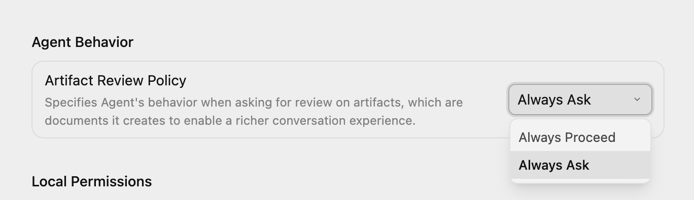

# 序章　昨日もやった「あの作業」を、自動化する話

ステータス：✅ 実証済み


---

## 昨日もやった「あの作業」のチリツモ...

管理画面を開く。
タイトルを入力する。
説明文を貼る。
日時を設定する。
投稿ボタンを押す。

これ、昨日もやりましたよね？


問い合わせメールを読んで、
スプレッドシートに転記する。
請求書PDFを保存して、フォルダに分ける。
予約サイトの管理画面に、
商品名・価格・在庫数を入れる。
Googleドキュメントの文章を、
noteやX投稿用に整える。

こういう
「**画面を開いて、入力して、保存する**」
作業なら、
**かなり近いんじゃないかなと思います**。

1回だけなら、たいしたことないんです。

5分。
10分。
長くても30分。

でも、毎日30分なら、
1年で約182時間です。

毎年1週間、
同じ画面を開いて、
同じ入力をして、
同じ保存ボタンを押している。

これ、冷静に考えるとけっこう大きいですよね。

この182時間、時給1500円で考えると、
**約273,000円分になります**。


せっかくなので、少し聞かせてください。

**その182時間、何に使いたいですか。**

新しい仕事を取りにいく、でも。

家族との時間を増やす、でも。

何年も積んでいるあの本をやっと読む、でも。

何でもいいんです。


ただ少なくとも——

「**昨日と同じ画面を開いて、昨日と同じ入力をする**」
には、使わなくていい。

それだけでも、割とでかい話だと思うんですよね。


---

## でも、自動化なんて無理...

たぶん、ここでこう思うはずです。

「**いや、それはわかるけど、
自動化とか無理でしょ**」

わかります。

自動化。
Python。
ターミナル。
黒い画面。
英語のエラー。

このへんの言葉が並ぶだけで、
「**あ、自分の世界じゃないな**」
と思う人は多いと思います。


僕も、コードは書けません。

なので、この教材は
「**コードを書ける人が、すごい自動化を作る話**」
ではありません。

コードが書けない人が、
**Claude Code等**を相談相手にしながら、
自分の業務に合った道具で、
**面倒なブラウザ作業を1つずつ減らしていく教材です**。

> 📌 **「コードを書かない」について**
> この教材では、コードを自分で考えたり書いたりする必要はありません。
> ただし、セットアップや実行のとき「ターミナル（黒い画面）で1〜2行のコマンドを入力する」場面は出てきます。
> **コマンドはすべてコピペでOKです。** 意味を理解していなくても進められます。

使う相談相手は、**Claude Code等**です。

「**Claude Code等**」とまとめてますが、
これは Claude Code・Codex・Antigravity
の3つのどれか1つ、ということです。

詳しい違いと選び方は第0章で説明しますが、
ここでは
「**どれを使っても、やることの流れは同じ**」
とだけ覚えておいてください。

すでに ChatGPT か Claude に課金している人は、
それぞれ **Codex** か **Claude Code** を使えます。
まだどこにも課金していない人は、
無料で始められる **Antigravity**
から触ってみるのがオススメです。

**「月3,000円で世界が変わる」**というのは、
大げさじゃないと思っています。
毎日30分の繰り返し作業が1つ減る。
1ヶ月で約15時間。
その15時間を3,000円で買えるなら、
十分すぎる投資です。

そして、**その先に使う道具は5つあります**。

MCP、Playwright、
Claude in Chrome、Make、
Chrome拡張。

「**うわ、また専門用語が来た**」
と思った人、大丈夫です。

基本は Claude Code等で、
「**〇〇を使って**」と依頼すればOKです。

自動化したい業務内容によって、
向く道具が違います。

**道具の使い分けについて相談できるGPTsを用意しています**。

<p class="fine-print">※ 使い方によっては、**月額プランとは別にAPI利用料や従量課金が発生する場合があります**。特に、エージェント機能、APIキー、外部サービス連携を使う場合は、料金画面や上限設定を必ず確認してください。最初は小さい作業で試し、いきなり長時間・大量の処理を回さないほうが安全です。</p>

---

## なぜ僕が、自動化に向かったのか

少しだけ自己紹介をさせてください。


僕は、もともと東京ガスという大企業に勤めていました。

そこからNFTバブルの勢いに乗って、
4,000万円ほどのお金が動くプロジェクトを経験、
その流れで、大企業の安定の道を捨てて、
起業しちゃいました。


ただ、NFTバブルは弾けました。

正直、かなりお先真っ暗でした。

「**どうしよう...**」と思っていた中、
一つやりたいことが見つかりました。

それが、「**地方で自由にAIを使って稼ぐ**」
ということでした。


都会と違って、
**地方にはまだまだ「情報格差」があります**。

・なんかAIが話題になっているけど、
　いまいち使い方がよくわからない

・新しいものに手を出して、
　機密情報が漏れたら不安

・困った時に聞ける人がいない


**そんな人や企業がまだまだ地方には溢れています**。

僕は、最新の情報を収集したり、
それをわかりやすく伝える「言語化」は
比較的得意なので、
地方で悩んでいる人のお助けマン的な役割は、
性に合っているようです。

今は車中泊をしながら、
AI研修の講師と、
業務委託の飛び込み営業をやっています。

**車で長野県を移動しながら働く日も多いです**。

でも、車を運転していると、
当然ですがPC操作はなかなかできません。

メールを返す。
管理画面を開く。
投稿作業をする。
ファイルを整理する。

こういう作業を、全部自分の手でやっていたら、
全然回らないんですよね。

だから、
「**できるだけAIに任せたい**」
「**ブラウザ操作を自動化したい**」
と本気で思うようになりました。

この教材には、
そのノウハウと試行錯誤の過程を、
**できるだけ全部詰め込みたいと思っています**。

きれいな成功談というより、
非エンジニアがAIに聞きながら、
**どうやって自分の作業を減らしていったかの記録です**。

---

## 非エンジニアの僕でもできたこと

たとえば僕の場合、
毎朝30分くらいかかっていた音声配信サービスA・Bのアップロード作業がありました。

これが今は、
iPhoneからMacに音声ファイルをAirDropして、
タイトルを設定するだけで、
あとは自動でAIが作業してくれます。
@demo_douga/podcast-upload-demo.mp4


・複数音声サービスへのログイン
・音声アップロード
・タイトル入力
・概要欄入力
・日時指定して予約投稿。
**毎日行う音声アップロードについて、
ほぼ全ての作業が自動で進むようになっています**。

さらに、
音声の文字起こしから
・note用のサムネイル生成
・note本文を制作して下書き保存
・Substackの記事制作
を自動で行い、

後は自分で手直しをして投稿すればOK
という自動化フローも作っています。

コードは一切自分で書いていません。

自動化を制作するには
普段の作業を録画して、
Claude Code等に見せて、
「**この作業を自動化したい**」と伝えただけです。

---

## 「全部自動化」しなくていい

ここで少し、視点を変えさせてください。

「自動化したいけど、
毎回ちょっと作業が違うんだよな」

こう思って、**自動化を諦めかけている人が多い**と感じています。

毎回同じ流れじゃないから。
判断が入るから。
先週とは違うから。

**でも、全部を自動化しようとしなくていいんです。**

たとえば、音声配信の記事化なら、

- 音声を文字起こしする
- 記事の形に整える
- 下書き保存する

ここまでは**AIに任せられます**。

その後に何を足すか、どこを削るか、
どの話を中心にするか——
ここは毎回違う。

だから**ここだけ人間がやればいい**。

それでも、だいぶ楽になります。

料理の例で言うと、
最初から最後まで全部ロボットに作らせる必要はないということです。
野菜を切る道具を使う。電子レンジで一部だけ温める。
ホットクックに煮込みだけ任せる。
**これなら、かなり現実的ですよね。**

ブラウザ作業の自動化も、これに近いです。

毎回同じクリック、同じ入力、
同じ下書き作成←——**ここだけAIに渡す**。
毎回判断が必要なところは、人間がやる。

僕はこれを「**半自動化**」と呼んでいます。

、**「完全自動化」ではなく「半自動化」
を積み上げていく**。

目的はあなたの30分を
もっと人間らしいことに使うことです。

---

## この教材は、走りながら育てます


正直に書いておきます。

**この教材**は、リリース時点で全部が完璧に揃っているわけではありません。


「自動化」のために必要なツールを、
すべて自分で実践して、
ありとあらゆるケースにおいて、
実体験をもとに語れるのが**理想です**。

でも、自動化の世界は変化が速すぎます。

今日の正解が、来月には古くなるかもしれない。

そのため、
すべてのツールを網羅できているわけでは、
正直ないです。


ちゃんと自分で触って、
できること、できないこと、
**ハマったところはそのまま出していきます**。

でも、正直、
自分**一人で全部の自動化パターンを検証するのは限界があると思っています**。

だから、購入者のコミュニティを作って、
みんなでシェアしていきたいと思います。

購入した方は、**LINEオープンチャット**に参加してください。

👉 [オープンチャット「ブラウザ操作自動化の教科書」](https://line.me/ti/g2/Wh6jCBOvSIs9K_3EvSQa24tzNnO59BNtQERbkA)

あなたが実際に自分の作業で試して、

うまくいったこと、
つまずいたことを共有してください。

**それをまた事例としてどんどん追加していきます**。


そういう、
**購入者みんなで育てていく教材にできたらいいなと思っています**。

自動化って、
**ぶっちゃけ孤独でしんどい作業になりがち**。

だから、方法論だけではなく、
**伴走できる教材にしたいんです**。

---

## ここで持って帰ってほしいもの


**ここで持って帰ってほしいもの**は、3つです。

**1つ目：自分の業務を1個、自動化する手順**

あなた自身の「あの作業」を、
ボタン1つに近づけるところまで。

**2つ目：次の自動化を作るための考え方**

メール、請求書、フォーム入力、
管理画面、SNS投稿。
毎回同じ流れがある作業を、一緒に見つけます。

業務に合った道具を選ぶ判断軸も渡します。

**3つ目：詰まったときに戻れる地図**

自動化は、途中で止まることがあります。
そこは隠しません。

ただ、止まったときに
何をスクショすればいいか。
AIに何を渡せばいいか。
**どこからやり直せばいいかまで説明します**。

---

## こういう人にはオススメしません


正直に書きます。
この教材を買っても、合わない人がいます。
先に、合わない方を並べておきます。

・**AIツールに、課金する気が一切ない人**

無料プランから始められるツール（**Antigravity**）
も紹介していますが、
本気で自動化を続けるなら、
どこかで月3,000円前後の課金が必要になる場面が出てきます。

「**絶対に1円も払いたくない**」という方には、
ちょっと厳しいかもしれません。

・**完全自動化を期待している人**

この教材では
「**公開・送信・削除・支払いなど、
やり直しがきかない操作は最後まで人間が押す**」
という設計を推奨しています。

なぜかというと、
投稿ボタンを押した瞬間、
記事は全フォロワーに届きます。

送信した請求書は、
取り消せません。

削除したファイルは、
戻らないことがあります。

AIがミスしたとき、
「AIが勝手にやった」
では取り返しがつかないからです。

だから、
**最後の「公開」「送信」「削除」「確定」
は人間が目で確認してから押す**。

この1ステップを残すだけで、
自動化の安全性は格段に上がります。

「**全部AIに任せて、自分は寝てるだけ**」
を目指す方には、物足りないと思います。

・**詰まったらすぐ諦めてしまう人**

自動化は、絶対にどこかで止まります。
そこから「**AIに何を渡して、どう抜けるか**」
を一緒に学ぶのがこの教材の本質です。
**止まった瞬間PCを閉じてしまいたくなる方**には、
つらいかもしれません。

---

## こういう人にこそオススメです


逆に、**こういう人にはぴったりだと思います**。

・**毎日・毎週、同じブラウザ作業をしている人**

メール、スプレッドシート、管理画面、
予約サイト、投稿サイト。
「**またこれやるのか**」と思いながら、
ずっと同じ手順を繰り返している人。

・**月3,000円前後の課金が、
自分の時間を買う投資と思える人**

毎日30分の作業が1つ減ると、
1ヶ月で約15時間です。
15時間を3,000円で買えるなら
これは悪い投資じゃない、
と思える方なら、確実に元は取れます。

・**そもそも自分が何の自動化をしたらいいのか分からない人**

意外と多いです。
「ブラウザ作業を自動化したい気持ちはある。
でも、具体的に何を最初にやればいいか思いつかない」
というパターン。

この教材には、特典として
**業務自動化ネタ出しアシスタントGPTs** を
用意しています。

普段の作業を話すと、
「**それなら○○を自動化するのがオススメ**」
と一緒に考えてくれるツールです。

ゼロから自分で考えなくても、
**AIに伴走してもらいながら
最初の1個を決められます**。

---

必要なのは、
**最初から完璧に理解することではありません。**

まずは無料の**Antigravity**、
もしくは月額のAIツールに課金して、
1つ小さな作業を選んで、
**画面録画を見せながら頼んでみることです**。

---

## まずは、1つだけでいい


あなたの仕事の中にある、
「毎回ちょっとめんどくさい、あの作業」
を1つだけ思い浮かべてください。

大きな業務じゃなくていいです。

請求書メールを探す。
フォームに同じ情報を入れる。
投稿画面にタイトルと説明文を入れる。

そのくらいで十分です。

それを、**Claude Code等**と一緒に、
小さな自動化に変えていきます。

---

## 第0章に進む前に

次に、購入者向けの特典をまとめて受け取れるページを置いています。

特に、最初の自動化候補を一緒に探すGPTsと、
教材本文を自分専用AIに読み込ませるためのmdファイルは、
読み進めながら何度も使えます。

第0章に入る前に、
必要なものだけ先に開いておいてください。

---

では、第0章で、
まず環境構築を見ていきましょう。

---

---

# 購入特典


---

ご購入ありがとうございます。

以下の5つの特典を、
上から順番に受け取ってください。

## 特典①　業務自動化ネタ出しアシスタント（GPTs）

[](https://chatgpt.com/g/g-6a0ece0ca25c819190141566263d44ff-ye-wu-zi-dong-hua-netachu-siasisutanto)

「何を自動化すればいいかわからない」
状態から始められる相談用GPTsです。
仕事の話を少し聞かせるだけで、
あなたの業務の中から自動化候補を一緒に探してくれます。
コードの話は出ません。まずここで「最初の1本」
を決めましょう。

👉 **[ネタ出しアシスタントを開く](https://chatgpt.com/g/g-6a0ece0ca25c819190141566263d44ff-ye-wu-zi-dong-hua-netachu-siasisutanto)**

---

## 特典②　ブラウザ自動化スターターキット

[](https://browser-automation-starter-kit.vercel.app/)

特典①で見つけた候補を、
目的・手順・成功条件・安全ラインに分けて整理する書き込み式キットです。
「やりたいこと」を実装の地図に落とし込めます。

👉 **[スターターキットを開く](https://browser-automation-starter-kit.vercel.app/)**

---

## 特典③　購入者専用 LINEオープンチャット

[](https://line.me/ti/g2/Wh6jCBOvSIs9K_3EvSQa24tzNnO59BNtQERbkA)

教材購入者だけが入れる、
質問・共有用のチャットです。
詰まったところを相談したり、
他の人の事例を見たりできます。

👉 **[オープンチャット「ブラウザ操作自動化の教科書」に参加する](https://line.me/ti/g2/Wh6jCBOvSIs9K_3EvSQa24tzNnO59BNtQERbkA)**

---

## 特典④　14日間ステップメール講座

[](https://metamake0601.systeme.io/aa3f000b-1d9e5946)

購入後、毎日1通。教材の進め方に沿って、
行動が止まらないよう14日間伴走します。
Day1〜Day14で実装まで進める実践課題つきです。

👉 **[メール講座に登録する](https://metamake0601.systeme.io/aa3f000b-1d9e5946)**

---

## 特典⑤　「AIに食わせてOK」権利＋教材フルテキストダウンロード

[](textbook-full.md)

購入者は、この教材の内容を**自分専用のAIに読み込ませて使えます**。

Custom GPT、NotebookLM、
Obsidian、Claude Projects、
Agent Skillsなどに入れて、
実務中の相談相手として活用してください。

教材を読むだけで終わらせず、
**自分専用の自動化アシスタント**に育てるための権利です。

### 使い方

**NotebookLM（オススメ）**
1. [NotebookLM](https://notebooklm.google.com/) を開く
2. 「新しいノートブック」を作成
3. 下のリンクからmdファイルをダウンロードして、「ソースを追加」から読み込む
4. 「詰まったとき相談する」「次のステップを教えてもらう」として使う

**Custom GPT**
1. ChatGPT の「GPTsを探す」→「＋作成」
2. 「ファイルのアップロード」にmdファイルを追加
3. 「この教材を元に自動化を手伝う専門家」として設定する

**Obsidian / 個人ナレッジベース**
1. 下のリンクからmdファイルをダウンロード
2. Obsidian の vault フォルダにそのまま入れる
3. AIプラグイン（Smart Connections等）と組み合わせて活用する

👉 **[教材フルテキスト（md）をダウンロードする](textbook-full.md)**

<p class="fine-print">※ダウンロードしたファイルは個人利用の範囲でご使用ください。再配布・転売はご遠慮ください。</p>

---

---

# 第0章　準備編：道具を揃える


---

## 1. まず最初に言っておきます

**まずは、とりあえず1つ、
アプリをインストールするだけ。**

すでにAI開発ツールをインストールしていて、
ある程度使いこなしている人は、
環境構築を読み飛ばして 
**[「10. 準備運動：AIニュース便を1個動かしてみよう」](#第0章-10-準備運動：aiニュース便を1個動かしてみよう)** に進んでください。

「環境構築」という言葉が苦手な人、
たぶん多いと思います。

正直に言うと、僕も、
**ここで一回気持ちが止まるタイプです**。

新しいアプリを入れる。
ターミナル（つまり、
コマンドを打つ黒い画面）を触る。
よく分からない英語の表示が出る。
途中で止まる。

この流れで挫折した経験、
ある人もいると思います。
気持ちはわかります。

**ただ、この章でやること**は、
整理するとこれだけです。

**AI開発ツール（つまり、AIにコードを
書かせて動かしてもらうための道具）
を1つ、使える状態にすることだけ**です。


今後、Python や Playwright、
Chromium といった「自動化ツール」
も後で必要になりますが、
これらは **AI 開発ツールに頼めば自動で揃えてくれます。**
だから最初から自分でインストール作業を覚える必要はありません。


以上です。

「**え、それだけ？**」

そうです。いったん、それだけです。

ただ、「**インストールが苦手**」という人も多いと思うので、
画面のスクリーンショットを多めに貼っています。

途中でわからなくなったら、
画面をスクショして、
AIにこう聞いてください。

「**今〇〇をインストールしています。
この画面でこのボタンを押したら、
こうなりました。
次どうすればいいですか**」

これだけで答えが返ってきます。

**あなたが全部理解しようとしなくて大丈夫です**。
まずは、「**必要なものを入れる**」
ところまで行ければOKです。

> 📌 **この章の読み方——自分のツールだけ読めばOKです**
>
> この章には、**3つのツールの手順**が書かれています。
> **全部読む必要はありません。自分が使うツールのセクションだけに飛んでください。**
>
> | 使うツール | 読む場所 |
> |---|---|
> | [**Antigravity**](#第0章-3-手順①-antigravityをインストール)（まだどこにも課金していない / 無料で始めたい） | → 「手順① Antigravityをインストール」へ |
> | [**Codex**](#第0章-4-手順②-codexで進める人はこちら)（ChatGPTにすでに課金している） | → 「手順② Codexで進める人はこちら」へ |
> | [**Claude Code**](#第0章-5-手順③-claudeアプリをインストール（claude-codeで進める人向け）)（Claudeにすでに課金している） | → 「手順③ Claude アプリをインストール」へ |
>
> 迷ったら **Antigravity** を選んでください。無料から始められて、後からいつでも切り替えられます。
>
> ---
>
> 📌 **「Claude Code等」という表記について**
>
> この教材では、Claude Code・Codex・Antigravity をすべてオススメしています。
> 本文では **「Claude Code等」** とまとめて呼びます。
> 「Claude Code等に頼む」と書いてあれば、「自分が選んだツールに頼む」と読み替えてください。

---

### 月額料金の話

**AI開発ツール**は、
有料プランを前提にしたほうが進めやすいです。

無料プランだと、コードを作って、エラーを直して、
また作って、という途中で制限に引っかかりやすいんですよね。

ChatGPT Plus も Claude Pro も、
月3,000円前後です。
**Antigravity** は、
無料プランから始められます。

最初は、**ちょっと引っかかると思います**。
サブスクが増えるのは、僕も普通に嫌です。

ただ、これは娯楽のサブスクというより、
**自分の時間を増やすための道具代に近いです**。


毎日30分の作業が1つ減ったら、
1ヶ月で約15時間です。
15時間を3,000円で買えるなら、
**悪い投資ではないと思っています**。

合わなければ1ヶ月でやめればOKです。

なお、月額プランだけで必ずすべての利用が収まるとは限りません。
使い方によっては、
APIキーの利用や、エージェント機能、
外部サービス連携で、
**従量課金が発生することがあります**。

ただ、**何も設定しなければ
月額プラン以上に料金が取られることはない**ので
ご安心ください。

もし使う場合は
最初に料金画面、利用上限、
予算上限の設定を一度見ておいてください。

---

## 2. AI開発ツール3つの比較（Antigravity / Claude Code / Codex）
いきなり3つも選択肢を出されて、
どれがいいのか迷っちゃう！

いや、確かにそうですよね。
正直に言うと、どれが「正解」
かは決まっていません。

**AIツールの世界**は、
毎月のように順位が入れ替わるからです。
今月は Claude Code が強く見える。
来月は Codex が一気に良くなる。
その次は Antigravity が便利な機能を出してくる。

こういうことが、ふつうに起きます。

**ただ、簡単な自動化をやる上で**は、
どれを選んでも「正解」とも言えます。

ツールは日進月歩で進化しているので、
**どんどん性能良くなっていっています**。

なので、
ここでは3つ並べて、特徴だけ整理します。
読みながら「**自分はこれかな**」
と思ったやつで進めてください。


| ツール | 提供元 | 料金の入り口 | 強み | こんな人向け |
|---|---|---|---|---|
| [**Antigravity**](#第0章-3-手順①-antigravityをインストール) | Google | 無料から | ブラウザ操作のサブエージェントが内蔵。コード・実行・ブラウザ確認が1画面で終わる | これから AI エージェントを触る人。まだどこにも課金していない人 |
| [**Codex**](#第0章-4-手順②-codexで進める人はこちら) | OpenAI | ChatGPT Plus（月3,000円前後） | ChatGPT に慣れている人がそのまま使える。ブラウザ確認まで自然 | すでに ChatGPT に課金している人 |
| [**Claude Code**](#第0章-5-手順③-claudeアプリをインストール（claude-codeで進める人向け）) | Anthropic | Claude Pro（月3,000円前後） | 日本語の文章感覚が丁寧。長い説明や設計の相談に強い | すでに Claude に課金している人。文章寄りの作業も同じツールでやりたい人 |

教材執筆時点（2026年5月）の僕の感覚としては、
こんな感じです。

- **これから AI エージェントを触る人は、Antigravity でまずやってみるのがオススメです**。無料で動かせますし、2026年5月のアップデートでさらに性能が上がりました。
- すでに ChatGPT に課金している人 →
 **Codex** がオススメ
- すでに Claude に課金している人 → 
**Claude Code** がオススメ

ちなみに、**僕（ペスハム）自身は Claude Code をメインで使っています**。


---

## 3. 手順①　Antigravityをインストール

ゼロから AI エージェントを触る人にはこちらがおすすめです。
**Antigravity** は無料で始められて、
ブラウザ操作のサブエージェントが内蔵されています。

すでに ChatGPT に課金している人は
[「**手順②Codexで進める人はこちら**」](#第0章-4-手順②-codexで進める人はこちら)
すでに Claude に課金している人は
[「**手順③Claudeアプリをインストール**」](#第0章-5-手順③-claudeアプリをインストール（claude-codeで進める人向け）)
へ進んでください。

ここでは、2026年5月時点の
 **Antigravity2.0** を前提に説明します。

Antigravity の特徴を一言で言うと、
「**エージェントに指示する→ブラウザを動かす→結果を確認する、
が1つのアプリで完結する**」ツールです。

今までは、AI にコードを書いてもらって、
ターミナルで動かして、ブラウザを開いて確認して、
エラーが出たら AI に戻る、
という往復が必要でした。

Antigravity 2.0 では、これがすべて1つの
デスクトップアプリの中で完結します。

コードを自分で書く必要はなく、
エージェントに
「**こういう動きをするスクリプトを作って**」
と伝えるだけです。

### 料金（無料から始められます）

| プラン | 料金 | 内容 |
|---|---|---|
| 無料 | 0円 | Gemini 3.1 Pro / Claude Sonnet / GPT-OSS が使える。ブラウザ自動化 OK。クレジットカード不要。ただし制限が早い。 |
| Pro | 約2,900円/月 | 同じモデルが、量の制限が緩い状態で使える |
| Ultra | 約28,000円/月 | 全モデル、Pro の20倍 |

まずは無料で大丈夫です。
**1日数回、自動化スクリプトを試すくらいなら十分です**。
毎日大量に使う、チームで使う、
という段階になったら Pro を検討してください。

一点だけ注意があります。
2026年3〜5月時点で、無料プランの利用上限（クォータ）
のリセット周期が不安定という報告があります。
「**突然動かなくなった**」ときは、
少し時間をおいてから試してみてください。

### Step 1　公式サイトにアクセス

ブラウザで [https://antigravity.google/](ht**tps://antigravity.google/) を開きます。


「**Download for MacOS**」
（または Windows の場合は別ボタン）
をクリックします。

### Step 2　OSに合わせてダウンロード

ダウンロードページに飛ぶと、
**OS別の選択肢が並んでいます**。


| OS | 選ぶボタン |
|---|---|
| **macOS（Apple Silicon = M1/M2/M3/M4チップ）** | Download for Apple Silicon |
| **macOS（Intelチップ）** | Download for Intel |
| **Windows（一般的なPC）** | Download for x64 |
| **Windows（ARM搭載モデル）** | Download for ARM64 |
| **Linux** | x64 または ARM64 |

自分のmacOSのチップがわからないとき。
Mac なら左上のリンゴマーク 
→「**このMacについて**」で確認できます。
**ほとんどの新しい Mac は Apple Silicon です**。

### Step 3　インストール

Mac の場合は `.dmg` ファイルを開いて、
**Antigravity** アプリを Applications
フォルダにドラッグします。
Windows の場合は `.exe` を実行して、
**画面の指示に従ってインストールします**。

通常のアプリと同じ手順なので、
難しいことはありません。

### Step 4　起動してGoogleアカウントでログイン

Antigravity を起動すると、
「**Welcome to Antigravity**」
と書かれた黒い画面が出ます。


「**Continue with Google**」
をクリックします。
**普段使っている Google アカウントでログインしてください**。
新しいアカウントを作る必要はありません。

「**Use Google Cloud project instead**」
というリンクもありますが、
これは Google Cloud
のプロジェクトを別途用意している人向けです。
普通は触らなくて大丈夫です。

### Step 5　Security Notice に同意する

ログイン後、
「**Security Notice & Data Use**」
という画面が出ます。


**AIエージェント**は、
データの取り扱いに注意が必要であることを説明している画面です。

「Yes, I agree 〜」にはチェックを入れず「**Next**」を押します。

これは、自分の使い方を Google に共有して、
**Antigravity** の改善に協力するかどうかの同意です。

個人情報や企業情報のセキュリティが弱くなるということで、ユーザー側としてはオンにするメリットは薄いので、チェック入れなくてOKです。

### Step 6　テーマを選ぶ

次にエディタ（つまり、作業画面）
の**テーマを選びます**。


3つから選べます。

| テーマ | 特徴 |
|---|---|
| **System** | パソコンの設定に合わせる（昼は明るく、夜は暗く） |
| **Light** | 明るい画面（昼間の作業向き） |
| **Dark** | 暗い画面（目に優しい、長時間作業向き） |

迷ったら「**System**」でOKです。
あとから設定画面で変えられます。

選んだら「**Next**」を押します。

### Step 7　プラグイン選択（Build with Google）

「**Build with Google**」
という画面で、最初に使うプラグインを選びます。


プラグインとは、**Antigravity** の中で AIが使える追加の機能セットです。
たとえば「**Chrome DevTools**」
を選ぶと、ブラウザの開発者ツールを 
AI が触れるようになります。

選択肢は以下の6つです。

- **Android** — Android アプリ開発用
- **Modern Web Guidance** — モダンな Web 開発の指針
- **Google Antigravity SDK** — Antigravity 拡張開発用
- **Science** — 科学計算・データ分析用
- **Firebase** — Firebase 連携用
- **Chrome DevTools** — ブラウザの開発者ツール連携

ブラウザ自動化が目的なら、**何も選ばずに「Finish」
を押してOK** です。
あとから設定画面で追加できます。

### Step 8　メイン画面到達

「**Finish**」を押すと、
Antigravity のメイン画面に入ります。


ここがあなたの作業場所です。

画面の見方を簡単に。

- 左サイドバー上：**New Conversation / Conversation History / Scheduled Tasks**（新規会話・履歴・予約タスク）
- 左サイドバー中：**Projects**（作業フォルダ一覧）
- 中央：**Ask anything, @ to mention, / for actions**（指示を打つ場所）
- 中央下：使うモデルの選択（Gemini 3.5 Flash など）

ここから、**指示を打って AI に作業させます**。

### Step 9　権限の設定（今はスキップOKです）

左下の「**Settings**」アイコンに、
権限の設定画面があります。

**今すぐ設定しなくても
動くので安心してください。**

Security Preset が **Default**
になっていることだけ確認してください。
これだけで、ターミナルコマンドを実行するたびに確認が入る「**安全な状態**」で動かせます。


File Permissions や Network
Permissions の細かい設定は、
**慣れてきたタイミングで設定してください**。
全手順はこの章の末尾
「**付録：Antigravity の権限設定**」
にまとめています。

### Step 10　作業フォルダ（プロジェクト）を作る

AI開発ツールでは、ローカルファイルの中から
「**作業フォルダ**」を指定して、
その作業フォルダを直接編集、上書き、保存してくれます。

最初は、**新しいフォルダを作るのがオススメです**。


具体的には、**ホーム直下に `code/automation/`
という階層を作るのがオススメです。**

```
~/code/             ← まず親フォルダを作る
  automation/       ← その中に作業フォルダ。ここを Antigravity に指定する
```

メイン画面の左サイドバー「**Projects**」
の右にあるフォルダアイコン（＋）から、
作業フォルダを追加します。


**具体的な作り方**は、
Finder から手で作ってもOKですし、
ターミナルで以下のコマンドを実行してもOKです。

**ターミナルとは**
「文字を入力してパソコンを操作する画面」
のことです。今後もときどき使いますが、
基本はコピペするだけです。

- **Mac の場合**：
Finder → アプリケーション → ユーティリティ → ターミナル、または Spotlight（⌘ + Space）で「ターミナル」と検索して開きます。

- **Windows の場合**：
スタートボタンを右クリック →「Windows PowerShell」または「ターミナル」を選びます。
または検索バーで「powershell」と入力して開きます。

```bash
# Mac
mkdir -p ~/code/automation
```

```powershell
# Windows（PowerShell）
New-Item -ItemType Directory -Force -Path "$HOME\code\automation"
```

#### なぜデスクトップやダウンロード直下にしないのか

**デスクトップやダウンロードフォルダ**には、
普段使っている資料や、ダウンロードしたファイル、スクショなど、いろんなものがゴロゴロしています。
AI 開発ツールに「デスクトップ」
をそのまま指定すると、
AI が周辺のファイルにアクセスしてしまい、
**万が一の際に勝手に書き換えてしまうリスクがあります。**

`~/code/automation/` のように、
**自動化作業専用の階層を切る** ことで、
AI が触れる範囲が物理的に分かれます。
将来、別の自動化を作るときは `~/code/別のプロジェクト/`を作っていけば、**全部 `~/code/` の下にまとまります**。


### Step 11　動作確認

ここまで来たら、最後に動作確認をします。

中央の入力欄に、こう入れてみてください。

```
ブラウザを起動して、https://www.google.co.jp を開いて、
画面のスクリーンショットを撮ってください
```

入力したら、**右の矢印ボタン（→）を押します**。


すると、Antigravity が動き始めます。
途中で「**Allow running this command?**」
という確認画面が出ます。
これは「このコマンドを実行してもいいですか？」という確認です。
「**1 Yes, allow this time**」
を選んで進めてください。


しばらく待つと、**スクリーンショットが右側に表示されます**。


確認するのは3つだけです。

- ブラウザが開いているか
- 指定した URL に移動しているか
- スクリーンショットが返ってきているか

3つ確認できたら、
**Antigravity** のセットアップは完了です。

Antigravity を選んだ人は、
次の「**7. 個人設定**」に進んでください。

---

## 4. 手順②　Codexで進める人はこちら

**Codex**（ChatGPT の Codex 機能）
で進める人向けの手順です。
すでに ChatGPT Plus に加入している人は、
**これが追加コストなしで使えます**。

Antigravity を使う人は
[「**手順①Antigravityをインストール**」](#第0章-3-手順①-antigravityをインストール)へ、
Claude Code を使う人は
[「**手順③Claudeアプリをインストール**」](#第0章-5-手順③-claudeアプリをインストール（claude-codeで進める人向け）)
へ進んでください。

Codex は、ざっくり言うと
「**ChatGPT 側のClaude Code みたいなもの**」です。

コードを書く。ファイルを直す。エラーを見て修正する、ブラウザを確認する。
必要ならコマンドを実行する。

こういう作業を任せられます。

### Codex の入口は3つあります

1つ目は、**Codexアプリ**です。
この教材でオススメする入口です。
**日常業務の自動化なら、まずこれで十分**です。


2つ目は、**Codex CLI**です。
ターミナルから使う **Codex** です。
これは開発者向けです。
最初から無理に使わなくて大丈夫です。

3つ目は、**Codex Cloud**です。
クラウド上で **Codex** に作業してもらう方法です。
スマホとつないで使う用途に向いています。

日常業務のブラウザ操作を自動化したい場合は、
まずは手元の **Codexアプリ**で考えれば OK です。

### Codex アプリで最初にやること

ChatGPT のサイドバーに、
**Codex** の項目があります。


ここから Codex のページに入って、
**デスクトップアプリ**をダウンロードします。


ダウンロードしたアプリを開くと、
**メイン画面が表示されます**。


最初にこの順番で設定してください。

1. ChatGPT / OpenAI アカウントでログイン
2. Codex アプリを開く
3. 作業フォルダを決める
4. フルアクセスを OFF にする
5. 書き込み範囲を作業フォルダだけにする
6. 必要になってから MCP やブラウザ機能を追加する


最初から、メール、Drive、Notion、
ブラウザ操作、コンピュータ使用を全部つなぐ必要はありません。
まずは、テスト用フォルダや、
**自動化プロジェクト専用フォルダだけで試してください**。

### 初心者にオススメの Codex 設定

この教材の読者は、基本的に「**日常業務向け**」
の安全寄り設定で始めてください。

- フルアクセス：OFF
- 自動レビュー：基本 OFF。自動化コードを作るときだけ ON
- 承認ポリシー：書き込み・送信・削除は必ず確認
- サンドボックス：作業フォルダだけ書き込み OK
- ネットワーク：必要なサイトだけ許可
- MCP：最初は読み取り中心
- ブラウザ操作：確認しながら使う
- コンピュータ使用：最後の手段

ここで大事なのは、
Codex に**何でも任せない**ことです。

調べる。整理する。下書きする。手順を作る。
自動化コードのたたき台を作る。

最初はここまでで十分です。

メール送信、SNS 投稿、ファイル削除、購入、
公開、顧客データの更新は、
**人間が確認してから実行します**。


---

## 5. 手順③　Claudeアプリをインストール（Claude Codeで進める人向け）

**Claude Code** をメインに使う人向けの手順です。
**僕（ペスハム）自身もこれを使っています**。
文章の感覚や設計の相談に強くて、
長く付き合える相棒という感じです。

Antigravity を使う人は[「**手順①
Antigravityをインストール**」](#第0章-3-手順①-antigravityをインストール)へ、
Codex を使う人は[「**手順②　Codexで進める人はこちら**」](#第0章-4-手順②-codexで進める人はこちら)
へ進んでください。

ここが第一関門です。

とはいえ、
**やること自体は普通のアプリインストールとほぼ同じです**。
画面が少し違っても焦らなくて大丈夫なので、
**近いボタンを探しながら進めてください**。

### Step 1　Claude.ai にアクセスする

Googleで「**claude**」と検索します。


一番上に出てくる「**Claude（claude.ai）**」をクリックします。
トップページが表示されます。


### Step 2　アカウントを作成する

「**メールで続ける**」を押すと、
登録したアドレスにメールが届きます。


届いたメールの「**Claude.aiにサインイン**」
を押すと、PCの画面で次に進みます。
名前を入れて、規約に同意してください。


その後、プロフィールを聞かれますが、
飛ばしてOKです。


### Step 3　有料プランに加入する

「**月20ドル、高くない？**」と思いましたか？

正直、**最初はちょっと高く感じると思います**。
僕も、**サブスクが増える感じは普通に嫌です**。

**ただ、自動化ツール作りで**は、
有料プラン（月3,000円前後）
を前提にしたほうが進めやすいです。
無料プランだと、コードを作って、エラーを直して、
また作って、**という途中で制限に引っかかりやすいからです**。

まず1ヶ月だけ試して、合わなければ解約する。
このくらいの軽さで大丈夫です。


「**Claudeを体験する**」
から Pro プランを選択します。


**クレジットカード情報を入力して購入します**。


### Step 4　デスクトップアプリをダウンロードする

加入が終わったら、左下のアイコンから
「**アプリと拡張機能を入手**」
をクリックします。


「**macOS版をダウンロード**」
を押すとアプリがダウンロードされます。


ダウンロードしたファイルを開いて、
Claudeアプリを「**アプリケーション**」
フォルダにドラッグします。


### Step 5　Claudeアプリを起動する

起動すると、こんな画面になります。


これでインストール完了です。

### 補足：Claudeアプリの3つのモード

**左上に3つのアイコンがあります**。
覚えておくと便利です。

1つ目は、**Chat（チャット）モードです**。
普通の会話モード。**文章生成や相談はここです**。

2つ目は、**Cowork（コワーク）モードです**。


メール処理・スケジュール管理など、
**自律的にタスクをこなしてもらうモードです**。
今回の自動化ツール作りでは使いません。

3つ目は、**Code（コード）モードです**。


これが本命です。**Claude Code のモード**です。
コードを書く・実行する・修正するを、
すべてやってくれます。

**自動化ツール作り**は、
このCodeモードで進めます。

### ここで詰まりやすいポイント

- アプリのダウンロードがうまくいかない
 → ブラウザ側でログインし直してから、もう一度「アプリと拡張機能を入手」を開く
- アプリを開いてもログインできない
 → ブラウザ版で同じアカウントにログインしている状態で、もう一度アプリを開く
- Code モードが出てこない
 → Pro プランに加入されているか、もう一度確認

分からなくなったら、画面をスクショして、
**ブラウザ版の Claude にそのまま聞いてください**。

```
ClaudeアプリをMacにインストールしようとしましたが、
[ここに症状を記入]という状態になります。

▼ 環境
macOS [バージョン]

解決方法を教えてください。

[スクリーンショットを添付]
```

これでだいたい答えが返ってきます。

---

## 7. 手順①.5　個人設定（カスタマイズ）を入れる

続いて、あなた個人は「こんな人ですよ」という情報を
AIに覚え込ませます。

「**それってそんなに大事？**」
と思うかもしれません。

地味なんですけど、けっこう大事です。

ここを飛ばすと、
**AI とのやり取りが毎回ゼロからになります**。

Antigravity も Claude Code も Codex
も、初期状態だと「**あなたが誰なのか**」
を全く知りません。
「**自分の仕事はこれで**」「こういう書き方が好みで」「専門用語は使わないでほしい」
といったことを毎回説明するの、
普通に面倒なんですよね。

最初に1回だけ自己紹介を登録しておくと、
**毎回の会話で AI が配慮してくれるようになります**。

どのツールでも、登録する場所はここです。

| ツール | 設定場所 |
|---|---|
| **Antigravity** | `AGENTS.md` ファイルに書く |
| **Codex** | アプリ内の「Custom instructions」 |
| **Claude Code** | アプリ左下のアイコン → 「Customize」→「Personal preferences」 |

Claude Code を使っている人は、
あわせて**プライバシー設定も一度見ておくと安心です**。


### 自分の個人設定を作るプロンプト（コピペ OK）

「**何を書けばいいかわからない**」
という人がほとんどだと思います。

なので、AI に自分の個人設定を作らせるプロンプトを用意しました。
新規チャットでこれを貼り付けてください（Antigravity /
Claude / Codex どれでも OK）。

```
あなたに、私のAI開発ツールのカスタム指示に
登録するための文章を作ってもらいたいです。

これから私の情報を伝えるので、それをもとに
今後のやり取りで「私のことを理解した状態で答えてくれる」
ような自己紹介テキストをMarkdown形式で作ってください。

▼ 私の情報
・名前：[ここに自分の名前]
・職業：[例：会社員 / 経営者 / フリーランス / 主婦 など]
・専門分野や得意なこと：[例：マーケティング / デザイン / 音声配信 など]
・現在やっている主な作業：[例：毎日のSNS投稿 / メール返信 / 顧客対応 など]
・自動化したいと思っている業務：[例：予約サイトへの入力 / メール下書き など]
・パソコンスキル：[例：プログラミング未経験 / Excelは普通に使える など]
・コミュニケーションの好み：[例：丁寧に説明してほしい / 短く要点だけ など]
・避けてほしい表現：[例：専門用語の連発 / 過度に堅い文章 など]

▼ AIに守ってほしいこと
・私は非エンジニアなので、説明は日本語でお願いします
・専門用語を使う場合は、短く意味も補足してください
・勝手にファイル削除、送信、公開、購入、確定、外部サービスへの反映をしないでください
・作業前に、何をするかを短く説明してください
・作業後に、どこを変更したか、何を確認したかを教えてください
・ブラウザ自動化では、座標クリックよりも、画面上の文言、ラベル、ボタンの役割、URL変化、完了メッセージを優先してください
・エラーが出たら、スクリーンショット、ログ、URL、今いる画面の状態を残す方針にしてください

▼ お願い
上記をベースに、AIが「ユーザーをよく理解している前提」で
日常業務の自動化を安全に手伝えるカスタム指示文を、500〜1000文字程度で作ってください。
コピペしてそのまま使える形でお願いします。
```

出てきた文章を、
**それぞれのツールの設定欄に貼り付けます**。

それ以降、AI は：

- 専門用語を避けて説明してくれる
- あなたの業務文脈を踏まえた提案をくれる
- 文章のトーンをあなたの好みに合わせてくれる

毎回イチから説明する手間が、
かなり減ると思います。

### 詰まったとき

**設定画面の場所がわからない場合**は、
AI にこう聞いてください。

```
[使っているツール名]のカスタム指示の設定画面がどこにあるか分かりません。
今アプリを開いている状態のスクリーンショットを添付するので、
設定画面までの行き方を教えてください。

[スクリーンショットを添付]
```

## 8. AI開発ツールを使いこなす3つのコツ

準備が終わったところで、
**使い始める前に3つだけ頭に入れておいてください**。
これを知らずに始めると、
**あとでちょっと遠回りしがちです**。

### 困ったら、まずスクショを撮る

この教材を通して、一番使う動作がこれです。

「**何かおかしい**」「エラーが出た」
「動いていない気がする」

そのとき、やることは1つです。

**今の画面をスクリーンショットに撮って、
AI に渡す。**

何が原因かを自分で考える前に、
撮ってください。
**原因の分析は AI がやります**。
あなたはスクショを渡すだけでいいです。

---

**Mac でスクショを撮る：
`Cmd（⌘）+ Shift + 4`**

押すと、**マウスカーソルが「＋」に変わります**。
ドラッグして、エラーが出ている部分を囲むと、
**デスクトップに画像が保存されます**。

画面全体を撮りたいときは 
`Cmd（⌘）+ Shift + 3` です。

---

**Windows でスクショを撮る：
`Win + Shift + S`**

押すと、画面が暗くなります。
ドラッグして囲むと、
**クリップボードにコピーされます**。
そのまま **AI のチャット画面に
 `Ctrl + V`で貼り付けられます**。

---

**撮ったスクショを AI に渡す方法**

ChatGPT や Claude等のチャット画面には、
**ファイルをドラッグして貼り付けられます**。

```
この画面でエラーが出ました。
[スクショをここにドラッグ]
次に何をすればいいか教えてください。
```

これだけで答えが返ってきます。

---

「**何が悪いかわからないから、聞くのが恥ずかしい**」と思う必要はありません。

スクショを渡すだけで、AI が読み取って、
**原因と対処を教えてくれます**。
説明を作り込む必要はゼロです。

第2章・第3章に進んでエラーが出たとき、
**何度もこの動作に戻ってきます**。
「**困ったらスクショ**」
を今の時点で体に入れておいてください。

---

### コツ1：いきなり「作って」と言わない

最初にやりがちなパターンです。

悪い例。

> 「音声配信サービスB の自動アップロードツールを作って」

良い例。

```
音声配信サービスBの自動アップロードツールを作りたいです。
まず設計だけ教えてください。
コードはまだ書かなくていいです。
```

「作って」と一言で言うと、
**AI はいきなりコードを書き始めます**。
でも、最初に「**どんなものを作るか**」の
認識がずれていると、
あとから「なんか違うな」
となって、やり直しになりがちです。

計画を確認してから GO を出すだけで、
**この無駄はかなり減ります**。

### コツ2：「自分で確認してから報告して」と伝える

**最初の指示にこの一文を入れておくのがオススメです**。

```
コードを書いたら実際に実行して、
正しく動くか確認してください。
エラーが出たら自分で修正してから教えてください。
```

これを言っておくと、AI が自分でテストして、
**自分で直すところまでやってくれやすくなります**。

毎回「動いた？」「**まだエラー？**」
と人間が確認し続けるの、
けっこう疲れるんですよね。
だから、最初にそう頼んでおきます。

### コツ3：詰まったら「症状とスクショを」伝える

原因を自分で考える必要はありません。

悪い例。

> 「たぶん右上のこの辺のボタンが押せてないと思うんですが…」

良い例。

```
ボタンをクリックする前に止まってしまっています。
スクリーンショットを添付します。
```

**症状と証拠（スクショ・エラー文）
だけ渡せば十分です**。

画像やエラー文には
情報が多く含まれているので、
AIが読んで理解しやすいんですよね。
原因の推測は AI がやります。

自分で言葉で伝えようとすると、
時として見当違いの方向に進んでしまうこともあります。
まずは、**起きていることをそのまま渡せば OK です**。

---

## 9. 第0章 チェックリスト

ここまでお疲れさまでした。

全部にチェックが入ったら、
**次のセクションへ進んでください**。
1つでも欠けていたら、
**そこだけ戻って AI に聞いてみてください**。

```
□ Antigravity / Claude Code等　いずれか1つが起動できる
□ ChatGPT / Claude の有料プラン　加入完了（Antigravity の人は無料でも OK）
□ 個人設定（Customize / Custom instructions / AGENTS.md）　登録完了
□ ターミナル操作の基本（コピペして Enter）　分かった
□ 詰まったときの聞き方（スクショ＋症状＋環境）　覚えた
□ AIニュース便　届いた（次のセクションで設定します）
```

今後使っていく自動化のためのツール
Python や Playwright や Chromium は、
AI 開発ツールに「**Playwright
を使うのに必要なものを入れて**」と頼めば、
自動でインストールしてくれます。
**ここでは「準備」として揃えなくて大丈夫です**。

---

## 10. 準備運動：AIニュース便を1個動かしてみよう

道具が揃ったところで、
1個だけ自動化を体験しておきましょう。

第2章から始まるブラウザ自動化の前に、
「**自動化が動いた**」という感覚を持っておくと、
気持ちが全然違います。

[**毎朝6時のAIニュース便**](https://site-teal-iota.vercel.app/)は、設定1回で翌朝から毎日 Gmail に最新 AI ニュースのまとめが届く自動化です。

[](https://site-teal-iota.vercel.app/)


**Playwright** も不要、
ブラウザを操作しません。
**必要なのは Gmail のアプリパスワードを1個取得するだけです**。

---

### ⚠️ Pythonのバージョンについて（先に確認してください）

これ、僕の知人が実際に詰まった話なので書いておきます。

Pythonを「公式サイトから最新版をインストールした」という人が、
セットアップを実行したら**仮想環境（venv）の作成で失敗した**んです。

原因は、**Python 3.14**。

2025年時点でリリースされたばかりで、
ツール側の対応がまだ追いついていないバージョンです。
ツール側は悪くない。
Python側が「新しすぎる」。

「最新版を入れたのになぜ動かない？」

...なんでやねん、という話なんですが、
これが現実です。

**Pythonは「最新版」が正解ではありません。**
「安定版」を入れてください。

---

**推奨バージョン：Python 3.12.x**

→ [python.org/downloads/release/python-3128/](https://www.python.org/downloads/release/python-3128/)

すでに 3.14 が入っていても、
3.12 を**追加でインストールするだけ**でOKです。
古いものを消す必要はありません。
セットアップスクリプトが自動で 3.12 を見つけて使います。

> 「自分の Python バージョンって何？」
> ターミナルで `python3 --version` と打てば確認できます。
> **3.14 と表示された人は、先に 3.12 を入れてください。**

---

### セットアップの流れ（4ステップ）

**詳しい手順はセットアップガイドに全部書いてあります**。

サイトを開いて、4ステップで完了します。

```
STEP 1　Gmailアプリパスワードを取得する（3〜5分）
         myaccount.google.com/security から取得

STEP 2　.env ファイルにアプリパスワードを貼り付ける
         テキストエディタで1行編集するだけ

STEP 3　ダブルクリックで起動
         Mac：run_digest.command
         Windows：run_digest.bat

STEP 4　テストメールが届いたら完了
```

> `.env` ファイルの書き方がわからない場合は、**[第2章の「.envファイルって何ですか」](#第2章-env-ファイルって何ですか)**で詳しく説明しています。先に読んでから戻ってきてもOKです。

翌朝から、**毎日6時にメールが届くようになります**。
Mac を起動したタイミングで当日分がまだ届いていなければ、
自動で送られます。

---

### Substack 購読ニュースレターまとめ（応用）

AIニュース便が動いたら、同じ仕組みの応用として「[**Substack 購読ニュースレターまとめ**](https://substack-digest-lovat.vercel.app/)」も作れます。

[](https://substack-digest-lovat.vercel.app/)

「**購読しているSubstackのメールを毎朝まとめて1通にして送って**」という指示をAI開発ツールに渡すだけで、AIニュース便と同じ .env ファイルを使いながら動きます。

「**まず1個動かす → 同じ仕組みで別のものも作れた**」
という体験を、ここで積んでおいてください。

---

ここまでできたら、**準備はかなり進んでいます**。

次の章では、揃えた道具を「**どう使い分けるか**」
の話をします。
Playwright、Claude in Chrome、
Make、Chrome 拡張、
この4つの自動化ツールを並べて、
自分の業務にはどれが向くのかを判定していきます。

**道具を揃える段階**は、ここで一区切りです。
次は、この道具を使って何をしていくか、
実践編の章へ進みます。

---

## 付録：Antigravity の権限設定

**慣れてきたタイミングで設定してください**。
最初は Default のまま進んで大丈夫です。

### Settings の開き方

左下の「**Settings**」
アイコンから設定画面を開きます。


左サイドバーの一番下にある **「Conversations」
** をクリックします。

設定する項目は4つです。

---

### 1. Security Preset

**Agent Settings の一番上にある項目です**。

| プリセット | 内容 |
|---|---|
| **Default** | ワーキングフォルダ外のターミナルコマンドとファイルアクセスを、すべて手動レビュー |
| **Full Machine** | 全ターミナルコマンドはレビュー必須。マシン上の任意のファイルを読み書き可能 |
| **Unrestricted** | すべての安全バリアを無効化 |
| **Custom** | 自分で一つずつ細かく設定 |

**オススメ：Default**


---

### 2. Artifact Review Policy

**オススメ：Always Ask**

AI がファイルを作るたびに「**これでいいですか？
**」と聞いてきます。
これを切ると、**AI が勝手にファイルを大量生成することがあります**。



---

### 3. File Permissions

「File Reads」と「File Writes」
の両方に、以下を **Deny（拒否）
** で追加します。

```
~/.ssh/        SSH鍵
~/.aws/        AWS認証情報
~/.env         パスワードなどの秘密情報
~/Documents/   個人ドキュメント全般
~/Library/     Mac の内部設定
```

「**File Reads**」の Allow に、
よく使うドキュメントサイトを追加しておくと便利です。

```
docs.python.org
playwright.dev
make.com
```


---

### 4. Network Permissions

以下を **Deny（拒否）** で追加します。

```
webhook.site
*.ngrok.io
pastebin.com
```

---

### なぜこの設定が必要か

AI が Web サイトを読みに行ったとき、
そのページに悪意ある指示文が仕込まれていることがあります。
AI がそれを「次の指示」
と勘違いして実行してしまう問題を
**プロンプトインジェクション** と言います。

この4つの設定を入れておくと、
その被害を防げます。

設定を変えたら、**必ず Antigravity を再起動してください**。
再起動しないと設定が反映されません。

### オススメ設定まとめ

| 項目 | オススメ |
|---|---|
| Security Preset | **Default** |
| Artifact Review Policy | **Always Ask** |
| File Reads / Writes（Deny） | `~/.ssh/`、`~/.aws/`、`~/.env`、`~/Documents/`、`~/Library/` |
| File Reads（Allow） | `docs.python.org`、`playwright.dev`、`make.com` |
| Network Permissions（Deny） | `webhook.site`、`*.ngrok.io`、`pastebin.com` |

---

---

# 第1章　自動化の5つの道具と5つの判定軸

ステータス：✅ 実証済み（実体験ベース）


---

## 先に、どんな作業を自動化できるのか見ておきます


道具の話の前に、まず上の図から
「**自分のあの作業、これに近いかも**」を探してみてください。

多分、いきなり「自動化」と言われて、
具体的なやり方の説明をされても、
「**で、それを何に使うの？**」

となっちゃいがちですよね。

（そもそも、みんな自動化したことないんで、
**イメージがわかないんです**）

なので、この章では、
「**あなたの業務のどんなところが自動化できそうか**」
と
「**それを自動化するにはどんな手段を使うのが最適なのか**」

を一緒に探していきましょう。

まず、
ブラウザ操作の自動化で狙いやすいのは、
だいたいこのあたりです。

### メール・請求書まわり

・問い合わせメールをスプレッドシートに転記する。
・請求書PDFをDriveに振り分ける。
・PDFから金額・日付・取引先を抜き出す。
・入金済み・未入金を照合する。

### 予定・タスクまわり

・スプレッドシートに行が増えたら請求書を作る。
・カレンダーの予定の前日にリマインドを送る。
・商談メモから次回タスクを拾ってカレンダーに入れる。

### 問い合わせ対応・営業管理

・自社に届く問い合わせを整理する。
・会社名、担当、メール、内容を仕分ける。
・返信が必要なもの、確認が必要なもの、
対応済みのものに分ける。
・商談メモや対応履歴を、
自社のCRMやスプレッドシートに記録する。

ただし、**他社の問い合わせフォームへの自動送信はやりません。**
特定電子メール法と各サイトの利用規約に引っかかります。

### コンテンツ制作

・録音した音声配信を予約投稿する
・Googleドキュメントの原稿からnoteの下書きを作る。
・Xの下書きを生成して予約投稿ツールに登録する。
・音声配信の文字起こしを記事化する。
・YouTubeやインスタの概要欄を作って入れ込む。

### EC・予約サイトの管理画面

・商品名、価格、在庫、説明文を入れる。
・公開ステータスを変更する。
・予約枠や空き状況を更新する。

### ブラウザ内の単発作業

・いま見ているページのURLとタイトルをNotionに送る。
・いま開いている管理画面の一覧をCSVで吐き出す。

---

自分の業務がどれに近いか、
なんとなく見えてきましたか。

では、これらの業務をどう自動化していくのか。
まずは「使う道具」の話から入ります。

道具の役割を押さえたあとに、
「**さっき挙げた業務には、どの道具が向いているか**」
をもう一度振り返ります。

---

## 自分の仕事を棚卸ししてみましょう

さっきの例を見ても、
「**自動化したいものが思い浮かばないよーー**」
という人、大丈夫です。

実際には、**見えていないだけで「自動化候補」
はたいてい日常の中に埋まっています**。

手を動かしてみましょう。

まず**特典2：ブラウザ自動化スターターキット**を使って、
今の業務を棚卸しして整理しましょう。

[https://browser-automation-starter-kit.vercel.app/](https://browser-automation-starter-kit.vercel.app/)

整理しても「何をどうやって自動化すればいいか分からない」
という場合は、
[**特典1：業務自動化ネタ出しアシスタント（GPTs）**](https://chatgpt.com/g/g-6a0ece0ca25c819190141566263d44ff-ye-wu-zi-dong-hua-netachu-siasisutanto/c/6a20b797-658c-83a6-9a2e-471a3713a9b8)に相談してみてください。

仕事の話を少し聞かせるだけで、
自分ができそうな自動化作業を一緒に考えてくれます。

この2つのツールを使って、
・毎日やっている作業、
・毎週やっている作業、
・コピペしている作業
などを洗い出し、目的・手順・成功条件・安全ラインに分けて整理してみましょう。

## ⚠️ 利用規約と安全な使い方の原則

道具の話に入る前に、
**一度だけ確認しておいてほしいことがあります**。

**ブラウザ操作の自動化**は、
使い方によってはサイトの利用規約に違反してしまう場合があります。

「**自分の作業を楽にしたいだけ**」
という気持ちでも、
サービス側のルールで禁止されていれば、
それはNGです。
知らずに違反してしまう前に、
**基本的な考え方を整理しておきます**。

### やってはいけないこと（代表例）

- 他社サイトへの大量アクセス・大量送信（迷惑行為・規約違反・法律違反になり得る）
- 「bot禁止」「自動操作禁止」「スクレイピング禁止」と明記されているサービスの操作
- CAPTCHA（ロボットではありません、画像認証など）の自動突破・回避ツールの使用
- 他人のアカウントへのアクセス、許可されていないデータへのアクセス
- Instagram、X（旧Twitter）、Amazon等での大量自動投稿・自動DM・大量データ取得
- 公式API（サービス同士をつなぐ正式な窓口）以外の経路を使った、明示的に禁止されているデータ収集

### 安全に使えるケースの目安

- 自分のアカウントで、自分の定型作業を自動化する
- 自社の管理画面に自分でログインして行う入力・転記作業
- 公式APIや公式連携が許可している範囲でのデータ取得・操作
- 相手サービスに負荷をかけない、少量の定型操作

基本の考え方は、「**自分の手元にある情報の整理**」
と「自分がいつもやっている定型作業の代行」
に使うことです。

### 利用規約の確認方法 — Claude等に調べさせる

「**このサービスで自動化してもいいのかな？**」
と思ったとき、
**Claude等に調べさせることができます**。
方法は2つあります。

#### ① サービス名を伝えて調べてもらう

「[サービス名]の利用規約で、
自動化ツール・bot・スクレイピングの使用は禁止されていますか？
確認して教えてください」

ただし、**Claude等の学習データには古い情報が含まれる場合があります**。
あくまで「**あたりをつける**」段階に留め、
最終確認は必ず自分でも行ってください。

#### ② 利用規約の全文をコピーして貼り付ける（より確実）

サービスの利用規約ページを開き、
**全文をコピーしてClaude等に貼り付けます**。

```
「以下は◯◯の利用規約の全文です。この規約の中で、自動操作・bot・スクレイピングに関する記述を探し、自動化ツールでの利用が問題になりそうか教えてください。

[ここに利用規約の全文を貼り付ける]」
```

この確認を一度やっておくだけで、
**かなり安心して進められます**。

### 🔔気をつけよう🔔：具体例 — 他社フォームへの自動送信


たとえば、他社のお問い合わせフォームへ
営業文面を自動送信する使い方は、
この教材では推奨しません。

特定電子メール法、各サイトの利用規約、
迷惑行為としての受け止められ方など、
**炎上やクレームにつながるリスクが高いからです**。

ブラウザ自動化は便利ですが、
外部への大量送信や営業フォーム送信ツールとして使うのではなく、
自分の手元にある情報整理や、
**許可された範囲の定型作業に使ってください**。


## 道具の名前で怖がらなくて大丈夫です

さて、**ここから実際に自動化で使うツールについて説明していきます**。

・**Playwright**（ブラウザを裏で動かすロボットを作る道具）。
・**MCP**（Gmail・カレンダー・Drive などに AI
ツールから直接つながる、業界標準の窓口）。
・**Claude inChrome**（AIが直接ブラウザを操作してくれる拡張）。
・**Chrome拡張**（自作でChromeに自分専用ボタンを足す仕組み）。
・**Make**（SaaS同士を線でつなぐノーコードの自動化サービス）。

いきなり専門用語が並ぶと身構えますよね。
僕も最初はそうでした。

でも、実際には **ClaudeCode等**（AIにコードを書かせるツール）
がこれらのツールを動かすので、
あなたがツール名を完璧に覚えなくても大丈夫です。

道具の地図さえあれば十分です。
「**どれがメインで、どれが補完なのか**」
さえ分かっていれば、
最終的な判断はAIに相談できます。

---

## 自動化の5つの道具

**業務自動化で押さえる道具**は、この5つです。
そして優先順位がはっきりあります。


```
1. Playwright
   ブラウザを裏で動かすロボットを作る道具。
   繰り返し作業に圧倒的に強い。
   ただし bot 検知の厳しいサイトには弱い。

2. MCP（Gmail / カレンダー / Drive / Notion など）
   Claude Code・Codex・Cursor など、MCP 対応ツールに共通して備わる「直通の窓口」。
   MCP は Anthropic が公開したオープン規格で、今や多くの AI ツールが採用している業界標準。
   Gmail を読む、カレンダーに予定を入れる、Drive のファイルを取得するなど、
   対応サービスであれば Playwright も Make も不要。
   Playwright と組み合わせて使うことも多い（MCP でデータ取得 → Playwright で別サイトに入力、など）。

3. Claude in Chrome / Codex in Chrome / Gemini in Chrome（AI親和拡張）
   AI が直接ブラウザを操作してくれる、特別な拡張。
   今のChromeをそのまま使えるので、bot 検知の心配が少ない。
   ただし繰り返し作業には不向き。

4. Chrome拡張（自作）
   ブラウザで作業している最中に「いま1ステップ省きたい」系に使う。
   「いま見ているページを Notion に送る」「選択テキストを整形する」ボタンを特定サイトに追加できる。
   自分用なら開発者モードで読み込むだけ（審査・ストア登録不要）。無料。
   Claude Code に頼めば最新仕様（Manifest V3）で書いてくれる。
   繰り返し・定期実行には向かない。

5. Make（クラウド常時稼働・Webhook受信が必要なときだけ）
   SaaS同士をAPIで線でつなぐノーコードツール。
   Make が必要な場面は「PC がオフでも動かしたい」「外部の Webhook を受け取りたい」くらい。
   Gmail / Drive / カレンダーは MCP で代替できるので Make は不要。
   チャットで指示できない。ChatGPT などに組み方を聞きながら画面で置いていく流れ。
   本格利用には有料課金が必須（Free は月1,000オペレーションまで）。
```

世の中には Zapier、n8n、
Power Automate、
RPAなど他にもたくさんあります。
ただ、**初版のこの教材では上の5つに絞ります**。

最強の道具はありません。
業務によって、**向き不向きがあるだけです**。

なので、この5つを頭に入れて、
これから紹介する **判定軸5本** に自分の業務を当ててみてください。
新しい道具が出てきても、
**軸さえ覚えていれば落ち着いて判断できます**。

道具の名前ではなく、**判定軸を覚える**。
**これがこの章で一番やってほしいことです**。

---

## ここで一つ、安心してほしいこと

この章で道具選びの軸を紹介しますが、
**みなさんが完璧に判断できるようになる必要はありません。**

[**特典1：業務自動化ネタ出しアシスタント（GPTs）**](https://chatgpt.com/g/g-6a0ece0ca25c819190141566263d44ff-ye-wu-zi-dong-hua-netachu-siasisutanto/c/6a20b797-658c-83a6-9a2e-471a3713a9b8)
に相談して「**これが向いてそうかな**」
と当たりをつける。

あとは **Claude Code等**（AIにコードを書かせるツール）に
「**この業務を自動化したい、どの道具がいい？
**」と相談する。

**最終的にはAIが判断して作業してくれます**。

**あなたの仕事**は、自分の業務を整理して、
AIに渡すこと。
道具の名前を完璧に覚えることではありません。

「これかな」くらいで、
AIに聞いてみてください。

---

## 判定軸5本フローチャート

ここに実際に業務自動化ネタ出しアシスタント（GPTs）に取り込んでいる「判定軸」を書いていきます。

繰り返しますが、あなたが内容を全て理解する必要はないので、ざっくり抑えてもらえば大丈夫です。

ではまず、
**あなたがやっている業務を1つ思い浮かべてください**。
毎週やっている転記、毎朝のアップロード、
月1回の集計。なんでもいいです。

その業務に、
**これから5本の質問を順番に投げます**。
答えると、どの道具を使うかの見当がつきます。

道具は1つに絞らなくて大丈夫です。
Gmail からデータを読む（MCP）
→ 別のサイトに入力する（**Playwright**）
のように、役割を分担して組み合わせる使い方が普通です。

### 軸1：対象サイトは Playwright で行けるか


これがすべての出発点です。
Playwrightというツールは
繰り返し作業の自動化にとても有効なのですが、

**一つだけ弱点がある**んですよ。

具体的には、こういうサイトは **Playwright で詰まります。**

- Cloudflare Turnstile が入っているサイト
- 2段階認証（2FA）が毎回必要なサイト
- CAPTCHA（ロボットではありません、画像認証）が出るサイト
- ログインのたびにメールやSMSで認証コードが送られるサイト

要は、不正防止のために
人間がチェックしないと動かない機能が
入っているサイトは動かしづらいんです。

これらはbotを使って不正にログインして
サイトを悪用されることを防ぐために
入っているツールなので、
皆さんの作業が邪魔される言われは
ないのですが、、、

この辺りも今後
AIによる作業の自動化が進んでくれば
改善されていくのではないかと思います。

ただ、これらのサイトでも
**CDP方式**という方法を使えば
突破できる抜け道があります。

抜け道といっても違法ではありません。

Playwrightは本来
セキュリティの観点から
新たにChromeを開いて作業します。

しかし**CDP方式**では
PlaywrightがゼロからChromeを開くのではなく、
すでにあなたがログインしている
Chromeに接続して操作する方法です。

詳しくは[第2章「ログインで詰まったら：CDP方式を試す」](#第2章-ログインで詰まったら：cdp方式を試す)で説明します。

まずは「**詰まっても抜け道がある**」くらいで読み進めてください。


Playwright でいけそうなら、
まずそれを検討してください。

Gmail や Google Drive のデータが絡む場合は、
その部分だけ MCP を使って取得し、
Playwright と組み合わせると効率的です。

MCPというのは、一言で言うと
ClaudeCode等とGmailなどを繋ぐ「**橋**」
のようなもので、

Gmailなどログインを突破して操作しづらいサイトでも、データを引っ張ってくることが出来るようになるんです。

MCP対応があるか確認するのは1つの手ですが、
**「MCPがある」＝「全部できる」
ではない**のがポイントです。

Gmail・Drive・カレンダー・Notion
などは主要な操作がMCPでカバーされていますが、
サービスによっては「**コンタクト管理はできるけどメール本文の編集はできない**」など、必要な操作の一部しかMCPに含まれていないことがよくあります。

なので確認するのは「**MCPがあるか**」ではなく、
「**自分がやりたい操作が、そのMCPに含まれているか**」
です。カバー範囲外の操作は、
結局 Playwright や別の手段と組み合わせることになります。

公式 API があるサービスなら、
Python スクリプトから APIを呼ぶ方法もあります（Google Sheets のセル操作、Notion のデータベース操作など）。
これも同じで、「やりたい操作が公開されているか」
を先に確認します。

APIというのは、「サービスが公式に用意している操作口」のことで、MCPとの違いがわかりづらいのですが、
MCPはAIが読みにいく「架け橋」
APIはプログラムで操作する「窓口」
みたいな感じでざっくり捉えておいてください。

MCPでも公式APIでも目的の操作が見つからない場合は、
**Claude in Chrome** や
**Chrome拡張** が選択肢になります。

### 軸2：繰り返し頻度はどれくらいか


- 毎日繰り返す → Playwright or Make（MCP 対応タスクなら MCP も可。ただし定時自動起動には別ツールとの組み合わせが必要）
- 週1〜月1 → どれでもOK
- その場の単発作業 → Claude in Chrome（その場で頼める）

繰り返し回数が多いほど、
コード化する **Playwright** の費用対効果が上がります。
1回の単発作業に **Playwright** を組むのは、
たいてい割に合いません。

### 軸3：PCがオフでも動かしたい？/ Webhook を受け取りたい？


最後に「実行環境」の問題を確認します。

**Make が候補になるのは次の2つのケースです**。

- PCがオフでも自動実行したい → Make（クラウドで常時稼働）
- 外部サービスの Webhook を受け取りたい → Make（Webhook のエンドポイントを持てる）

**Webhook とは何か**

何かが起きた瞬間に、外部サービスから Make へ「お知らせ」
を送ってもらう仕組みです。

たとえば Googleフォームに回答が届いたとき、
フォーム側が Make に「回答が来たよ！」
と直接知らせます。Make はその通知を受け取って、
次の処理を動かします。

イメージとしてはこうです。

- **定期確認型**：郵便受けを5分おきに見に行く
- **Webhook型**：インターホンが鳴る

Playwright は自分から動き出す必要がありますが、
「来た瞬間に反応する」
という用途には Make の方が向いています。

それ以外のケースでは **Playwright** で十分です。
Make は不要です。

### 軸4：今使っているブラウザの右上に「自分専用ボタン」を置きたいか


「このサイトを開いているときだけ、
ワンクリックで Notion に送りたい」
「この管理画面の中に、
自分専用の整形ボタンを足したい」

**こういう用途は自作Chrome拡張の出番です**。

逆に定期実行やブラウザ外の操作（ダウンロードなど）
複雑な画面遷移等は自作Chrome拡張の苦手分野です。

- YES → Chrome拡張（自作）
- NO → Chrome拡張は要らない

### 軸5：人の最終確認が必要か


ここは「**どの道具を使うか**」ではなく、
「**そもそも全自動にしていい作業か、
人の目を入れた方がいい作業か**」
を考える軸です。

技術的には自動化できても、
**自動化しない方がいい作業**があります。
こういうものです。

- 公開（noteやSNSへの投稿、ブログ記事の公開）
- 送信（メール、DM、フォーム返信）
- 削除（ファイル、コンタクト、アカウント）
- 支払い・購入・振込
- 予約確定、契約締結
- 顧客への一斉連絡

共通点は、**「やり直しがきかない」「他人に影響する」「お金が動く」**です。

こういう作業は、**最後のボタンだけは人間が押す**設計にしてください。
下書きの作成、文面の準備、
データの整形——ここまでは自動化していい。
でも「投稿する」「送信する」「決済する」
のボタンは、自分で押す。

あとから「AIが勝手にやったので」、
と言い訳はできませんからね。

#### なぜ全自動にしない方がいいのか

理由は3つあります。

1. **AIは間違えます**。文章の中身を取り違えたり、宛先を間違えたり、金額を勘違いしたりします。送信前に1秒見れば気づけるミスでも、全自動だと止められません。

2. **取り消せない操作が多い**。送ったメールは取り消せません。公開した投稿はキャッシュに残ります。振り込んだお金は戻ってこないこともあります。

3. **責任の所在が曖昧になる**。「AIが勝手にやった」は通用しません。あなたのアカウントから出た以上、あなたの責任です。だから最後の判断は自分で握っておいた方が、結果的に安心して使えます。

#### 半自動の具体例

- 問い合わせメールへの返信案を自動生成
 → **下書きとして保存。送信ボタンは自分で押す**
- noteの記事を音声から自動生成
 → **下書き保存まで。公開は自分で**
- 請求書の自動作成
 → **PDF生成まで。先方への送信は自分で**
- カレンダーへの予定登録
 → 予定の自動登録はOK、ただし**他人への招待送信は人が確認してから**

判定ルール：

- 公開・送信・支払い・削除を含む
 → **下書きまで自動、最後は人間**
- 含まない（ファイル整理、データ取得、自分のメモへの転記など）
 → **全自動可**

「**少しでも迷ったら下書きまで**」が原則です。
自動化に慣れてきて「これは大丈夫」
と判断できるようになってから、
徐々に全自動の範囲を広げていけば十分です。

### フローチャートで並べる

```
[業務を1つ思い浮かべる]
        ↓
[軸1] 対象サイトは Playwright で行ける？
   YES → Playwright を検討（Gmail・Drive 等のデータ取得は MCP と組み合わせると効率的）
   NO（bot検知・2FA等）→ MCP 対応サービス（Gmail・Drive 等）→ MCP が担当
              公式 API あり（Sheets・Notion 等）→ Python スクリプトで API を呼ぶ
              どちらもない → Claude in Chrome / Chrome拡張へ
        ↓
[軸2] 繰り返し頻度は？
   毎日 → Playwright（定期実行には別ツールとの組み合わせが必要）
   週1〜月1 → どれでもOK
   単発 → Claude in Chrome
        ↓
[軸3] PCがオフでも動かしたい / Webhook を受け取りたい？
   YES → Make が候補
   NO  → Make は不要
        ↓
[軸4] 特定サイトに自分専用ボタンを置きたい？
   YES → Chrome拡張（自作）
   NO  → 不要
        ↓
[軸5] 公開・送信・支払いを含む？
   YES → 下書きまで自動、最後は人間
   NO  → 全自動可
        ↓
[道具を選ぶ（1つでも、組み合わせでもOK）]
```

これを人が考える必要はありません。
[**特典1：業務自動化ネタ出しアシスタント（GPTs）**](https://chatgpt.com/g/g-6a0ece0ca25c819190141566263d44ff-ye-wu-zi-dong-hua-netachu-siasisutanto/c/6a20b797-658c-83a6-9a2e-471a3713a9b8)は、あなたの業務に応じて適切な方法を示してくれます。

---

## それぞれのツールの役割

5つの道具はライバルではありません。
役割が違うだけです。
**ここから**は、それぞれの役割を順に説明します。

### 6-1. Playwright — 裏で動くロボットを作る（メイン）

ステータス：✅ 実証済み

**Playwright**（ブラウザを裏で動かすロボットを作る道具）
は、Microsoft製の無料ツールです。

普段ブラウザでやっている操作（開く・入れる・選ぶ・押す・待つ・撮る）
を、**プログラムから実行できます**。
**あなたが普段やっている作業の多く**は、
実はこの組み合わせです。

#### なぜ Playwright がメインなのか

理由はシンプルです。
**繰り返し作業に圧倒的に強い** からです。

一度コード化してしまえば、
**ダブルクリックで動きます**。
夜中でも、無人でも動きます。
100件 1000件 と回しても、
安定して動きます。

今回の自動化のメインは
「いつもやっている作業を自動化して時短する」なので、
このPlaywrightの定期実行が相性良いのです。

#### 使い方は2つあります

**1つ目：Playwright MCPで試運転する**

Playwright
MCPは「**Claude等とPlaywrightをつなぐ橋**」
と思ってください。
これを使うと、Claude等に日本語で「**このサイトを開いて、
このボタンを探して**」
と頼むだけで操作してくれます。

```
Playwright MCPを使って
音声配信サービスBの投稿画面を開いて、
新規投稿の画面まで進めるか確認してください。
実際に投稿はしないでください。
```

「**この画面、自動化できそうかな？**」を、
コードを書く前に下見できます。

**2つ目：Playwrightコードでロボット化する**

これが本命です。
一度自動化の仕組みを作ってしまえば、
あとは実行ボタンを押せば、
自動でその通り動きます。

コードを書くのは **Claude Code等**。

あなたがやるのは、
・自分の作業を見せて
・何をしたいか伝えて
・AIが書いたコードを動かして
・止まったら状況をAIに伝えること。
この4つです。

Macなら `.command` ファイルを作っておけば、
**ダブルクリックで実行できます**。
デスクトップに `audio_upload.command`
を置いておいて、朝にダブルクリック。
これで自動でブラウザが立ち上がり、
**ログイン済みの画面が開いて作業が始まります**。

Windowsなら、`.bat` ファイル（バッチファイル）か `.ps1` ファイル（PowerShellスクリプト）
を作っておけば、**同じようにダブルクリックで実行できます**。
こちらもデスクトップに置いておけば、
**朝のクリック1つで動き出します**。

非エンジニアにとって、ここはかなり大事です。
ターミナルを開いてコマンドを打つやり方だと、
そこで嫌になりますよね。

#### Playwrightで作った実例

「**業務委託先の宿泊施設情報入力自動化**」

イメージはこちらの動画をどうぞ。（機密情報が多く、
モザイク多めですみません）

@demo_douga/おてつたびデモ_完成_モザイク.mp4

1件あたり30〜50項目、手でやると1時間近く。
宿が10件20件と増えると人間がやってられません。

このように**企業の内部サイトなど、
MCPが設定されていないサイトで、
人間が手動でやらなければならない作業は、
Playwroghtが最も得意とする領域です。**

詳しくは[第4章「実例①　業務委託先の管理画面入力を自動化した話」](#第4章-実例①-業務委託先の管理画面入力を自動化した話)で解説しています。

#### Playwright で詰まる NG サイト一覧（重要）

ここははっきり書いておきます。
以下のサイトは、
**Playwright** では原則突破できません。


**Cloudflare Turnstile が入っているサイト**
- Substack（海外のニュースレター配信サービス）
- X（旧Twitter）
- LinkedIn
- Notion

**Google系（MCP で対応。
Playwright も Make も不要）**
- Gmail → Gmail MCP
- Googleドライブ → Drive MCP
- Googleカレンダー → Calendar MCP

**Microsoft 365 系**
- Outlook、Teams、OneDrive など

**金融系全般**
- 銀行サイト
- 証券サイト
- クレジットカードの管理画面

**大手 EC**
- Amazon
- 楽天

**SNS系**
- Discord
- Facebook
- Instagram

**E2E暗号化サービス**
- Proton 系（ProtonMail、Proton Drive など）

**2FA 必須サイト全般**
- ログインのたびに認証コードが飛んでくるサイト

これらのサイトを Playwright で触ろうとすると、
たいてい「**お前は人間か？**」
の判定で止まります。
ここに該当したら、
Claude in Chrome / Make / 公式API
に切り替えてください。


#### 詰まったときの対応

「NGサイト一覧」と書きましたが、
正確には「**ふつうの Playwright では詰まる**」です。

詰まっても、
すぐに諦める必要はありません。
**CDP方式**という、
「すでに自分がログインしているChromeにPlaywrightをつなぐ」方法で抜けられることがあります。

実際に作る段階で使う話なので、手順と考え方は [**第2章「ログインで詰まったら：CDP方式を試す」**](#第2章-ログインで詰まったら：cdp方式を試す) で説明します。

第1章では、
まず「**Playwrightで詰まるサイトがある**」
「**詰まったらCDP方式でやってと頼む**」
「**それでもダメなら他の方法を検討する**」
くらいで大丈夫です。

たとえば僕は、Substack の登録者データを Proton
にバックアップする自動化で詰まりました。
CDP方式で Substack の CSV
ダウンロードまでは進めましたが、
Proton への自動インポートは突破できず、

結果的に最後だけ手動にすることにしました。

詳しいスクショや試行錯誤は
 [**第4章「実例④　Substack 登録者のバックアップを半自動化した話」**](#第4章-実例④-substack-登録者のバックアップを半自動化した話) で扱います。

---

### 6-2. MCP — 対応サービスへの直通の窓口

ステータス：✅ 実証済み

**MCP**（Model Context Protocol）
は、Anthropic が公開したオープン規格で、
AIがサイトを読み込みやすくするための「架け橋」のようなものです。

公式ではないですが、
Claude Code・Codex・Antigravity など、
多くの AI ツールが採用している業界標準の規格になっています。

#### MCP でできること

・Gmail を読む、メールにラベルを付ける、
下書きを作る。
・カレンダーの予定を取得する、追加する。
・Drive のファイルを読む。
・Notion のページを読む、書く。

これらが、ブラウザを開かず、コードを書かず、
**AI ツールに日本語で頼むだけで動きます**。

```
「今月届いた請求書メールを全部リストアップして」
「来週の予定を整理して、明日のタスクを教えて」
「Drive の○○フォルダにある議事録ファイルを要約して」
```

このような指示が、そのまま実行されます。

#### MCP・API・Playwright の違い

3つの道具は、
それぞれ「**どこに話しかけるか**」が違います。

**MCP**：
AI ツール（Claude Code など）
が仲介役になって、
**サービスに話しかける仕組み**です。
設定さえ済ませれば、
**日本語で「Gmail を読んで」**
と言うだけで動きます。
ただし MCP サーバーが公開されているサービスにしか使えません。

**API**：
プログラムが**サービスの「専用窓口」
に直接アクセスします。**
MCP より細かい操作ができます。
Google Sheets の特定セルに書く、
Notion のデータベースに行を追加するといった操作は、
API の方が確実です。
**ただし API キーの取得・設定が必要**で、
サービスごとに手続きが違います。

**Playwright**：
ブラウザの「画面」を操作します。
人間がやっているクリック・入力・スクロール
といった動きをコードで再現します。
MCP も API もないサービス、または画面の状態を見ながら操作しないといけない業務で使います。

| | MCP | API | Playwright |
|---|---|---|---|
| 対象 | 対応サービスのデータ | 対応サービスのデータ | ブラウザの画面 |
| 操作方法 | 日本語で AI に頼む | Python スクリプトで直接呼ぶ | コードでクリック・入力 |
| 事前準備 | MCP サーバーの設定 | API キーの取得・設定 | 特になし |
| bot 検知 | 関係ない | 関係ない | 弱い |

#### MCP の限界と、API が出てくる場面

- 添付ファイルのバイナリダウンロードは MCP では難しい（Python + IMAP で補う）
- Mac / AI ツールが起動していないと動かない（常時稼働は Make が必要）
- 対応していないサービスには使えない → 公式 API があれば API で対応
- セル単位・行単位など細かい操作が必要なとき → **MCP より API の方が向いている**（Google Sheets・Notion DB 等）

#### 主な MCP 対応サービス（代表例）


- Gmail / Google Calendar / Google Drive
- Notion
- Obsidian
- Slack
- GitHub
- その他、MCP サーバーが公開されているサービス全般

対応サービスは増え続けています。「**(サービス名)　MCP**」で検索すると最新情報が見つかります。


### 6-3. Claude in Chrome / Codex in Chrome / Antigravity in Chrome — AI親和拡張


ステータス：✅ 実証済み

**ここで紹介する3つ**は、
通常のChrome拡張とは別カテゴリです。
AI が直接ブラウザを操作してくれる、
**より使いやすいツールです**。

#### Claude in Chrome

Anthropic公式の拡張です。
ページを読み、クリックし、
**フォーム入力や移動ができます**。
**横で見ながら手伝ってもらう感覚に近いです**。
ただ繰り返し作業には弱いです。
**都度都度作業をお願いするという感覚になります**。

有料プラン向けのベータ版提供（2026年5月時点）
ということになります。

- **Free**：使えない
- **Pro**（月20ドル）：Haiku 4.5のみ
- **Max**（月100ドル / 200ドル）：全モデル選択可
- **Team / Enterprise**：使える


#### Codex in Chrome

OpenAI公式の **Codex** Chrome拡張です。
ログイン済みのChrome状態を使って、
Gmail、Salesforce、LinkedIn、
**社内ツールを読んだり操作したりできます**。

**ChatGPT の有料プラン側で利用枠が用意されています**。

#### Antigravity in Chrome

Google の **Antigravity** が Chrome
を開いて操作する機能です。
通常の自分のChromeとは分けるため、
**別プロファイルで動きます**。

#### 3つに共通する強みと弱み

Playwrightのように「**新たにブラウザを立ち上げる**」わけではなく、
既存のブラウザの拡張機能なので、ログイン認証が必要なサイトでも使うことができます。

**強み**

- Playwrightが詰まるサイトでも、「今使っているブラウザで」使えるので bot 検知の心配が少ない
- 録画やコードを書かなくても、その場で頼める
- 「いま見ているこのページ」を処理するのが得意

**弱み**

- あなたがChromeを開いている時間にしか動かない（無人運転は不向き）
- 毎回AIが画面を見て考えるので、100件 1000件と回す処理ではコードより遅い
- ブラウザのセキュリティ制限で、ローカルファイルへの直接アクセスは弱い
- 課金が必要

#### 使いどころのイメージ

- Googleスライド30枚に、1枚目で録画して「同じことを残り29枚にもやって」と頼む
- 今このページの内容を要約して、別のサービスのフォームに入れてもらう
- Playwright で詰まったサイトの、その日だけの作業を肩代わりしてもらう

「**あなたの隣に座る助手**」
のイメージで使っていただけます！

---

### 6-4. 自作 Chrome 拡張 — 作業中の「いま1ステップ省きたい」に使う


ステータス：🟡 実験中（追記版で深掘り予定）

**ここで言う Chrome拡張**は、
HTML と JavaScript で自分専用に作る拡張です。
Cla**ude in Chrome のような AI
親和拡張とは別物です**。

「いま見ているページの URL とタイトルをワンクリックで
Notion に送りたい」
「**選択したテキストを整形して別サービスに貼り付けたい**」
「**この管理画面に、
自分専用の操作ボタンを足したい**」

こういう用途に使います。

#### Playwright との使い分け

**Playwright**：
定期実行・一括処理・人がいない時間に動かす作業
**Chrome 拡張**：
ブラウザで作業している最中に「いま助けてほしい」系

「**夜中に勝手にやっといて**」なら Playwright、
「今まさに作業中の手間を1ステップ減らしたい」
なら Chrome 拡張、
という分け方が一番ラクです。

#### 他の人に配るのに強い

これがもう一つ大きなメリットです。

Playwright で作ったスクリプトを家族や同僚に渡そうとすると、
相手の PC に Python と Playwright と Chromium を
セットアップしてもらう必要が出てきます。

`.command`（Mac用）や `.bat`（Windows用）ファイルを渡しても、
**相手の OS のバージョン、Python のパス、権限設定**などで
動かないことが普通にあります。
非エンジニアの人に渡すと、
だいたいここで止まります。

その点、**Chrome拡張は環境依存がほとんどありません**。

拡張機能のフォルダを zip にして渡して、
「**`chrome://extensions/` を開いて、
デベロッパーモードをオンにして、
このフォルダを読み込んでください**」
と伝えるだけで、Mac でも Windows でも動きます。

社内ツールとして配る、家族や同僚に使ってもらう、
というシーンでは、
**Chrome拡張のほうが圧倒的にハマりにくいです**。

#### ハードルは思っているより低い

**自分用なら審査・ストア登録は一切不要**です。
`chrome://extensions/` を開いて
「**デベロッパーモード**」をオンにし、「パッケージ化されていない拡張機能を読み込む」でフォルダを指定するだけで動きます。

審査に求められるManifest V3 というコードのルールも、
Claude Code 等が書いてくれます。
「**最新仕様（Manifest V3）で書いて**」
と一言添えるだけで対応した拡張を書いてくれます。
権限（`storage`・`activeTab`・`scripting` など）も、必要なものを足していく形で問題ありません。

**作り方は日本語で頼むだけです。**

```
「いま見てるページのURLとタイトルを取得して、Notion に送る拡張を作って。
Manifest V3、service worker の制約も踏まえて書いて」
```

（service workerとは裏方の処理のことです）
配布したい場合は Chrome ウェブストアの審査が必要ですが、
自分用・社内用なら「**開発者モードで読み込む**」
で運用できます。

---

### 6-5. Make — SaaS同士を線でつなぐ


ステータス：🟡 実験中（追記版で深掘り予定）

**Make**は、SaaS（Gmail、Notion、
Sheets、Slack、ChatGPTなど）
同士をAPIで直接つなぐノーコードツールです。
**同じノーコードツールの Zapier より料金が安いのが特徴です**。

得意なのは、「**何かのツールで何かが起きたら、
それをトリガーに別の何かが動きだす**」
連携を作ることです。

- Stripe で決済が完了したら → 請求書PDFを作って送る
- スプレッドシートに行が追加されたら → ChatGPT で要約して Discord に投稿
- 外部サービスの Webhook を受け取って → Notion に記録する

ただし、Gmail / Drive / カレンダーのような
Google系サービスは、
MCP 対応ツールで直接操作できるため、
Make を使う必要はありません。
Make が本当に必要な場面は「**PCがオフでも常時稼働させたい**」
「外部サービスの Webhook を受け取りたい」
という限られたケースだけです。

#### Make の落とし穴 — チャットで頼める道具ではない

Make はチャットで「**こんなのつくって**」
と頼める道具ではありません。
**画面に並んだモジュール（機能のブロック）
を線でつないで作ります**。

現実的なやり方はこうです。

ChatGPT や Claude等に
```
Makeで、Discordのメッセージから日時を読み取って
Googleカレンダーに予定登録するシナリオを作りたい。
初心者向けに、どのモジュールをどの順番で置くか、
各項目に何を入れるかまで書いて
```

と具体的に頼みます。
返ってきた手順通りに Make の画面でモジュールを置いていく。
**これが現実的な使い方です**。

#### Make MCP という新しい選択肢（未検証）

最近、Make **MCP** という機能が出てきたみたいです。
これが本当に動くなら「**ChatGPT に手順を聞いて画面で並べる**」
の手間が大幅に減ります。

**ただし Make の有料プラン加入が必要**で、
2026年5月時点では実用ラインに乗っているか確認中です。
検証できたら追記します。

#### Make の料金プラン（2026年5月時点）


ざっくり整理するとこうなります。

- **Free プラン**: 月1,000オペレーションまで
  - 個人で1〜2個の自動化を試すなら、無料でも動きます
- **Core プラン**: 月 $9〜 / 月10,000オペレーション
  - 副業で本格的に使い始めるラインです
- **Pro プラン**: 月 $16〜 / 月10,000オペレーション + 優先実行
  - 業務で安定運用するならここから

「**オペレーション**」とは、
Make のシナリオが1ステップ動くたびにカウントされる単位です。
例えば「**Gmail受信 → Sheets追記**」
だと2オペレーション。
**月50通のメールを処理すれば月100オペレーションです**。

本格運用には課金が必要になります。

#### Make の苦手分野

- APIがないサービス
- 画面操作（ボタンを押す系）
- 月のオペレーション数による課金（設計を間違えると1日で枠を使い切る）

Make は「**画面操作が要らない、
API がそろっているサービス同士の連携**」専用です。
画面操作が絡むなら **Playwright** か Claude
in Chrome です。

---

## さっき挙げた業務には、この道具がオススメ

ここまでで、5つの道具の役割が見えてきました。

最初に並べた業務に戻って、
「**これにはどの道具を使うのが良いか**」
を振り返ります。

判定の出発点はいつも同じです。
**まず Playwright で行けるかを確認する。
** 繰り返しのブラウザ操作、自社管理画面、
無人運転はここが本筋です。
Gmail・カレンダー・Drive など MCP
対応サービスが絡む部分は、
その箇所だけ MCP で直接操作します。
Playwright と組み合わせる使い方が普通です。

あくまで「だいたいこれ」の目安です。
**最終的に**は、判定軸5本に当てはめて自分で決めるのが正解です。

### メール・請求書まわり

→ **オススメ：Gmail MCP ＋ Playwright の組み合わせ**

Gmail の操作は、検索・ラベル付け・本文の読み取り・下書き作成までは MCP で完結します。「**今月届いた請求書メールをリストアップして**」「**特定の件名にラベルを付けて**」みたいな指示なら、コードを書かずに動きます。

ただし、**MCP だけでは完結しない部分**が出てきます。たとえば添付の請求書PDFをローカルに保存する、Drive の特定フォルダに振り分ける、PDFの中身を解析して台帳に転記する——このあたりは、現状の Gmail MCP だと届きません。

なので、実用的には次の役割分担になります。

・**MCP**：メールの検索、ラベル付け、下書き作成、本文の読み取り
・**Playwright**：添付ファイルのダウンロード、Drive や別サービスへの保存、その先の画面操作

「**探す・読むまでは MCP、ファイルや別画面を動かすところから Playwright**」と覚えておくと困りません。

Make は「**Mac が閉じていても動かしたい**」「外部サービスのトリガーで起動したい」ときだけ使います。Gmail が絡んでいるだけなら Make の出番はありません。

### 予定・タスクまわり

→ **オススメ：Calendar MCP / Gmail MCP ＋ Playwright の組み合わせ**

Googleカレンダーは MCP で予定の取得・追加・削除まで完結します。Gmail も同じです。「**来週の予定を整理して**」「**メールから予定を読み取ってカレンダーに追加して**」はそのまま動きます。

ただし、カレンダーや Gmail から取った情報を**他のサービスに転記する作業**になると、転記先が MCP 非対応であることが多いです。たとえば「商談メモから次回タスクを拾って自社のCRMに入れる」だと、CRM側の画面操作は Playwright が必要になります。

・**MCP**：カレンダーの読み書き、Gmail からの情報抽出
・**Playwright**：CRM、独自管理画面、その他SaaSへの入力・転記

「**Notion に追加されたらカレンダーに登録**」のようなリアルタイムのトリガー連携は、Mac が閉じていても動く必要があるため、**その場合のみ Make を検討します**。

### 問い合わせ対応・営業管理

→ **オススメ：Gmail MCP ＋ Playwright の組み合わせ**

問い合わせメールを整理する部分は Gmail MCP が得意です。「**会社名、担当、メール、内容を仕分けて**」「**対応済み・未対応にラベル付けして**」は MCP で動きます。返信の下書きまでも MCP で作れます。

そこから先、**自社CRMに記録する、スプレッドシートに転記する、対応履歴を別画面に入力する**といった部分は、画面操作になるので Playwright の出番です。

・**MCP**：メールの仕分け、ラベル付け、内容抽出、返信下書き
・**Playwright**：CRMへの記録、スプレッドシート転記、自社管理画面への入力

ただし、他社のお問い合わせフォームへの営業文面送信は、規約違反や迷惑行為になりやすいので、この教材では推奨しません。

### コンテンツ制作（SaaS横断）

→ **オススメ：Claude in Chrome**

なぜなら、note や SNS など、
bot 検知の強いサイトが多く、
そのうえ「**今この原稿を投げ込みたい**」
という単発作業が中心だからです。

Claude in Chrome なら、
ログイン済みのChromeで画面を見せながら
「**これと同じことをやって**」と頼めば、
複数ページにわたる加工も任せられます。

### EC・予約サイトの管理画面

→ **オススメ：Playwright**

なぜなら、自社運営の管理画面は bot 検知がなく、
**画面構造も安定しているからです**。

毎日繰り返す入力作業を **Playwright** でコード化すれば、
安定して動きます。
業務委託先の宿情報入力も、
ここに当てはまります。

### ブラウザ内の単発作業

→ **オススメ：Claude in Chrome**

なぜなら、**ログイン済みのブラウザでその場で頼める道具だからです**。
繰り返しでないので、
コード化やシナリオ構築は要りません。

「**今ここに見えてる情報を、
Notion に整形して送って**」で済みます。

特定サイトに **自分専用ボタン** を残したい場合だけ、
自作Chrome拡張を検討してください。

---

このマッチングは、
あくまで「**だいたいこれ**」の目安です。
**実際は、自分の業務を判定軸5本に当てはめて決めるのが正解**です。

---

## 判定ワークシート — 自分の業務に当てはめる

頭で理解するだけだと、
自分の業務に当てはめられません。

**まず、特典2：ブラウザ自動化スターターキットで今の業務を棚卸ししてください。**

[https://browser-automation-starter-kit.vercel.app/](https://browser-automation-starter-kit.vercel.app/)

自分がやっている作業を書き出すだけで、
「どれが自動化の候補になるか」
が整理されます。

棚卸しが終わったら、**特典1：
業務自動化ネタ出しアシスタント（GPTs）
で候補を具体化してください。**

「この業務をどう自動化すればいい？」
「どの道具が向いている？」を、
自分の状況をもとに一緒に考えてくれます。

最後に、1件だけ選んでください。
**その1件を第2章以降で実際に作っていきます**。

**複数を一度にやろうとしないでください**。
最初の1件で流れを体に染み込ませると、
**2件目以降が圧倒的に速くなります**。

---

## よくある質問

### Q. Claude in Chrome があれば Playwright は要らないのでは？

ノーです。
Claude in Chrome は
**あなたがChromeを開いている時間** にしか動きません。
夜中に無人、毎朝7時に勝手に、サーバー上でずっと、
という用途では **Playwright** で `.command`（Mac）
/ `.bat` / `.ps1`（Windows）
化するほうが現実的です。

また、Claude in Chrome
は毎回AIが画面を見て考えるぶん、
**コードよりは時間がかかります**。
100件 1000件と回す処理では、
**Playwright** で書いたほうが安定して速いです。

### Q. Make があれば Playwright は要らないのでは？

**Make は API があるサービス同士の連携専用です**。
画面操作（ボタンを押す、フォームに入れる、
画像をアップロードする）には向きません。
自社管理画面や bot 検知の緩いサイトでの繰り返し作業は、
**Playwright** の独壇場です。

### Q. 全部を一度に覚える必要がある？

ありません。
まずスターターキットで自分の業務を棚卸しして、
ネタ出しアシスタントで「どれから始めるか」
を決めてください。
候補が決まったら、
Claude Code等 に「この業務を自動化したい、
どの道具がいい？」と相談すれば、
道具選びも一緒にやってくれます。
覚えるより、まず1件動かすことのほうが大事です。

### Q. どれが一番ラクですか？

その場の**単発作業なら Claude in Chrome
がいちばんラクです**。
頼めば終わります。（ただし時間はかかります）

ただし、繰り返し作業を一生分ラクにしたいなら、
**Playwright** のほうが結果として圧倒的にラクです。
最初の組み上げに時間がかかるぶん、
あとは黙って動きます。

### Q. Chrome拡張を作る必要は本当にある？

ほとんどの人は要りません。
「**特定サイトの中に自分専用ボタンを1個だけ足したい**」
場面でだけ検討してください。
それ以外は **Playwright** か Claude in
Chrome で済みます。

---

## 第1章のまとめ

**自動化の9割は、道具選びで決まります。**

道具を間違えると、
いくらコードを直しても動きません。
道具が合っていれば、
**コードはAIがすぐ書いてくれます**。

最初にやるのは、コードを書くことではなく、
**道具を選ぶこと** です。

道具の選び方はこうです。

1. **Playwright（本筋）**：ブラウザ操作を自動化するエンジン。繰り返し、自社管理画面、無人運転に強い
2. **MCP（対応サービス向け）**：Gmail・カレンダー・Drive 等が絡む部分はここで直接操作。Playwright と組み合わせることも多い
3. **Claude in Chrome / AI親和拡張**：bot 検知サイトでも通る。その場の操作向き（後の章で詳しく扱います）
4. **Chrome拡張（自作）**：作業中に「この1ステップ省きたい」ときに使う（詳しい内容は今後追記していきます）
5. **Make**：PC が閉じていても動かしたい、外部 Webhook を受け取りたい、そのときだけ使います（詳しい内容は今後追記していきます）

選び方は **判定軸5本**。
順番に答えれば、自然と道具に着地します。

迷ったら **Claude Code等** に聞いてください。
自分の業務を整理して、AIに渡すことが、
あなたの仕事です。

> 📌 この章は、実際に触りながら随時追記していきます。「使ってみたらこうだった」という実体験もどんどん足していきます。

まず**特典2：ブラウザ自動化スターターキット**で、今やっている業務を棚卸ししてください。

[https://browser-automation-starter-kit.vercel.app/](https://browser-automation-starter-kit.vercel.app/)

書き出したら、[**特典1：業務自動化ネタ出しアシスタント（GPTs）**](https://chatgpt.com/g/g-6a0ece0ca25c819190141566263d44ff-ye-wu-zi-dong-hua-netachu-siasisutanto/c/6a20b797-658c-83a6-9a2e-471a3713a9b8)で「どの業務から始めるか」「どの道具が向いているか」
を一緒に考えてもらってください。

候補が決まったら、
1件だけ選んで第2章へ進んでください。

---

## 次の章へ

次の第2章は、**Playrightで戦った実録** です。

判定軸で **Playwright** に着地した業務を、
実際にどう作っていくのか。
4つのフェーズ（録画 → コード化 → デバッグ → 安定化）
に分けて、**フォーム入力や音声配信アップロードで通ってきた道をなぞります**。

**最初から完璧に動くコード**は、
まず出てきません。
止まって、原因を渡して、直して、また動かす。
この繰り返しで育てます。

Claude in Chrome、Make、
**Chrome拡張は後ろの章で厚めに扱います**。
道具の地図を持ったまま、
次の章へ進んでください。

---

---

# 第2章　Playwright で作る：録る・作る・直す・育てる

ステータス：✅ 実証済み（実体験ベース）


---

## この章で渡すもの

第1章で「**5つの道具と判定軸**」
を整理しました。

あの判定軸は、頭の中だけで作ったものではありません。
実際に手を動かして、詰まって、
「**あ、ここが境界線か**」と気づいた体験から来ています。

この章では、「**Playwright向き**」
と判定した業務を、実際に作る手順を渡します。

合言葉は、**「録る・作る・直す・育てる」**です。

音声アップロードでも、フォーム入力でも、
管理画面操作でも、この型で進めます。
**毎回ゼロから考えなくてよくなります**。

読み終わると、

- 最初の1本を動かすための進め方が分かる
- どこで止まっても、次に何をすべきかが分かる
- Phase 3 で止まったときの「材料の渡し方」が分かる
- 壊れても途中から再開できる設計の考え方が分かる

ここが揃います。

---

## まず、自分の業務を診断しよう

特典の [**「ネタ出しアシスタント GPTs」**](https://chatgpt.com/g/g-6a0ece0ca25c819190141566263d44ff) を使ってください。


毎日・毎週やっている作業を話すと、
Playwright / MCP / Claude in Chrome / Chrome拡張 / Make
のどれ向きか判定が出ます。
**「Playwright向き」と出た人だけ**、
この章を読み進めてください。

---

## 準備運動：5分で動くスクリプト

本題に入る前に、1本動かしてみてください。
動いた感触があると、
**後の章が一気に読みやすくなります**。

### 最初の課題

> Wikipedia 日本語版で「自動」のページを開いて、タイトルと段落を、ハイライトしながら取得して `result.txt` に保存する

**ブラウザは画面に表示した状態で動かしてください**。
裏でこっそりではなく、
**目の前で動くところを見てもらうのがねらいです**。

### 手順

1. Claude Code等 を起動する
2. こう頼む

```
Playwright（Python）を使って、Wikipedia 日本語版の「自動」ページを開き、
ページタイトルと本文の段落を取得して result.txt に保存するスクリプトを書いて実行してください。

条件：
- ブラウザは画面に表示した状態（headless=False）で動かす
- タイトルを黄色くハイライトしてから取得する
- 段落は1件ずつスクロールして水色でハイライトしながら取得する
- 取得のあいだにウェイトを入れて、動いている様子が目で見えるようにする
- 取得が終わったら Enter を押すまでブラウザを閉じない
- スクリプトと result.txt は現在のフォルダに保存する
- 実行に必要な仮想環境・パッケージのセットアップも行う
```

3. 出てきたコードと手順を、そのまま実行する
4. ブラウザが開いて、タイトルや段落が色付きで光るのを眺める
5. 終わったら `result.txt` を開いて、中身を確認する

### この準備運動のねらい

AIに頼んだコードが本当に動くのを、
**自分の目で見て体験してもらうことです**。

ブラウザが開いて、タイトルが黄色く光って、
段落がひとつずつ水色に光ってスクロールしていく。

「**AIがブラウザを動かしてる**」
が目で見えます。


これが「**ロボットが代わりに作業してる**」
状態の、いちばん分かりやすい姿です。

### 動いたら

ブラウザが開いて、ハイライトが流れて、
**`result.txt` ができていれば成功です**。

中身がズレていてもOK。
「**目の前でブラウザが動いて、
ファイルが生成された**」
だけで合格にしてください。

エラーが出たら、
エラー文をそのまま Claude Code等に貼って
「**直してください**」と頼んでください。

---

## 4フェーズの合言葉：録る・作る・直す・育てる

ここで紹介する4フェーズは、
**Playwright を使うときの進め方**です。

MCPやChrome拡張やMakeを使うときも、
大きな「型」は一緒ですが、
細かくは別の進め方になる場合があります。

たとえば Claude in Chrome なら、
録画は要りません。
横で見ながら「**これと同じことやって**」
と頼むだけです。

ここでは、まず **Playwright のときの進め方だけ**整理します。

---

### なぜ「型」が必要か

自動化でしんどくなる理由のひとつは、
**今どこにいるか分からなくなる**ことです。

録画もした。AIにも頼んだ。
コードも出てきた。
でもエラーが出た。
何を直せばいいか分からない。
AIに聞いたら、また別のコードが出てきた。
入れたら今度は別のところで止まった。

こんな風になってくると頭の中がぐちゃっとします。

**だから、型が必要です。**

今は録る段階なのか。作る段階なのか。
直す段階なのか。育てる段階なのか。

これが分かるだけで、かなり落ち着くんです。

---

### 全体図

```
Phase 1　録る
業務を録画して、Claude Code等 に見せる
　↓
Phase 2　作る
最小版のコードを作ってもらう
　↓
Phase 3　直す
動かして、止まった場所を1つずつ直す
　↓
Phase 4　育てる
再開・ログ・配布形まで整える
```

順番にやれば大丈夫です。

**最初から Phase 4 まで考えなくていいです**。
まず録る。次に作る。止まったら直す。
動いたら育てる。

---

## Phase 1　録る：業務を録画して、Claude Code等 に見せる

最初にやることは、**録画**です。

毎日やっているブラウザ操作の作業ほど、
**言葉にしようとすると抜けます**。
録画なら全部1本に入ります。

### 録画方法

Macは `Shift + Command + 5`、
Windowsは `Windowsキー + G`
（XboxGame Barが表示されるので、そこで「録画」を選択します）。
録画の際はなるべく**画面全体を撮るようにしてください。**
URLバーやタブもAIにとってはヒントになります。

### きれいに撮らなくていい

途中で迷っても、押し間違えても、
読み込み待ちが入っても、
撮り直ししなくてOKです。

むしろ
**現実の揺れが入っているほうが
「あ、ここ間違いやすいのね」ということがわかり**、
Claude Code等 には理解しやすいです。

ただし、
**パスワードや個人情報が映る場面だけは隠してください**。
もしどうしても映ってしまう場合は、
別途動画編集ソフトで隠した上で動画をAIに渡すことを推奨します。
CapcutやClipchampなどであれば、
無料で動画にマスクをかけることができます。

### 録画に入れてほしいもの

- 最初に開くページ
- ログイン後にどこへ進むか
- アップロードするファイルをどこから選ぶか
- 毎回変わる入力と、毎回同じ入力の違い
- 最後に押すボタン
- 完了したと分かる画面（完了メッセージ・URL変化・一覧反映など）

ここまで映っていると、
**Claude Code等** はかなり理解しやすくなります。
途中から録画が始まっていると「**この画面にはどうやって来たんですか？**」という話になります。最初から最後まで、
1回通しで録ります。

### 渡すときの言い方

続いて、録画ファイルを **Claude Code等** に渡します。

動画の渡し方は、主に4つあります。

**1. そのままドラッグ＆ドロップする**

いちばん簡単です。
録画ファイルをチャット欄にドラッグして、
ファイルが添付されたらそのまま送ります。

**2. Shift を押しながらドラッグ＆ドロップする**

普通のドラッグでうまく添付されないときは、
**Shift を押しながら**ドラッグしてみてください。
アプリによっては、ファイルを開くのではなく、
チャットに渡す動きになります。

**3. 添付ボタンから選ぶ**

チャット欄の近くに、(クリップ📎)、(＋)、
(ファイル追加)のようなボタンがある場合は、
そこから録画ファイルを選びます。
ドラッグがうまくいかないときは、
この方法が安定します。

**4. ファイルのパスを貼る**

動画そのものを添付できない場合は、
録画ファイルの場所(パス)を文字で渡します。

Mac の場合は、
Finder でファイルを選んで
 **Option +　Command + C** を押すと、
ファイルのパスをコピーできます。


または、Finder の下にパスバーを表示して、
場所を確認してもOKです。

Windows の場合は、
エクスプローラーでファイルを右クリックして
「**パスのコピー（Copy as path）**」
 を選びます。


Windows 10 などで表示されない場合は、
**Shift を押しながら右クリック**すると出ることがあります。

画面上部のアドレスバーをコピーすると、
フォルダの場所だけになることがあるので、
できれば**動画ファイルそのものを右クリックしてパスをコピー**してください。

動画を渡したら、こう伝えます。

```
動画ファイルはここにあります。
[ここにファイルパスを貼る]

この動画を見て、作業手順を分解してください。
```

```
この動画は、私が毎週やっている○○の作業です。

まず、動画の中で行っている操作をステップごとに整理してください。
そのうえで、Playwright（ブラウザを裏で動かすロボットを作る道具）の
Pythonコードで自動化できそうか、難しそうな箇所があるかも教えてください。
```

「完璧なコードを書いて」
と最初から言わなくて大丈夫です。

**Phase 1 の目的は、
AIに作業を理解してもらうことです**。
動画を見て、作業手順を分解してもらう。
自動化しやすい部分と、
詰まりそうな部分を見つけてもらう。
コードはまだ出てきません。

### AIに棚卸しさせる

動画を渡したあと、
以下の形で整理してもらいます。

```
この作業を以下の形で整理してください。

1. 作業全体の目的
2. 操作手順
3. 毎回変わる入力
4. 毎回同じ入力
5. ログインが必要な箇所
6. ファイルアップロードが必要な箇所
7. 自動化で詰まりそうな箇所
8. 最初に作るべき最小版
```

「5. ログイン」「6. ファイルアップロード」
は詰まりやすいポイントです。ここを先に言語化しておくと、
Phase 3 でエラーが出たときの対応がかなり楽になります。

### 最初は小さくていい

整理が返ってきたら、
「**8. 最初に作るべき最小版**」だけ確認してください。

いきなり全部入りを目指さないでください。
たとえば音声配信サービスへの投稿を自動化するなら、

- まず投稿画面まで開ける
- 次に音声ファイルを選べる
- 次にタイトルだけ入れられる

のように、1段ずつ積み上げていきます。

最初から全部作ろうとしないでください。
**どこで壊れているか分からなくなります**。

### Phase 1 の完了ライン

Phase 1 は、
**AIが作業の流れを説明できるようになったら完了**です。

まだコードは完成していなくて大丈夫です。
この段階で大事なのは、

**「AIと自分が、同じ作業を見ている状態」**

を作ることです。
ここがズレたままコードを書かせると、
あとで大きくズレます。

具体的には、以下が揃っていれば次へ進んでください。

- どのページで何をするか、AIが説明できる
- どの入力が毎回変わるか、見えている
- 詰まりそうな箇所が言語化されている
- 「最初に作る最小版」が決まっている

---

## Phase 2　作る：Claude Code等 にコードを作ってもらう

### コードを作ってもらうときの頼み方

```
では、この作業を自動化する Playwright の Python コードを作ってください。

最初は最小版で構いません。
まずは○○の画面を開き、ログインして、投稿画面まで進むところまで作ってください。

ブラウザは表示した状態（headless=False）で動かしてください。
エラーが起きたら、スクリーンショット（つまり、失敗した場面の証拠写真）を自動で保存してください。

ログイン情報は .env から読み込む形にしてください。私が .env に書きます。
`.env` の雛形を作ってください。
`.gitignore` にも `.env` を追記して、誤って公開されないようにしてください。

ボタンをクリックした後は、クリックできたかどうかではなく、
期待した結果になったかで確認してください。

例：
- URLが変わった
- 次の画面の見出しが出た
- 完了メッセージが出た
- 一覧に新しい行が増えた

座標クリックは最後の手段にしてください。
```

**最小版で頼む**のがコツです。
「全部最初から完璧に動かして」
ではなく、
「まずこの画面まで開く」
「まずログインまで通す」と区切ります。

### 最初に生成されるファイル

Claude Code等 がコードを作ると、
だいたい次の3つのファイルが生成されます。

```
main.py          ← メインのロボット本体
.env             ← ログイン情報などの秘密情報
requirements.txt ← 必要な道具の一覧
```

**`main.py`**（またはスクリプト名）は、
ブラウザを開く・ログインする・ボタンを押す、
といった一連の操作が書かれたメインの処理ファイルです。

**`requirements.txt`**は
「このロボットを動かすために必要なものの一覧」です。
requirements（必要なもの）
をそのままファイル名にしたものです。
Claude Code等 が「これを先にインストールしてください」と作ってくれます。

この時点で中身を完璧に理解しなくて大丈夫です。
**メインの処理は `main.py`、秘密情報は `.env`、
必要な道具リストは `requirements.txt`**、
これだけ分かれば十分です。

### `.env` ファイルって何ですか

ここで `.env`（ドット・エンブ）
ファイルについて説明します。
[第0章の課題「**AIニュース便**」](#第0章-10-準備運動：aiニュース便を1個動かしてみよう)でも出てきました。


`.env` は、プログラムを動かすときの
**設定や秘密情報をまとめておく専用ファイル**です。
ファイル名そのものが「**ドットから始まって、
env で終わる**」だけ。
拡張子(.pngとか.txtとかのこと)
もありません。

なぜ使うのか。
**パスワードやAPIキーをコードに直接書かないため**です。

コードに直接パスワードを書いてしまうと、
うっかり GitHub に公開してしまったり、
スクショを撮ったときに映り込んだりします。
`.env` に書いておけば、コードからは「**読み込んで使う**」だけ。
ファイル本体は手元にだけ置いておけば、
外には出ません。

中身はこんな感じです。

```
SERVICE_EMAIL=your-email@example.com
SERVICE_PASSWORD=your-password-here
```

`SERVICE_EMAIL` のところにメールアドレスを、`SERVICE_PASSWORD` のところにパスワードを1行ずつ書くだけです。
ここにはパスワードを書いても大丈夫です。

あとは Claude Code等
が「**このファイルから読み込んで使うコード**」
を書いてくれます。

一点注意していただきたいことです。
`.env` は **GitHubに上げたり、内容をそのままAIに読み込ませたりしない**でください。`.gitignore` というファイルに `.env` を1行追加しておくだけで防げます。

> **GitHub（ギットハブ）とは**、コードをオンラインに保存・管理できるサービスです。スクリプトのバックアップや変更履歴の管理に使います。この教材では深く取り扱いませんが、「そういうものがあるんだな」程度に頭に入れておいてください。

**Claude Code等** に頼むときは、
こう添えてください。

```
`.env` の雛形を作ってください。
`.gitignore` にも `.env` を追記して、誤って公開されないようにしてください。
```

### ブラウザは、最初は見える状態で動かす

コードを書いてもらうとき、
必ずこう伝えてください。

```
headless=False で、ブラウザを表示した状態で動かしてください。
```

`headless=False`（つまり、ブラウザを画面に表示して動かすモード）にしておかないと、どこで止まったかが見えません。ログイン画面で止まったのか、ファイル選択で止まったのか、**裏側で動いているとまったく分からないまま終わります**。

最初は遅くていいです。
**見えることのほうが大事**です。

### クリックの正しさは「結果」で判断する

コードを作ってもらう時点で、
もう1つ伝えておくと精度が上がります。

```
ボタンをクリックした後は、クリックできたかどうかではなく、
期待した結果になったかで確認してください。

例：
- URLが変わった
- 次の画面の見出しが出た
- 完了メッセージが出た
- 一覧に新しい行が増えた

座標クリックは最後の手段にしてください。
```

自動化は「ボタンを押す作業」ではなく、
**状態を次に進める作業**です。
「押した」ではなく「次の状態に行けた」
で判断するように、
最初からAIに伝えておきます。

### Phase 2 の完了ライン

- 最小版のコードが生成された
- `.env` の雛形ができた
- ブラウザを表示した状態で動かす設定になっている
- クリック後の結果確認が入っている

ここで「**最後まで動く**」必要はありません。
**動かして検証できる最初の形**ができていれば OK です。

---

## Phase 3　直す：実際に動かして、詰まりを材料にする

> **ここで詰まるのが普通です。**
> Phase 3 は、完成させる章というより「どこで止まるかを見つける章」です。
> 詳しい直し方は [第3章](#第3章) で扱います。ここでは、最初に集める材料だけ押さえます。

### まず、コードを実行する

**Claude Code等** のチャット欄でこう頼んでください。

```
作ったコードを実行してください。
```

それで実行してくれれば OK です。

「**ターミナルで実行してください**」と言われた場合は、
このコマンドをコピペしてください。

```bash
python3 main.py
```

ファイル名が違う場合（例：`upload.py`）
は、**Claude Code等** が教えてくれます。

---

### 実行すると、止まります。それが正常です

コードを実行します。

すると、ブラウザが開きます。
ログイン画面に行くかもしれません。
投稿画面まで進むかもしれません。
途中で止まるかもしれません。
英語のエラーが出るかもしれません。

ここで焦らないでください。

最初の実行は、完成チェックではありません。
**材料集めです。**

どこまで進めるのか。どこで止まるのか。
どんなエラーが出るのか。
画面はどうなっているのか。

これを集めるために実行します。

### 止まったら、材料を3つ集める

止まったら、まずこの3つを集めます。

- ターミナルに出たエラー文
- 止まった画面のスクリーンショット
- 期待していた動作と、実際に起きた動作

```
実行したところ、以下のエラーが出ました。

[ターミナルに出たエラー文をそのまま貼る]

このとき画面はこうなっています。
[スクリーンショットを貼る]

期待していた動作：○○ボタンが押されて、次の画面に進むはずでした。
実際の動作：○○の画面で止まりました。

原因を推測して、該当箇所だけ修正してください。
```

ここから先の詳しい直し方は、[第3章の「報告テンプレート」](#第3章-報告テンプレート（コピペok）) と [第3章の「第2階層の抜け方」](#第3章-第2階層の抜け方) を使ってください。

### ログインで詰まったら：CDP方式を試す

「NGサイト一覧」と書きましたが、
正確には「**ふつうの Playwright では詰まる**」です。

**詰まったら諦めなくていいです。「CDP方式」
という選択肢があります。**

CDP方式を一言で説明すると、
「**Playwright
があなたの使っているChromeに後からつなぐ方法**」です。

ふつうの Playwright は、
新しいブラウザをゼロから自動で起動します。
このとき、ブラウザに「自動化ツールが起動した」
という情報が残ります。これを見てサービス側が「人間じゃない」
と判断することがあります。

CDP方式は違います。
**あなたがいつも使っているChromeを普通に手で開き、
手でログインする。** その後、
Playwright はそのChromeに「後からつなぐ」
だけです。ブラウザは最初から人間が起動しているので、
「自動化された新しいブラウザ」
とは区別されます。

イメージとしては——「ロボットにゼロから車を運転させる」
のではなく、「人間がエンジンをかけてシートベルトをして、
あとはロボットにハンドルを渡す」
ような形です。

詳しい仕組みは分からなくて大丈夫です。
詰まったら、こう頼むだけです：

```
このスクリプトをCDP方式で動かすように変更してください。
ログインは自分でやります。ログイン後の画面から自動化してください。
```

実際にこの方法で **Substack・ChatGPT・note** のログイン認証を突破できました。

Cloudflare 系（X、LinkedIn など）
や Proton といったセキュリティが極めて強いサイトには効きませんが、**「ふつうの方法で詰まったらCDP」と覚えておくだけで、選択肢が大きく広がります**。

#### なぜ Playwright は Bot 検知に引っかかるのか

Playwright でブラウザを起動すると、
Chrome にいくつかの「**自動化されてるサイン**」が残ります。
サービス側のサーバーは、これを見て「**これは人間じゃない**」
と判断します。

このサインが出ると、厳しいサービスは**「メールを送ったフリをして、
実際には送らない」**のような挙動をします。
エラーも出ないので、
**気づかないままハマり続けます**。

#### CDP方式の本質

**一度だけ、人間の手でログインする。**

これだけです。

ログインに必要なのは、
実は**一度このセッションを通りましたという通行手形 （Cookie）
** だけなんです。
**Playwright** に毎回パスワードを打たせる必要はありません。

```
人間が手でログイン
  ↓
Cookie が user_data_dir（プロファイルフォルダ）に保存される
  ↓
Playwright が同じフォルダを使って起動
  ↓
「ログイン済み」の状態でスタートできる
```

2FA やメール認証が必要なのは**最初の一回だけ**。
以降の自動実行では Cookie が使われるため、
認証コードは飛んできません。

#### やり方はClaude Code等に聞けばOK

詳しいコマンドや手順は、
**Claude Code等 にそのまま頼んでください**。

```
このスクリプトをCDP方式で動かせるように変更してください。
ログインは自分でやります。ログイン後の画面から自動化してください。
```

これだけで、必要な手順を含めて答えてくれます。
コマンドを暗記したり、
仕組みを理解したりする必要はありません。

#### 「突然ログインできなくなった」と感じたら

ログイン情報が保存されるクッキーには有効期限があります。
期限が切れると、また認証が求められます。

そのときはもう一度 Claude Code等
に「**CDP方式でやり直して**」と伝えれば、
手順を案内してくれます。

#### この突破策が効かないケース

ただし、すべての NG サイトに使えるわけではありません。

- **Cloudflare Turnstile 系**（X、LinkedIn、Notion など）：永続プロファイルでもブラウザの「自動化サイン」を読まれて止まります
- **Proton 系**：E2E 暗号化のせいで「自動でデータを動かす操作」が全部弾かれます

実例としては、Substack の登録者バックアップで
CDP方式を使いました。
詳しいスクショと流れは [第4章「実例④　Substack 登録者のバックアップを半自動化した話」](#第4章-実例④-substack-登録者のバックアップを半自動化した話) にまとめています。

---

### 直すときは、1か所ずつ

Phase 3 で大事なのは、
**全部作り直さないこと**です。

```
全体は大きく変えずに、
今回止まった○○の箇所だけ修正してください。
```

それでも直らない場合は、
第3章に進んでください。

- [第3章「抜け方3：人間がやる切り分け」](#第3章-抜け方3：人間がやる切り分け)
- [第3章「別のAIに聞く」](#第3章-抜け方4：別のaiに聞く（強力）)
- [第3章「引き継ぎ書を書いてもらう」](#第3章-抜け方5：いま使っているaiに「引き継ぎ書」を書いてもらう)

入力したのに保存されない、保存ボタンを押すと未入力扱いになる、といったフォーム系の詰まりは [第5章「B-1. 入力したのに保存されない（React 対応）」](#第5章-b-1-入力したのに保存されない（react-対応）) を使ってください。

### Phase 3 の完了ライン

- 最小版が最初から最後まで通して動いた
- 詰まったポイントは全部、修正の理由とセットで残った

---

## Phase 4　育てる：完成させる（配布形・定期実行・回復設計）

動くようになったら、
**毎日使える形**に仕上げます。

### ダブルクリックで動く形にする

毎回ターミナルを開いて `python main.py`
を打つやり方だと、**毎朝ちょっとめんどくさいです**。
使い慣れた場所にファイルを置いて、
ダブルクリックで動かせる形にしておきます。

**Mac の場合：`.command` ファイル**

```
このスクリプトをダブルクリックで実行できるように、
.command ファイルを作ってください。
仮想環境の有効化と python 実行をまとめてください。
エラーが出たときはターミナルを閉じずに止まるようにしてください。
Enterを押したら終了する形にしてください。
```

**Windows の場合：
`.bat` または `.ps1` ファイル**

```
このスクリプトを Windows でダブルクリックで実行できるように、
.bat ファイル（バッチファイル）を作ってください。
仮想環境の有効化と python 実行をまとめてください。
```

### 途中再開できる設計

何回も回しているうちに、「**ここから先だけ動かしたい**」
が必ず出てきます。

たとえば、サービ**スAへのアップロードが終わったあとにサービスBで止まったとします**。最初から全部やり直すと、サービスAに二重投稿になるかもしれません。

途中から再開できると、
**そのリスクがなくなります**。

```
処理の進捗をファイルに記録して、
途中で止まっても、次の実行ではそこから再開できる形にしてください。

サービスAが終わっている場合にスキップできるよう、
--skip-service-a のようなオプションも追加してください。
```

### エラー時にブラウザを閉じない

エラーが出た瞬間にブラウザが閉じると、
何が起きたか分かりません。

```
エラーが起きてもブラウザを閉じず、その場で止まるようにしてください。
画面を確認したあと、Enterを押したら終了する形にしてください。
```

これだけで、止まった画面を見られる、
スクリーンショットも撮れる、必要なら手で状況を確認できる、
原因を伝えやすくなる、
という4つがそろいます。

### ログとスクリーンショットを残す

**自動化で困るの**は、
あとから見たときに何が起きたか分からないことです。

昨日は動いた。今日は止まった。でも、
どこで止まったのか覚えていない。
エラー文も消えてしまった。

**こうなると調査が大変です**。なので、
ログとスクリーンショットを残します。

```
各ステップの開始・完了・エラーをログに残してください。

エラーが起きたときは、スクリーンショットを screenshots フォルダに保存してください。
ファイル名には日時とステップ名を入れてください。
例：screenshots/2026-05-26_0830_upload_error.png
```

### 必要なら定期実行

**毎朝7時に勝手に動く形にしたいとき**は、
定期実行の仕組みを使います。

**Mac の場合：launchd**（つまり、
Macに組み込まれたスケジューラ）

```
このスクリプトを launchd で毎朝7時に自動実行するように、
.plist ファイル（launchd の設定ファイル）を作ってください。
配置場所と読み込み方も教えてください。
テスト実行の方法も合わせて教えてください。
```

**Windows の場合：タスクスケジューラ**

```
このスクリプトを Windows のタスクスケジューラで毎朝7時に自動実行するように、
登録手順を1ステップずつ教えてください。
```

ただし、**公開・送信・削除・支払い**が絡む処理は、
最後のボタンは人間が押す形のままにしてください。

### 応用：融通をどこまで持たせるか

最初の1本では、無理にここまで考えなくて大丈夫です。

ただ、自動化を何回か作っていると、
「**この場合はスキップしたい**」「エラーが出たらやり直したい」
「この文章で送っていいかAIに見てほしい」
みたいに少しずつ融通を持たせたくなります。

そのときは、3段階で考えると整理しやすいです。

#### 1. 固定

決まったボタンを押す。決まった文を入れる。
決まった順番で進める。

安定します。ただし融通はありません。
**最初の自動化はこれで十分**です。

#### 2. 条件分岐

ここが一番実用的です。

- もし「公開済み」ならスキップする
- もし「エラー表示」が出たらリトライする
- もし「請求書PDF」があればDriveに保存する
- もし「未入金」なら確認リストに入れる

人間が毎回見ていた小さな判断を、
**ルールにして入れていくイメージです**。
このレベルになると、
かなり現場で使える自動化になります。

#### 3. AI判断

文章の生成、メールの分類、優先度付け、
問い合わせの内容把握。
**AIが得意な場面もあります**。

ただし、**AI判断を入れると一気にブレやすくなります**。
同じ入力でも昨日はOK、
今日はNGということが起きます。

だから、**間違っても致命傷にならない部分に限定します**。

たとえば、AIが作った文章をいきなり送信するのではなく、
下書きにする。AIが「**請求書っぽい**」
と判断したメールを確認フォルダに入れる、
というくらいが現実的です。

#### 安定させるなら3層で考える

自動化を育てていくなら、
**3層に分けると安定しやすいです**。

- **下層：Playwright**（クリック・入力・画面遷移の固定処理。AIの気分で変わると困る部分）
- **中層：ルール**（この条件なら進む、この条件ならスキップ、という条件分岐）
- **上層：AI**（文章生成・分類・要約・判断の補助。間違いが許容できる範囲のみ）

**Playwright**は手足。ルールは交通整理。
AIは判断や文章の補助。この分担にすると、
かなり安定します。

### Phase 4 の完了ライン

- ダブルクリックで動く
- 途中で止まっても再開できる
- エラー時にブラウザがすぐ閉じない
- ログとスクリーンショットが残る
- 自分以外の人（または未来の自分）が見ても動かせる

---

## 一連の流れをスキルとして呼び出す

Phase 1 から Phase 4 の流れが定まってきたら、
**毎回同じ説明をしなくて済む形**にしておきましょう。

Claude Code 等には「**スキル**」
という機能があります。

スラッシュコマンド（ /〇〇 ）
で呼び出せるカスタム命令を、
あらかじめ定義しておく仕組みです。

 ファイルがダブルクリックでスクリプトを直接実行する入口なら、
 スキルは「**Claude Code
 への指示をワンコマンドで呼び出す入口**」です。
 レイヤーは違いますが、「毎回同じ操作を簡単に呼び出す」
 という発想は同じです。

### 作り方

Claude Code等 に頼むのが一番早いです。

> 「この自動化プロジェクトを再開するときに使うスキルを作って。プロジェクトのフォルダ構成、スクリプトの動かし方、よくある詰まりポイントを含めて」

すると、 フォルダに Markdown ファイルが作られます。

次回から、**Claude Code 等で /〇〇 などと打つだけ**で、
Claude Code
がプロジェクトの文脈を把握した状態で作業を始めてくれます。

### 使いどころ

- 毎日・毎週、同じ自動化スクリプトをClaude Code経由で実行したい
- エラーが出たときに「この前みたいに直して」と素早く頼みたい
- 複数の自動化プロジェクトを持っていて、切り替えをスムーズにしたい

**.command でスクリプトを直接動かしたい**場合は
.command、
**Claude Code 等と相談しながら動かしたい**場合はスキル、
という使い分けになります。

---

## ChatGPT Tasks：コードなしで「毎日◯時に◯◯」を動かす

Playwright を使わない、
もっとシンプルな定期実行の選択肢もあります。

**ChatGPT Tasks** は、
ChatGPT に「**毎日◯時に◯◯をやって**」
と頼むだけで、定期的に動いてくれる機能です。

たとえば：

- 「毎朝8時に、今日の天気と今日の予定を教えて」
- 「毎週月曜の朝に、今週やることのリストを整理して」
- 「毎日17時に、今日やったことを3行でまとめて」

ブラウザを操作する系の自動化ではないですが、
**AIに定期的に考えてもらう・まとめてもらう作業**には向いています。

設定方法は、**ChatGPT の画面でタスクを選んで、
日本語で依頼するだけ**です。コードは不要です。

| | Playwright | ChatGPT Tasks |
|---|---|---|
| 向いている作業 | ブラウザ操作・入力・クリック | 情報まとめ・リスト整理・確認 |
| コードの要否 | 必要 | 不要 |
| 定期実行の設定 | cron/launchd | ChatGPT の画面から |
| 人間の確認 | ログ・スクショで確認 | メール・通知で受け取る |

Playwright は「**ブラウザを動かす**」
。ChatGPT Tasks は「**AIに定期的に考えてもらう**」
。目的が違うので、
組み合わせて使うのが自然です。

---

## 録る・作る・直す・育てるを、1つの流れで見る

音声アップロードを例に、
この流れをまとめます。

**Phase 1：録る。**
毎朝やっているアップロード作業を録画します。
サービスAを開く、音声ファイルを選ぶ、
タイトルと説明文を入れる、予約日時を設定する、
サービスBにも同じように入れる。
この流れを **Claude Code等** に見せます。

**Phase 2：作る。**
**最小版のコードを作ってもらいます**。
いきなり全部ではなく、まずサービスAの投稿画面まで行く。
次にファイルを選ぶ。次にタイトルを入れる。
小さく作ります。

**Phase 3：直す。**
実際に動かします。ログインで止まる、
ファイルが見つからない、ボタンが押せない、
予約日時が入らない。そのたびに、
エラー文とスクショを **Claude Code等** に渡します。
直して、また動かします。1か所ずつ。

**Phase 4：育てる。**
**途中で止まっても戻れるようにします**。
サービスAが終わっているならスキップ。
スクショとログを残す。ブラウザを閉じずに止める。
こうして、毎日使える形に近づけます。

---

## いきなり大きな自動化を作らなくていい

ここまで読むと「**やること多いな**」
と思ったかもしれません。

でも、最初にやることは1つだけです。

**録画です。**

自分が毎回やっている作業を、1回録画する。
**そこから始めれば大丈夫です**。

最初の自動化は小さくていいです。

投稿画面まで開くだけ。ファイルを選ぶだけ。
タイトルだけ入力するだけ。

それでも、「**自分の作業が1つAIとコードで動いた**」
という感覚が残ります。

一度その感覚ができると、
**次に見える景色が変わります**。

「**あれも録画すればいけるかも**」「ここで止まっても、
スクショを渡せばいいんだ」

こう思えるようになります。

---

## Playwrightが活きる業務の見分け方

### 内製ツールや、bot検知がゆるい管理画面

ログインが普通に通って、画面構造もシンプル。
入力項目が多いだけ、
みたいな業務は**Playwright**の主戦場です。

### 複数のSaaSをまたぐ業務（ログイン突破できるなら）

1サイトずつログインさえ通れば、
**Playwright**で横断できます。

### 夜中・早朝に勝手に動かしたい業務

Chrome拡張はChromeを開いている間しか動きません。
無人実行が必要なら**Playwright**です。

---

逆に、

- ログインがCloudflareなどで弾かれる
- Chromeにすでにログイン済みで、1クリックで終わらせたい
- 完全自動より、人間が最後のボタンを押す形でいい

**こういう業務**は、Chrome拡張や Make のほうが楽です。

---

## 次の章へ

ここまでで、**Playwright**で自動化を作る型は渡しました。

でも、自動化は「**作ったあと**」が本番です。

サイトの仕様が変わる。ログインが切れる。
昨日まで動いていたのに、今朝動かない。

こういうことが、必ず起きます。

第3章では、**詰まったとき・壊れたときの直し方**を扱います。

**実際にどんな自動化を作ったか**は、第4章（事例集）
で紹介します。音声配信アップロード、
業務委託のページ作成、予約メール転記など、
業務ごとの詰まりとその抜け方を「録る・作る・直す・育てる」
に沿って並べています。

まずは第3章で、「**壊れたら直す技術**」
を押さえておきましょう。

---

---

---

# 第3章　エラーと壊れたときの直し方


---

## この章で渡すもの

**自動化は、一発にしてならず。**

これは脅しでも何でもなくて、ただの事実です。
いくらAIが頭良くなっても、
まだそこまで万能ではない。

作ってる過程で最後まで行かずに途中で止まることもあります。
昨日まで動いていたコードが、
今朝になったら同じ場所で止まることもあります。
僕も毎週のように経験しています。

正直に言うと、最初のころは「**自分のやり方が悪いんだ**」
とずっと思っていました。
でも違いました。

プロのエンジニアでも、毎日詰まっています。
多分。知らんけど。

サイト側の作りが変わる、
ボタンの位置が変わる、
そもそも昨日と今日でログイン画面の挙動が違う、

こういうことはふつうに起きます。
多分。おそらく。

だから、最初に書いておきます。

**自動化は、止まるのが普通です。**

止まったときに、慌てず、ちゃんと抜けられる。
**これが続けられる人と途中でやめる人の差です**。

第1章で 5つの道具（MCP, Playwright、
Claude in Chrome、Make、
Chrome 拡張）を覚えて、
第2章で **Playwright**（つまり、
ブラウザを裏で動かすロボットを作る道具）
の進め方を覚えました。

この章では、その上で「**壊れたときどう直すか**」を渡します。

ここを読み終わると、

- エラーが出ても、何を切り出してAIに渡せばいいか分かる
- 同じ症状を何度繰り返しても抜けないとき、別の角度から崩す方法が分かる
- どうしても直らないときに「ここで引く」判断もできる

この3つが手に入ります。


エラーは「**失敗の証拠**」ではなくて、
「AIに渡す材料」です。
材料が増えるほど、
**AIの返事の精度は上がります**。
**ここを最初にひっくり返しておいてください**。

---

## 詰まりは2階層ある

詰まりには、種類があります。

ぜんぶ同じ「止まった」に見えるんですけど、
**中身は2階層に分かれます。**
これを最初に分けて見るだけで、
**抜け方がだいぶ変わります**。

### 第1階層：症状をそのままAIに渡せば直る

**エラー文が出ている。**
**画面のどこかが赤くなっている。**
**ターミナルに何か英語が並んでいる。**

こういう状態は、ほとんどが第1階層です。

やることはシンプルで、
**エラー文をそのままコピペ**して、
**スクショを添えて、**
本来どうなってほしかったかを書いて、
AIに渡す。

これだけです。

初心者がぶつかるエラーの 7割か 8割くらいは、
これで抜けられます。

### 第2階層：渡しても直らないとき

問題は、ここから先です。

AIに渡しても、提案を試しても、
**また同じ場所で止まる。**
**別のエラーが出始める。**
**そもそも何が起きているか自分でも分からない。**

こうなったら第2階層です。

第2階層は、よくこんなときに起きます。

- サイト側が iframe（つまり、ページの中に埋め込まれた別の画面）を使っていて、普通の探し方では中まで届かない
- Shadow DOM（つまり、普通の探し方では見つけにくい部品の作り）で隠されている
- React（つまり、最近よく使われる Web 画面の作り方）で、入力したつもりがサイト側に伝わっていない
- Cloudflare（つまり、bot か人間かを見張る門番）に弾かれている
- そもそもログインが切れている

ここは「**同じ聞き方を繰り返す」
だけでは抜けにくいです。**
角度を変える技がいります。

気持ちはわかります。
何度試しても直らないと、
**もう自動化なんてやめようかと思う瞬間が来ます**。
でもここで抜け方を1個でも持っていると、
**ぜんぜん景色が変わります**。

---

## 第1階層の抜け方

まずは第1階層から。
ここは「型」さえあれば、迷いません。

### エラー文をそのままAIに渡す

ターミナルに英語が並んでいると、
読まずに閉じたくなります。

僕も最初はそうでした。
英語アレルギーです。

でも、読めなくていいです。
読まずに、**まるごとコピペしてAIに渡してください**。


AIは英語のエラー文を「**自分のためのヒント**」
として読んでくれます。
人間にはチンプンカンプンでも、
AIにとってはあればあるほどおいしい材料なんですね。
なので、あなたがエラー内容を理解する必要はありません。

### スクショ＋症状＋環境の3点セット

エラー文だけでは、足りないことも。
そのときは3点セットで渡します。

1. スクリーンショット（つまり、止まった場面の証拠写真）
2. 症状（何をやろうとして、何が起きたか）
3. 環境（どのOS、どの道具、どのバージョン）

この3つが揃うと、
**AIの返事の精度がぐっと上がります**。

### 報告テンプレート（コピペOK）

毎回ゼロから書くのは大変なので、
**テンプレートを置いておきます**。
詰まったら、**これに穴埋めしてAIに送ってください**。

```
以下のエラーが出ました。

▼ エラー文
[ターミナルに出ているエラー文をそのままコピペ]

▼ 画面の様子
[スクリーンショットを添付]

▼ どの状態から始めたか
[例：管理画面にログイン済みで、一覧画面にいました]

▼ 何をしようとしたか
[例：「新規作成」ボタンを押して、作成画面に進もうとしました]

▼ 本来どうなってほしかったか
[例：作成画面が開いて、タイトル入力欄が表示されてほしかったです]

▼ 実際どうなったか
[例：一覧画面のままで、URLも変わりませんでした]

▼ 環境
macOS / Python 3.11 / Playwright 最新版

原因を推測して、該当箇所だけ修正してください。
```

ポイントは、最後の「**該当箇所だけ修正してください**」です。
これを書かないと、
**AIはコード全体を作り直すことがあります**。
動いていた部分まで壊れることがあるので、
**「直す場所は1か所だけ」
と毎回お願いする** のがコツです。

### やってはいけない報告

逆に、**こう言い方はやめてください。**

- 「動かない」
- 「エラーが出ました」
- 「うまくいきません」
- 「無理」
- 「やだ」

AIは超能力者ではありません。
情報が少ないと、めちゃくちゃ当てずっぽうの答えを探しにいっちゃいます。
そうすると、時に意図した方向から真逆の方向にいってしまうこともあります。

もう面倒で「**動きません**」と書きたくなったら、
その代わりに上のテンプレートを開く。
これだけで、1日に何時間も変わります。

---

## 第2階層の抜け方

**ここが本番です。**

第1階層の報告を出した。
AIが提案を返してきた。
試した。
**でも、直らない。**

ぬう。
どうしたらいいんだああああああ！

ここで抜けられるかどうかが、
**自動化を続けられる人とやめる人の分かれ目になります**。

### 抜け方1：質問の精度を上げる

最初にやるのは、「**何を試して、どうなったか**」
を具体的に渡すことです。

```
さきほど教えていただいた方法を試しましたが、
まだ同じ場所で止まります。

▼ 試したこと
① main.py の○○の部分を、提案いただいた形に書き換えました
② python main.py で実行しました

▼ その結果
以前のエラー：○○○○
今のエラー：××××
（同じエラーのままなら「同じエラーが出ます」と書く）

▼ スクリーンショット
[新しいスクショを添付]

別のアプローチを試したいです。
原因として考えられるものを3つ挙げて、
最も可能性が高いものから順に試したいです。
```

ここで大事なのは、

- 「**何をどう試したか**」を具体的に書く
- 「**別のアプローチを試して**」と依頼する
- 「**3つ挙げて**」と複数の選択肢を求める

の3つです。

AIは、前の会話を完璧に覚えているわけではありません。
**毎回「初めて聞く相手」
のつもりで書く** くらいでちょうどいいです。

### 抜け方2：角度を変える「3つのリセット技」

同じ方向で粘っても抜けないときは、
**方向そのものを変えます。**

#### リセット技① 「全く別のやり方を提案して」

```
このアプローチではうまくいかないようです。
全く別のやり方で同じ目的を達成する方法はありますか。
3つくらい候補を出してください。
```

3つ出させるのがミソです。
1つだけだと、**AIはさっきと似た提案を返してきがちです**。
3つ出させると、**違う角度から考え始めます**。

#### リセット技② 「いったんそこは飛ばして次へ」

```
この部分はあとで手動でやることにします。
次のステップに進める形でコードを修正してください。
```

完璧を目指さないでください。
80%動けば、**業務時間はちゃんと減ります**。
残りの20%は手動でいいです。

ここで粘って3日溶かすより、
半自動で今日から運用したほうが、
確実に楽になります。

#### リセット技③ 「全部捨ててやり直す」

これは最終兵器です。

「**このコード、なんか色々おかしくなってきた気がする**」
と感じたら、ファイルをまるごと消して、
新しい会話で最初から作り直します。

不思議なことに、**これが一番早いことが結構あります**。
30分悩むより、5分でゼロから書かせ直したほうが解決する、
というのは何度も経験しました。

**積み上げてきた修正がもったいない気持ちは分かります**。
でも、傷んだコードに修正を重ねるより、
きれいな状態から作り直したほうが、
結果的に早いです。

### 抜け方3：人間がやる「切り分け」

AIに丸投げしても抜けないときは、
人間がやる作業があります。

それが「最小単位で動かす」です。

たとえば「ログインができない」とき、
いきなり「**ログインから投稿まで全部**」
を動かそうとしない。

```
① ブラウザを開くだけ → 動くか
② ログインページを開くだけ → 動くか
③ メールアドレスを入力するだけ → 動くか
④ パスワードを入力するだけ → 動くか
⑤ ログインボタンを押すだけ → 動くか
```

1段ずつ切って試します。

これをAIにこう頼みます。

```
いきなり全部実行ではなく、
ステップごとに動くかを確認できる形にコードを分けてください。

各ステップの後でブラウザを止めて、
私が目視で確認してから次に進むようにしてください。
```

どこで止まっているかが見えると、
AIに渡す情報も「**どのステップで詰まったか**」
まで具体化できます。
そうすると、**第1階層に戻って抜けられることが多いです**。

### 抜け方4：別のAIに聞く（強力）

いま使っているAIで何度試しても抜けないとき、
**別のAIに聞くと一発で解決することがあります**。

これは、片方が劣っているという話ではありません。
それぞれ得意な見方があるだけです。

僕がよくやるのは、

- いま使っている Claude Code等で詰まったら、別の AI 開発ツールに同じ話を投げる
  （Claude Code を使っている人は Codex /
  Antigravity に、
  Codex を使っている人は Claude Code /
  Antigravity に、という具合）
- それでもダメなら、ブラウザの ChatGPT や Gemini に投げる

の順です。

**ChatGPT **は、
概念の説明や別の発想を出すのが得意です。
「**もっと初心者向けに説明して**」と頼むと、
理解が進むことがあります。

**Gemini **は、
Google 系のサービスや最新情報に強い場面があります。
**Google スプレッドシートやドライブが絡む案件**で別のヒントが出ることがあります。

Grok は、SNS
や最近のサービス仕様で別の見方が出ることがあります。

道具の優劣ではなくて、複数の脳で見てもらう、
という発想です。

### 抜け方5：いま使っているAIに「引き継ぎ書」を書いてもらう

抜け方4に関連した技もお伝えします。

別のAIに聞くとき、
**ゼロから経緯を書くのは大変です**。
そして、雑に書くと別のAIも雑な答えしか返してきません。

そこで、いま使っている **Claude Code等** に、
**「別のAIに引き継ぐ用の質問文」
** を書いてもらいます。

#### 引き継ぎ書を書かせる依頼テンプレート

```
これまでの作業を別のAIに引き継いで相談したいので、
以下の内容を整理した「引き継ぎ用の質問文」を作ってください。

含めてほしい情報：
① これから何をしようとしているか（目的）
② 現在の環境（OS、Pythonバージョン、使っている道具）
③ 作っているファイルの構成
④ どこまで動いているか
⑤ 今詰まっているエラーと、これまで試したこと
⑥ 別のAIに聞きたい質問

別のAIにそのまま貼り付ければ即座に状況を把握できる、
コピペ可能な形式で出してください。
```

これを送ると、**こんな形のテキストが返ってきます**。

```
【相談】Playwrightで音声配信サービスBの投稿ボタンが押せない

▼ やりたいこと
音声配信サービスBの音声アップロードを自動化中。
タイトル・サムネイル・カテゴリの入力までは完了しているが、
最後の「投稿」ボタンがクリックできない。

▼ 環境
・macOS Sonoma
・Python 3.11
・Playwright 最新版
・対象：音声配信サービスBの新規投稿ページ

▼ 試したこと
1. page.get_by_role("button", name="投稿") → 反応なし
2. page.get_by_text("投稿") → 複数マッチでエラー
3. 待機時間を10秒から30秒に延長 → 変化なし

▼ 質問
このボタンを確実にクリックする方法を教えてください。
```

これをそのまま ChatGPT や Gemini に貼ると、
最初の1往復目から、
**かなり的を射た答えが返ってきます**。

普通の人は、別のAIに聞くときに「**ボタンが押せません**」
とだけ書きがちです。
これだと別のAIは答えようがありません。

でも、いま一緒に作っているAIは、
ここまでの経緯をかなり把握しています。
だからゼロから書くより、
書かせたほうが圧倒的に精度が高い。

この発想は、ブラウザ自動化に限らず、
**別のAIにバトンを渡すあらゆる場面で使えます**。
覚えておくと、本当に得します。

---

## パターン辞典：よくあるエラー10選

詳しいパターン辞典は**第5章**にまとめています。
詰まったときは、[第5章のパターン辞典](#第5章-パターン辞典：よくあるエラー10選)を開いてコピペ用プロンプトをそのままAIに貼ってください。

---

## 第2階層を抜けられないときの判断


ここまで全部やった。
それでも抜けない。

こういう日があります。
僕も普通にあります。

そのときに大事なのは「諦め方」です。
ここで判断を間違えると、何日も溶かして、
**結局自動化そのものをやめます**。

### いったん引く


30分以上同じ場所で詰まったら、
**いったんパソコンから離れます**。
散歩でも、シャワーでも、寝るでもいいです。

精神論で言っているわけではありません。
**僕の経験で**は、離れた後のほうが解ける確率が明らかに高いです。
昨日まったく動かなかったコードが、
**翌朝に同じエラー文を貼り直しただけで動くことがあります**。

### 別の道具に切り替える

**第1章で渡した 4道具を思い出してください**。
**Playwright** で詰まっているなら、
その作業はそもそも Claude in Chrome や Make
のほうが向いていないか、
1回考え直します。

判定ワークシートをもう一度開いて、
「**この作業は本当に Playwright 案件か**」を見直す。
これだけで、**別の道に乗り換えられることがあります**。

### 自動化を諦める判断

たまに、**本当に自動化に向いていないサイトがあります**。

Cloudflare がきつい、
毎回パスワード認証がいる、二段階認証が必須、
そういうサイトは無理に突破しません。

利用規約で自動化が禁止されているサイトなら、
なおさらやりません。

「**このサイトは自動化しない**」と決めるのも、
立派な判断です。
全部自動化するのが正解ではありません。

### 半自動に倒す

完全自動化が無理でも、
**半自動にできることはほとんどです**。

- ログインだけ人間がやる
- 最後の「公開」ボタンだけ人間が押す
- 件数が多い処理だけ自動化して、確認は人間がやる

これでも、業務時間はちゃんと減ります。
僕がいま回している自動化も、
半分以上は半自動です。

「**最後のボタンは人間が押す**」
を基本にしておくと、
事故も起きにくいし、安心して走らせられます。

---

## 詰まり対処マップ

ここまでの流れを、1枚にまとめます。
迷ったらこれに沿ってください。

```
止まった
  │
  ├─ エラー文がある？
  │    └─ ある → 【第1階層】報告テンプレで送る → 直る → 完了
  │
  ├─ 同じ症状を繰り返す？
  │    └─ する → 【第2階層】質問の精度を上げる
  │            ↓ ダメなら
  │         リセット技①「全く別のやり方」
  │            ↓ ダメなら
  │         リセット技②「いったん飛ばす」
  │            ↓ ダメなら
  │         リセット技③「最初からやり直す」
  │            ↓ ダメなら
  │         人間の切り分け（最小単位で動かす）
  │            ↓ ダメなら
  │         いま使っているAIに引き継ぎ書を書かせる
  │            ↓
  │         別のAIに引き継ぎ書を貼って相談
  │            ↓ ダメなら
  │
  └─ 抜けない？
       ├─ 30分超えた → いったん離れる（散歩・寝る・翌日）
       ├─ 道具を変えられる？ → 別の道具に切り替える
       └─ それでも無理 → 半自動に倒す or そのサイトは諦める
```

この流れを覚えておくだけで、
「**何をすればいいか分からない**」
状態にはならなくなります。

---

## この章で一番伝えたいこと

最後に、3つだけ書きます。

### 詰まりは「学んでいる時間」

**詰まらずにスルッと動いたコード**は、
何も身についていません。
詰まって、調べて、試して、抜けた経験だけが、
自分のものになります。

だから、詰まったときに「**あ、いま学んでる時間だ**」
と思えるようになってください。
これができるようになると、
もう途中でやめません。


### 30分ルール


**詰まったら 30分でいったん区切ってください**。

30分自分で考えて、
30分でAIと対話して、
それでも抜けなかったら、いったん離れる。

これを決めておかないと、半日溶けます。
半日溶かしたあとの徒労感で、
**自動化そのものを嫌いになります**。

**時間を区切るの**は、
根性がないからではありません。
続けるための仕組みです。

### 80%でいい


完璧主義は捨ててください。

100%自動化を目指して3日溶かすより、
80%動く半自動を今日から使ったほうが、
**ぜんぜん業務時間は減ります**。

残りの20%は手動でいいです。
最後のボタンは人間が押す、これでいいです。

### 諦めなければゼロにはならない


最後に。

ここまでやって、**どうしても抜けないことはあります**。
僕も普通にあります。

でも、その作業が自動化できなくても、
別の作業はちゃんと自動化できます。

1つ詰まっても、**自動化全体を諦めないでください**。
1つ動けば、毎日10分は減ります。
週で1時間、月で4時間です。

ゼロを 0.1にする、
**これが続けると一番効きます**。
完璧を目指さずに、
**動くものから動かしていってください**。

---

## 次の章へ

ここまでで、

- 第1章：4道具の選び方
- 第2章：Playwright の進め方（4フェーズ）
- 第3章：エラーと壊れたときの直し方

が揃いました。

**戦う型と、壊れたときの直し方**は、
これで全部です。

次は、実例集とパターン辞典を挟んで終章に向かいます。
作った自動化をどう運用に乗せるか、
そして、**ここから何をやっていくかを渡します**。

肩の力を抜いて、次に進んでください。

---

---

---

# 第4章　実例集：4フェーズの型を、実際の仕事で動かす


---

## この章で渡すもの

第2章で「**4フェーズの型**」を渡しました。

でもたぶん、読みながらこう思いませんでしたか。

「**これって自分の仕事でも本当に使えるの？**」

この章は、その答えを渡す章です。

実際に僕が作った7つの自動化を、
**最初から最後まで公開します**。

成功したものも、詰まったものも、
最後まで自動化できなかったものも、
そのまま書きます。

読み終わると、

- 4フェーズの型が、自分の仕事でも動くイメージがつく
- 「詰まる」のが普通だとわかる
- 道具が変わっても、進め方は同じだとわかる

ここが揃います。

---

## 読む前に：4フェーズの型を思い出す

ここから実例に入りますが、最初に1点だけ。

実例ごとに使った道具は違います。
**Playwright** を使ったものも、
Gmail の API を使ったものも、
全部混ざっています。

でも、進め方は全部同じです。

```
Phase 1：業務を録画して、Claude Code等 に分解させる
Phase 2：コードを作ってもらう
Phase 3：実際に動かして、詰まりながら直す
Phase 4：壊れても再開できる設計にする
```

道具が変わっても、この型で進みます。

それだけ頭に置いて、実例を見てください。

---

## 実例①　業務委託先の管理画面入力を自動化した話

@demo_douga/おてつたびデモ_完成_モザイク.mp4

### 自動化前の状態

ペスハムはある時期、
とある人材サービス（宿泊施設向けの人材サービス）
のエリア営業をやっていました。

新しい宿が見つかったら、
管理画面に募集ページを作成する必要がありました。

入力項目がとにかく多い。

```
・法人名・施設名
・業種・業界・連絡先・住所
・担当者の名前（漢字+ひらがな）
・募集タイトル・背景文・特典文
・お手伝い内容のタグ選択（数十個）
・歓迎条件のドロップダウン（10個以上）
・服装・身だしなみのルール
・シフト例（時間帯×複数）
・施設の見出し・紹介文・写真
```

これを全部入力すると、
1宿あたり30分以上かかっていました。

それを月に何十宿も、営業後の時間にやる。
完全に時間の墓場でした。

### 自動化後の状態

```
1. ターミナルで python new_inn.py と打つ
2. 質問に答える（5分）
3. python main.py を実行
4. ブラウザが勝手に開いて全項目を自動入力
```

30分 → **5分**＋放置x1になりました。
1宿あたり25分が、毎回返ってきます。

---

### Phase 1：14分の動画を録画した

最初にやったのは、「**新しい宿の募集ページを作る**」
作業を最初から最後まで録画することでした。

録画すると14分の動画になりました。

これを Claude Code等 に渡して、
「**この作業を自動化したい**」と伝えました。

すると、作業が5つの工程に分解されて返ってきました。

```
① 管理画面にログイン
② 事業者を新規作成
③ 募集ページのウィザード（7ステップ）
④ フル編集フォームの入力
⑤ 施設ページの作成
```

頭の中にあった作業が、初めて「地図」
になった瞬間でした。

### Phase 2：「そのまま作って」と頼んだだけ

「**そのコードを全部作ってください**」
と伝えました。

5つのファイルが出てきました。
この時点で、ペスハムは1行もコードを書いていません。

### Phase 3：4回詰まった

実行してみると、4回詰まりました。

**1回目**：「業種」のドロップダウンが選べない。
[第5章「B-2. ドロップダウンが選べない」](#第5章-b-2-ドロップダウンが選べない) のコピペ文で解決しました。

**2回目**：フォームに入力したのに保存されない。
画面上は入力済みに見えても、内部状態が更新されていない問題でした。[第5章「B-1. 入力したのに保存されない（React 対応）」](#第5章-b-1-入力したのに保存されない（react-対応）) で解決しました。

**3回目**：「次へ」ボタンを押したのに、
次のステップが表示される前に処理が走る。
[第5章「C-1. ページ遷移後に止まる（待機問題）」](#第5章-c-1-ページ遷移後に止まる（待機問題）) で解決しました。

**4回目**：ドロップダウンの選択が保存時に消える。
2回目と同じく、画面上の選択と内部状態がズレる問題でした。
同じパターンで解決しました。

4回とも、第5章のコピペ文を使って解決しました。

**Claude Code等** への質問は50回以上になりました。
でも全部抜けられました。

### Phase 4：途中で止まっても続きから再開できる形にした

何宿も使い回すうちに、
毎回どこかで止まることに気づきました。

毎回最初からやり直していたら意味がありません。

「**事業者 ID をコマンドライン引数で渡して、
途中から再開できる形にして**」と頼みました。

```bash
python main.py config/旅館.json 3004
```

これで、どこで止まっても続きから動かせるようになりました。

### この実例で学んだこと

コードが書けなくても、
業務を分解して **Claude Code等** に渡す、
詰まったらパターン辞典を引く、
この流れで完成します。

「詰まる」のは失敗ではありません。
詰まった回数が多いほど、「**次に似た作業をするとき**」
が速くなります。

---

## 実例②　音声配信の毎日アップロードを自動化した話

@demo_douga/podcast-upload-demo.mp4

### 自動化前の状態

毎朝 iPhone で音声を録音して、
PC で以下の作業を手動でやっていました。

```
1. iPhoneからAirDropでPCに音声を送る
2. 音声配信サービスAの管理画面を開く
3. 音声をアップロード
4. タイトル・説明文・予約日時を入力して投稿
5. 音声配信サービスBの管理画面を開く
6. 同じことを繰り返す
7. 投稿できたか確認する
```

毎日30分かかっていました。

### 自動化後の状態

iPhone で AirDrop で音声を送ると、
**Mac が勝手に動き出します**。
タイトルを入力するだけで、
あとは全部自動です。

30分が、タイトル入力の10秒になりました。

---

### Phase 1：2サービスの作業を録画した

音声配信サービス A・B の投稿作業を、
1本の動画で録画しました。

「**2サービスを順番に操作して投稿する作業**」
と Claude Code等 に説明しました。

### Phase 2：小さく分けて作った

最初から「**2サービス全自動**」
を作らせませんでした。

まず「**サービス A の投稿画面まで開く**」だけ。
次に「音声ファイルを選ぶ」。
次に「タイトルと説明文を入れる」。
最後に「**サービス B でも同じことをする**」。

動かしながら積み上げました。

一気に全部作らせると、
**どこで何が起きているか分からなくなります**。
小さく確認しながら育てると、
**詰まり場所がすぐ特定できます**。

### Phase 3：macOS の罠に詰まった

「AirDrop で音声ファイルが届いたら、
自動でアップロード処理を始めたい」

これを **Claude Code等** に頼みました。

最初に出てきた方法が **launchd**（macOS
に標準で入っている定期実行の仕組み）でした。

設定して実行しましたが、動きませんでした。

ここで、第3章の「**別の AI に聞く**」
を試しました。

**Claude Code等** に引き継ぎ書を書いてもらって、
**Codex** に投げました。

返ってきた答えは「**launchd** から起動した bash
には Downloads フォルダへのアクセス権がない。
macOS の TCC（つまり、
アプリごとにフォルダのアクセス権を管理する仕組み）
が原因」でした。

これは、AI でも気づきにくい macOS 固有の罠でした。
別の AI に聞いたから抜けられた、
典型的なパターンです。

解決策は **launchd** をやめて、
Homebrew の
fswatch（ファイルの変化を監視して処理を動かすツール）
を使うことでした。

### Phase 4：サービス A だけ終わって止まったときの再開

サービス A の投稿まで終わって、
B の途中で止まることがありました。

「--skip-service-a というオプションを追加して、
A をスキップして B から始められる形にして」
と頼みました。

これで、どこで止まっても続きから動かせるようになりました。

### この実例で学んだこと

**Claude Code** だけに固執しなくていいです。

詰まったら別の AI に切り替えると、
**あっさり抜けられることがあります**。
**特に macOS 固有の問題**は、
そのケースが多いです。

---

## 実例③　ボイスメモの文字起こしをコピーするだけでnoteに投稿される話

### 自動化前の状態

毎朝 iPhone でボイスメモを録音して、
note と Substack
に記事を上げるまでの手順はこうでした。

```
1. iPhone から AirDrop で音声ファイルを Mac に送る
2. Whisper か Opal で文字起こし（ここで数分待つ）
3. 文字起こしをコピーして ChatGPT に貼り付け、記事化を依頼
4. 生成された記事をコピーして note の新規作成画面に貼り付け
5. Substack にも同じ記事を貼り付けて下書き保存
6. サムネイル画像を別途作成して添付
```

毎日の作業です。
1回1回は大した量ではないですが、
積み重なると「今日はいいや」につながります。

### 自動化後の状態

```
1. iPhone でボイスメモを録音する
2. ボイスメモアプリで「文字起こしをコピー」をタップ
3. Mac の .command をダブルクリック → Enter を押す
```

以上です。

あとは Mac が自動で動きます。

- ChatGPT が文章を整えてタイトル案を出す
- タイトルからサムネイル画像を自動生成
- note に自動ログインして下書き保存
- Substack にも自動ログインして下書き保存
- その日の振り返り日記を Obsidian に自動保存

---

### Phase 1：ボトルネックは「文字起こしの待ち時間」だった

Whisper や Opal は精度が高い文字起こしツールです。
ただ、音声ファイルを処理するのに時間がかかります。

この「数分待つ」が、
毎日続くと地味に重くのしかかります。

そこで気づいたのが、
**iPhone のボイスメモアプリに標準で入っている「文字起こし」機能**です。


録音が終わると自動でテキスト化されていて、
「文字起こしをコピー」
をタップするだけでクリップボードに入ります。
処理時間はほぼゼロです。

精度は Whisper ほど高くありません。
でも「多少荒くても、ChatGPT が整えてくれる」
と割り切りました。
実際、誤変換や言いよどみは ChatGPT
がきれいに直してくれるので、
記事の品質は問題ありませんでした。

### Phase 2：.command ダブルクリック + Enter だけで動く形にした

文字起こしをコピーした状態で `.command`
ファイルをダブルクリックすると、
ターミナルが開きます。


クリップボードの内容（文字起こしテキスト）
が画面に表示されて、
Enter を押すだけで処理が始まります。


```
[ボイスメモを録音]
    ↓
[「文字起こしをコピー」をタップ] ← iPhone の機能、1タップ
    ↓
[Mac の .command をダブルクリック → Enter]
    ↓
[あとは全部自動]
```

AirDrop も、
Mac 上での文字起こし処理も不要になりました。

`.command` ファイルは「ダブルクリックで実行できる Mac 用の実行ファイル」です。
ターミナルを開かなくてもいい、
非エンジニア向けのランチャーです。

### Phase 3：ChatGPT・note・Substack をまとめて自動操作した

記事化の中身は CDP（ブラウザを外部プログラムから操作する仕組み）
を使って作りました。


ChatGPT の画面を開いて文章を整え、
タイトル案を出してもらいます。

さらに、タイトルをもとに**サムネイル画像を自動生成し、
ダウンロード**します。


note と Substack
はすでにログイン済みのブラウザを使うため、
ログイン作業は不要です。
新規作成画面を開いてタイトルと本文をそのまま貼り付け、
**下書き保存まで自動で完了**します。


サムネイル画像のアップロードだけ、自動化が難しく、
最後の編集時に合わせてアップロードを行なっています。

そして、**最後の「公開ボタンを押す」は、
もちろん人間がやります。**

### Phase 4：日記まで自動化にくっつけた

音声配信では、その日に考えていたことや動いていたことを話しています。
つまり文字起こしには、「その日の思考の断片」
がそのまま入っています。

ならば、記事を作るついでに「今日1日の振り返り日記も作ってください」
と ChatGPT に頼めばいいと気づきました。


日記を書くための時間を新たに用意しなくていい。
すでにやっている音声配信の流れの中に、
日記を組み込んでしまう。

できあがった日記は **Obsidian**（高機能なメモツール）
に自動保存されます。

```
音声配信をアップする
    ↓（同じ .command の中で）
note・Substack の下書きを作る
    ↓
その日の振り返り日記を Obsidian に保存する
```

新しい習慣を気合いで始めるより、
今ある習慣にくっつけてしまう方が続きます。

### この実例で学んだこと

「**精度より速さ、粗削りは次のステップが整える**」
という発想が、自動化を動かし続ける鍵です。

完璧な文字起こしにこだわっていたら、
処理時間がネックで結局使わなくなっていたかもしれません。
「80点で速く動く → ChatGPT が残りを補う」
という流れにしたことで、
毎日続けられるものになりました。

また、「自動化を新しい習慣に使う」
より「**すでにある習慣に自動化をくっつける**」
方が圧倒的に定着します。
日記の自動化は、音声配信という既存の習慣があったから成立しました。

---

## 実例④　Substack 登録者のバックアップを半自動化した話

### 自動化前の状態

毎月 Substack の登録者データを手動でエクスポートして、
Proton のスプレッドシートに移していました。


「**月1回だから手動でいいか**」と思いながら、
毎月やるたびに「またか」と思う作業でした。

### 自動化後の状態

`run.command` をダブルクリックすると、**Substack の登録者ページが自動で開きます**。

**エクスポートボタンを押すだけで CSV が出てきます**。
Proton への貼り付けだけ、
手動で残しました。


全部を自動化することはできませんでした。
でも、「またか」の時間は7割減りました。

---

### Phase 1：最初のハードルはログインだった

Substack には
Cloudflare（自動化ブラウザからのアクセスを検知してブロックする仕組み）が入っていて、通常のログイン方式では突破できませんでした。

「**ユーザー名とパスワードを入力してログインする**」
という方式を諦めて、別の方法を探しました。

たどり着いたのが [**CDP**（Chrome DevTools Protocol、つまり Chrome の開発者ツールに外から接続してブラウザを操作する方式）](#第2章-ログインで詰まったら：cdp方式を試す)です。

すでにログイン済**みの Brave
ブラウザのクッキーをそのまま読み取って使います**。
Substack 側から見ると「**いつものブラウザがアクセスしている**」
状態になるので、bot 検知を回避できます。

### Phase 2：最小版から積み上げた

最初は「**画面を開くだけ**」
のコードを作りました。

ログインはひとまず脇に置いて、
「**セッションが読み込めるか**」
だけを確認しました。
動いてから、ログインまわりを足しました。

### Phase 3：クッキーの復号で詰まった

最初は Brave の SQLite（データベースファイル）
からクッキーを直接読もうとしました。

Brave の暗号化方式が変わっていて、
復号がうまくいきませんでした。

これに気づくまでに時間を使いました。

「**ブラウザ自身にやらせる**」
という発想の転換が突破口でした。
**CDP** 方式に切り替えて、
ブラウザが自分で持っているクッキーをそのまま使う形にしました。

### Phase 4：最後まで自動化できなかった

Proton（E2E 暗号化、
つまり外からの自動操作に強く抵抗するセキュリティ設計のサービス）
へのファイル自動インポートが、
どうやっても突破できませんでした。

**Playwright**、自作 Chrome 拡張、
Claude in Chrome の3つを試しました。
ぜんぶ詰まりました。

最終的な結論は「**Proton への貼り付けは手動でいい**」でした。

全部自動化できなくても、ここは手動でいい、
という判断です。

「**10分かかっていた作業が3分になった**」なら、
それで十分でした。

### この実例で学んだこと

**どの道具でも突破できない壁**は、
実際にあります。

そのとき、「**全部を諦める**」
のではなく「どこまでを自動化するか、線を引き直す」
という発想が使えます。

E2E 暗号化サービスや、
セキュリティが強いサービスへの自動操作は、
基本的に難しいです。
そこは手動で残す、
**というのが現実的な落としどころです**。

---

## 実例⑤　Gmail の請求書 PDF を自動で収集した話

### 自動化前の状態

毎月、請求書のメールが十数件届きます。

外注している方 の請求、レンタルサーバーの請求、
各種サブスクの領収書。

1通ずつ開いて、PDF を見て、ダウンロードして、
月別フォルダに入れる。
月末にまとめてやると、
毎回30分近くかかっていました。

### 自動化後の状態

スクリプトを1回実行するだけで、
PDF が `~/Downloads/請求書/YYYYMM/`
に自動で保存されます。


月末の30分が、コマンド1つになりました。

---

### Phase 1：Gmail MCP から試した

**Claude Code等** には Gmail MCP（AI
が Gmail に直接アクセスするための接続口）
が使える状態でした。

「件名に請求書・領収書・invoice が含まれるメールを探して、
添付 PDF をダウンロードして」
と頼みました。

メールの検索まではうまくいきました。
2473件から70件に絞り込めました。

でも、添付ファイルのダウンロードで止まりました。
Gmail **MCP** に、
添付ファイルを取得する機能がそもそもありませんでした。

### Phase 2：IMAP に切り替えた

**Claude Code等** に「Gmail MCP
では添付ファイルが取れなかったので、
別の方法で取りたい」と伝えました。

返ってきた提案が「**IMAP**（つまり、
メールサーバーに直接アクセスする方式）
を使えば取れます」でした。

Google アカウントの設定でアプリパスワードを1個発行して、
`**.env**` ファイルに入れました。
あとは **Claude Code等** がコードを書いてくれました。

ブラウザを1つも開かずに、
PDF が保存されました。

```
~/Downloads/請求書/
├── 202605/
│   ├── freee_invoice_202605.pdf
│   ├── sakura_202605.pdf
│   └── ...（32件）
```

### Phase 3：「届かないなら、別の入口を探す」

**今回の詰まり**は、コードのバグではありませんでした。

使おうとした道具（Gmail **MCP**）に、
そもそも必要な機能がなかったのです。

このケースでの対処は「**道具を変える**」でした。

「**MCP でできなかった部分を、IMAP で代替して**」
と伝えるだけで、Claude Code等
が切り替えを提案してくれます。

詰まり方の種類で、対処が変わります。

- エラーメッセージが出る → [第5章のパターン辞典](#第5章-パターン辞典：よくあるエラー10選)
- 道具の機能の限界にぶつかった → 道具を変える、または方法を変える

今回は後者でした。

### Phase 4：毎月の定期実行に乗せる場合

毎月末に手動で実行する形でも、十分使えます。

「**毎月1日に自動で動かしたい**」場合は、
Mac の launchd（定期実行の仕組み）
で設定できます。
「**まず手動で動かして、慣れたら定期実行にする**」
という順番で大丈夫です。

定期実行の設定は、
**Claude Code等** に頼めば plist
ファイルも手順書もセットで出してくれます。

### この実例で学んだこと

**Playwright**（ブラウザを操作する道具）
以外の仕事でも、進め方は同じです。

MCP → IMAP と切り替えたように、
「**どの道具で届けるか**」
はやりながら決められます。

**ブラウザを開く必要がない処理**は、
ブラウザを使わない方が速くて安定します。
メールや API で直接やりとりできるなら、
**そちらの方が壊れにくいです**。

「**Make が必要だ**」と思っていたメール系の作業の多くが、
Claude Code等 と IMAP
の組み合わせだけで完結します。
Make が本当に必要なのは「**PC がオフのときでも、
メールが届いた瞬間に処理したい**」
という場合だけです。

---

## 実例⑥　民泊チェックインアプリを作って、宿泊施設に提案した話

これまでの5つは「自分の作業を減らす」
自動化でした。

この実例は少し違います。「**誰かの課題を解決するアプリ**」
を Claude Code で作って提案した話です。

---

### 課題を聞いた

宿泊施設向けのエリア営業をしていた頃（実例①と同じ時期）
、いくつかの民泊施設と話す機会がありました。

そこで共通して聞いた悩みが3つあります。

```
・チェックインのたびに立ち会わないといけない
・外国人ゲストと言葉が通じない
・毎月のチェックインシステムの利用料が高い（7,000〜15,000円/月）
```

「**無人でチェックインできる仕組みを、
月額費用なしで作れないか**」と考えました。

### 作ったもの

**TOBIRA**（トビラ）
という名前でプロトタイプを作りました。


```
・宿泊者名簿の電子化（法令対応フォーム）
・外国人パスポート確認（日英中韓 4言語対応）
・事前チェックイン（QRコードをゲストに送るだけ）
・オーナー向けダッシュボード（予約・宿泊者・設定）
・買い切り98,000円、月額ゼロ
```

技術的には Next.js（Webアプリを作るフレームワーク）
と Supabase（ユーザー認証やデータ管理を担うサービス）
の組み合わせです。

ブラウザ自動化のコードとは構造が違いますが、
**Claude Code に「こういう画面を作って」
と伝えながら積み上げていく進め方は同じ**でした。

「最初は QR コードを開いたらフォームが出るだけ」
の最小版から始めて、機能を足していきました。

### 詰まった場所

チェックイン完了後に宿泊者名簿を自動生成するところで、
法令フォーマットとの突き合わせが想定より複雑でした。

「こういう形式の PDF を出したい」
とサンプルを見せながら Claude Code等
と詰めていく方法で乗り越えました。

外国語対応も最初は英語だけでした。
中国語・韓国語は「このフォームを多言語対応にして」
と頼んだら、ほぼ一発で出てきました。

### 提案した結果

プロトタイプを持って、
関わっていた宿泊施設のオーナーに提案しました。

興味を持ってもらえました。

ところが——

「**実は私、Claude Code 使ってるんですよね。
自分で作りたいと思ってます**」

という返事でした。

残念ながら導入は見送りになりました。

### この実例で学んだこと

結果としてボツになりましたが、
「**Claude Code があれば、
アイデアを短期間で提案できる形にできる**」
という実感はありました。

昔なら「アプリを作って提案する」
には開発コストが大きすぎて、
普通の人には選択肢になりませんでした。

今は違います。

そして、提案相手もまた Claude Code
を使いこなしているかもしれない、
という話でもあります。

**ツールが普及すると、
提案する側だけが得をする時代は終わります。**

「自分でも作れる」という人が増えるほど、
価値があるのは「作る技術」
ではなく「**何を作るかを判断できること**」
になっていきます。

---

## 実例⑦　Brain人気記事ランキングをスプシに自動転記した話

### 自動化前の状態

このBrainを出す際に、
Brain でどんな記事が人気なのかを定期的に確認していました。

以前聞いたセミナーでも「リサーチが重要」という話を
よく聞いていました。

しかし、
BrainはランキングをCSVでダウンロードする手段がなく、
いちいち目で見てチェックしなければならなかったのです。

> 📌 **利用規約について**
> Brain の利用規約を確認した上で、個人のリサーチ目的での公開ランキングページの取得は問題ないことを確認しています。大量アクセス・営業目的・再配布目的での使用はしないでください。

毎回やっていた手順はこうです。

```
1. Brain の人気順ページを開く
2. 上位20件のタイトルと著者をスプシに手でコピペ
3. 日付を入力
```

「5分で終わるから手動でいいか」と思いながら、
毎回「またか」と感じる作業でした。

### 自動化後の状態

`Brainランキング転記.command` をダブルクリックして、スプレッドシートの URL を貼り付けて Enter。

約30秒で上位20件がスプシに書き込まれます。


---

### Phase 1：何を取得するか整理した

Brain の人気順ページ（`/search?order=fav`）
を開いて、取得したい情報を整理しました。

```
・順位（表示順）
・タイトル
・著者名
・取得日
```

ページ構造を Claude Code等 に見せて、
「この4つをリストで取得して」と伝えました。

### Phase 2：スプシの権限は意外と行けた

Brain のスクレイプ自体はすぐ動きました。

詰まったのはスプレッドシートへの書き込みです。

第1章でも、Google系のサービスはPlaywrightで突破は難しく、APIキーを発行したOAuth認証を取らないと難しいと書きましたが、

今回の操作（一括でA1セルを選択してコピー）
くらいであれば、「**Playwright でスプシの UI
を直接操作**」ができました。

```
1. Google スプレッドシートをブラウザで開く
2. A1 セルに移動
3. データをクリップボードにコピー
4. Ctrl+V でペースト
```

API を使わずに、
人間と同じ操作で書き込む方法です。
Googleのログインは Persistent
Context（保存されたCookieやセッションを読み込むことで、
既存のログイン情報を使い回す方式）
で解決しました。

### Phase 3：ヘッダー色付けで想定外の詰まりが出た

ヘッダー行を太字にする処理で止まりました。

Google Sheets の「太字ボタン」
を Playwright でクリックしようとすると、
ボタンの位置が環境によって変わることがあります。

最終的な解決策は「**キーボードショートカットを使う**」でした。

```python
page.keyboard.press("Meta+b")   # Cmd+B で太字
```

UI のクリックより、ショートカットキーの方が安定します。[第5章「A-1. ボタンを押しても何も起きない」](#第5章-a-1-ボタンを押しても何も起きない) と同じ考え方です。

### Phase 4：自分用から、配れる形に育てた

動くコードができた段階では、
「自分だけが使えるスクリプト」でした。

ここからもう一手間かけて、「**他の人に渡せる形**」
に整えました。

```
・requirements.txt（パッケージ一覧）
・セットアップ.command（ダブルクリックで環境構築）
・Brainランキング転記.command（ダブルクリックで実行）
・README.md（手順書）
```

さらに LP（ランディングページ）を作って、
ZIP ファイルをダウンロードできる形にしました。

LP は Vercel にデプロイして、
6月のセミナー参加者への特典として配布しました。

こちらでも配布しています。
[https://brain-scraper-lp.vercel.app/](https://brain-scraper-lp.vercel.app/)

### この実例で学んだこと

「**自分だけが使えるコード**」と「**他の人に渡せるツール**」
は、完成度が全然違います。

渡せる形にするために必要なのは：

- 環境構築のセットアップスクリプト
- ダブルクリックで動くランチャー
- 手順書（README）

この3つを揃えると、
コードを書けない人にも使ってもらえます。

自動化を「自分の作業を減らす」だけに使うか、
「人に渡せる価値にする」かで、
活用の幅が変わります。

---

## 7つの実例から見えること

7つの業務は全部違います。

管理画面の入力。音声のアップロード。
iPhoneからの常駐サーバー起動。
CSV のエクスポート。メールの添付 PDF 収集。
民泊チェックインアプリの提案。
Brainランキングのスクレイプと配布。

使った道具も、少しずつ違います。

**Playwright**。Playwright + fswatch。
Flask 常駐サーバー + launchd。
CDP 方式。Gmail MCP + IMAP。
Next.js + Supabase。

でも、基本的な進め方は全部同じでした。

```
Phase 1：録画して作業を分解する
Phase 2：小さく作る
Phase 3：詰まったら、道具か方法を変える
Phase 4：壊れても続きから再開できる形にする
```

業務が違っても、サービスが違っても、
型は同じです。

それが分かると、「**初めて触るサービスを自動化する**」
ときに、ゼロから考えなくてよくなります。

---

## 次は自分の番

4つの実例を読んで、「**自分の仕事でもできそう**」
と思ったものが1つくらいはあったはずです。

次のステップは、1つ選ぶことです。

「**全部自動化したい**」
は今は考えなくていいです。

今週、自分でやった繰り返し作業を1つ選んで、
画面録画して、**Claude Code等** に見せてください。

最初の1個が動いたとき、「**あ、これは型なんだ**」
と実感できます。

**2個目、3個目**は、
最初よりずっと速くなります。

---

## 次の章へ

第2章・第3章・第4章で、「作る」
ための道具が揃いました。

でも「作れた」と「**使い続けられる**」は別物です。

**第5章で**は、詰まったときにそのまま使えるプロンプトを状況ごとにまとめています。

「**最初のコードを作るとき**」「定期実行を設定するとき」
「エラーが出たとき」「ログを入れたいとき」
「Windows でも動かしたいとき」。

こういう場面で、**コピペしてすぐ使えるプロンプト集です**。

第2章・第3章・第4章で出てきたプロンプトを整理したもので、
**別の業務に使うときにも引けるようにまとめています**。

---

---

---

# 第5章　プロンプト辞典：状況別コピペ集


---

## この章の使い方

本文として読む必要はありません。

困ったとき、何かを追加したいとき、
設定したいときに開いて、
**該当するプロンプトをコピペして使う辞典です**。

「**最初のコードを作りたい**」「ログを入れたい」
「定期実行を設定したい」
「**エラー通知を入れたい**」
「Windows でも動かしたい」

そういうときに、ここを引いてください。

**プロンプトの中に `▼` で始まる行があります**。
そこを自分の環境や業務の内容に書き換えてから、
**Claude Code等** に渡してください。

---

## 0　準備：AIとの付き合い方を決める

### 0-1　個人設定（カスタム指示）を作る

AI開発ツールに「自分のことを覚えさせる」
ためのプロンプトです。
1回だけ登録しておくと、
毎回の会話で配慮してくれるようになります。

設定場所：Antigravity は `AGENTS.md`、
Codex は「Custom instructions」
、Claude Code は「Customize」
→「Personal preferences」

```
あなたに、私のAI開発ツールのカスタム指示に
登録するための文章を作ってもらいたいです。

これから私の情報を伝えるので、それをもとに
今後のやり取りで「私のことを理解した状態で答えてくれる」
ような自己紹介テキストをMarkdown形式で作ってください。

▼ 私の情報
・名前：[ここに自分の名前]
・職業：[例：会社員 / 経営者 / フリーランス / 主婦 など]
・専門分野や得意なこと：[例：マーケティング / デザイン / 音声配信 など]
・現在やっている主な作業：[例：毎日のSNS投稿 / メール返信 / 顧客対応 など]
・自動化したいと思っている業務：[例：予約サイトへの入力 / メール下書き など]
・パソコンスキル：[例：プログラミング未経験 / Excelは普通に使える など]
・コミュニケーションの好み：[例：丁寧に説明してほしい / 短く要点だけ など]
・避けてほしい表現：[例：専門用語の連発 / 過度に堅い文章 など]

▼ AIに守ってほしいこと
・私は非エンジニアなので、説明は日本語でお願いします
・専門用語を使う場合は、短く意味も補足してください
・勝手にファイル削除、送信、公開、購入、確定、外部サービスへの反映をしないでください
・作業前に、何をするかを短く説明してください
・作業後に、どこを変更したか、何を確認したかを教えてください
・ブラウザ自動化では、座標クリックよりも、画面上の文言、ラベル、ボタンの役割、URL変化、完了メッセージを優先してください
・エラーが出たら、スクリーンショット、ログ、URL、今いる画面の状態を残す方針にしてください

▼ お願い
上記をベースに、AIが「ユーザーをよく理解している前提」で
日常業務の自動化を安全に手伝えるカスタム指示文を、500〜1000文字程度で作ってください。
コピペしてそのまま使える形でお願いします。
```

---

### 0-2　いきなり「作って」と言わない（コツ1）

```
[業務名]の自動化ツールを作りたいです。
まず設計だけ教えてください。
コードはまだ書かなくていいです。
```

---

### 0-3　「自分で確認してから報告して」と伝える（コツ2）

**最初の指示にこの一文を添えておくと**、
AIが自分でテストして直すところまでやってくれやすくなります。

```
コードを書いたら実際に実行して、
正しく動くか確認してください。
エラーが出たら自分で修正してから教えてください。
```

---

### 0-4　設定画面が見つからないとき

どのツールでも、設定画面の場所がわからないときは画面を見せて聞くのが最速です。

```
[使っているツール名]のカスタム指示の設定画面がどこにあるか分かりません。
今アプリを開いている状態のスクリーンショットを添付するので、
設定画面までの行き方を教えてください。

[スクリーンショットを添付]
```

---

### 0-5　アプリのインストールで詰まったとき

第0章で出てきた、
インストール段階の質問テンプレートです。

```
ClaudeアプリをMacにインストールしようとしましたが、
[ここに症状を記入]という状態になります。

▼ 環境
macOS [バージョン]

解決方法を教えてください。

[スクリーンショットを添付]
```

---

### 0-6　画面でエラーが出たとき

エラー文を読めなくても、
画面を見せて次の行動を聞くためのプロンプトです。

```
この画面でエラーが出ました。
[スクショをここにドラッグ]
次に何をすればいいか教えてください。
```

---

### 0-7　ブラウザ操作の最小テスト

AI開発ツールがブラウザを操作できるか確認するための短いプロンプトです。

```
ブラウザを起動して、https://www.google.co.jp を開いて、
画面のスクリーンショットを撮ってください
```

---

### 0-8　利用規約を確認する

自動化してよいか不安なときに、
規約文を読ませるプロンプトです。

```
以下は◯◯の利用規約の全文です。
この規約の中で、自動操作・bot・スクレイピングに関する記述を探し、
自動化ツールでの利用が問題になりそうか教えてください。

[ここに利用規約の全文を貼り付ける]
```

---

## A　最初のコードを作る

### A-0　Playwright の練習用スクリプトを作る

第2章の冒頭で使った、
Playwright の動作確認用プロンプトです。

```
Playwright（Python）を使って、Wikipedia 日本語版の「自動」ページを開き、
ページタイトルと本文の段落を取得して result.txt に保存するスクリプトを書いて実行してください。

条件：
- ブラウザは画面に表示した状態（headless=False）で動かす
- タイトルを黄色くハイライトしてから取得する
- 段落は1件ずつスクロールして水色でハイライトしながら取得する
- 取得のあいだにウェイトを入れて、動いている様子が目で見えるようにする
- 取得が終わったら Enter を押すまでブラウザを閉じない
- スクリプトと result.txt は現在のフォルダに保存する
- 実行に必要な仮想環境・パッケージのセットアップも行う
```

---

### A-1　録画からコードを作る

業務を画面録画して、
**Claude Code等** に見せるときのプロンプトです。

```
この動画は、[何の業務か] を手動でやっている作業です。

▼ 使っているブラウザ
Chrome / Brave / Safari（該当するものを書く）

▼ ログイン状態
すでにログインしている状態から始める

Playwright と Python でこの作業を自動化するコードを作ってください。

以下の順番で進めてください。
① まず作業をステップごとに分解して教えてください
② 分解を確認してから、コードを作成してください
③ コードは main.py と requirements.txt のセットで出してください

初回は「1件だけ動く最小版」で作ってください。
複数件処理と途中再開は、最初に動いてから追加します。
```

---

### A-1.2　録画ファイルのパスを渡す

動画をドラッグできないとき、
ファイルの場所だけ渡すためのプロンプトです。

```
動画ファイルはここにあります。
[ここにファイルパスを貼る]

この動画を見て、作業手順を分解してください。
```

---

### A-1.3　録画を見て、自動化できるか判断してもらう

コード化の前に、まず作業の難しさを見てもらうプロンプトです。

```
この動画は、私が毎週やっている○○の作業です。

まず、動画の中で行っている操作をステップごとに整理してください。
そのうえで、Playwright（ブラウザを裏で動かすロボットを作る道具）の
Pythonコードで自動化できそうか、難しそうな箇所があるかも教えてください。
```

---

### A-1.5　録画を渡した後に「作業を整理してもらう」

録画を渡したら、いきなりコードを作らせず、
まず作業を分解・整理してもらいます。

```
以下の形で整理してください。

1. 作業全体の目的
2. 操作手順
3. 毎回変わる入力
4. 毎回同じ入力
5. ログインが必要な箇所
6. ファイルアップロードが必要な箇所
7. 自動化で詰まりそうな箇所
8. 最初に作るべき最小版
```

---

### A-2　手順書（テキスト）からコードを作る

動画ではなく、**テキストで手順を説明するときのプロンプトです**。

```
以下の手順の作業を、Playwright と Python で自動化するコードを作ってください。

▼ 作業の手順
1. [URL] を開く
2. [ここに手順を書く]
3. [ここに手順を書く]
...

▼ 入力するデータの形式
CSV のファイル / JSON のファイル / 手動入力（該当するものを書く）

▼ 完了の判定方法
[どの文字が出れば完了か、またはどのURLになれば完了か]

秘密情報（パスワード、APIキー）はすべて .env から読む形にしてください。
設定値（対象フォルダ、送信先メール等）はコードの先頭にまとめてください。
```

---

### A-2.5　最小版の Playwright コードを作る

第2章 Phase 2 で使う、
最初のコード生成プロンプトです。

```
では、この作業を自動化する Playwright の Python コードを作ってください。

最初は最小版で構いません。
まずは○○の画面を開き、ログインして、投稿画面まで進むところまで作ってください。

ブラウザは表示した状態（headless=False）で動かしてください。
エラーが起きたら、スクリーンショット（つまり、失敗した場面の証拠写真）を自動で保存してください。
ログイン情報は .env から読み込む形にしてください。私が .env に書きます。
```

---

### A-3　既存の繰り返し作業から候補を探す

「**何を自動化すればいいか迷っている**」
ときのプロンプトです。

```
自分の業務を自動化したいです。
以下の作業リストを見て、自動化に向いているものを教えてください。

▼ 毎日やっている作業
（思い浮かぶものを書き出す）

▼ 毎週やっている作業
（思い浮かぶものを書き出す）

以下の観点で判断してください。
① 繰り返しが多いか
② 手順が決まっているか
③ ブラウザ操作が中心か

最初に自動化するのに向いている順に並べて、理由も教えてください。
```

---

### A-4　Playwright MCP で画面遷移だけ確認する

実投稿・実送信をせず、
目的の画面まで行けるかだけ確認するプロンプトです。

```
Playwright MCPを使って
音声配信サービスBの投稿画面を開いて、
新規投稿の画面まで進めるか確認してください。
実際に投稿はしないでください。
```

---

### A-5　Chrome拡張を作る

ブラウザ上に自分用の小さなボタンを置きたいときのプロンプトです。

```
いま見てるページのURLとタイトルを取得して、Notion に送る拡張を作って。
Manifest V3、service worker の制約も踏まえて書いて
```

---

### A-6　Make のシナリオを組む

Make を使う必要がある場合、
画面でどのモジュールを置くか聞くプロンプトです。

```
Makeで、Discordのメッセージから日時を読み取って
Googleカレンダーに予定登録するシナリオを作りたい。
初心者向けに、どのモジュールをどの順番で置くか、
各項目に何を入れるかまで書いて
```

---

## B　設定・環境を整える

### B-1　秘密情報を .env に分離する

パスワードや API キーをコードに直書きしているとき、
分離するプロンプトです。

```
このコードに含まれているパスワードや API キーを、
.env ファイルに移してください。

以下をセットで作ってください。
① コードを .env から読む形に書き直したもの
② .env ファイルの中身（実際の値は仮のものでOK）
③ .env.example（GitHub に上げていい見本ファイル）
④ .gitignore への .env 追記（まだなければ）

python-dotenv を使ってください。
```

---

### B-1.5　.env の雛形と .gitignore を作る

第2章の `.env` 説明で出てきた短いプロンプトです。

```
`.env` の雛形を作ってください。
`.gitignore` にも `.env` を追記して、誤って公開されないようにしてください。
```

---

### B-2　設定値をコードの上部にまとめる

コードのあちこちに散らばっている設定値（対象フォルダ、
メールアドレス等）を
一箇所にまとめるプロンプトです。

```
このコードの設定値（ファイルパス、送信先メールアドレス、
件数の上限、期間の指定など）を、コードの先頭にまとめて定義してください。

変更したいときにそこだけ見れば済む形にしてください。

変数名には何を表すか分かる名前をつけてください。
```

---

### B-3　仮想環境と requirements.txt を作る

初めて **Python** のスクリプトをもらったとき、
環境を整えるプロンプトです。

```
このスクリプトを動かすために必要な環境を整える手順を教えてください。

▼ OS
macOS / Windows（該当するものを書く）

以下をセットで教えてください。
① Python の仮想環境（venv）を作るコマンド
② requirements.txt の中身
③ パッケージをインストールするコマンド
④ 動作確認用の最小コマンド

仮想環境を有効化するコマンドも含めてください。
```

---

### B-4　ブラウザを見える状態で動かす

どこで止まったか確認できるようにするため、
コード生成時に添える一文です。

```
headless=False で、ブラウザを表示した状態で動かしてください。
```

---

### B-5　クリック後の結果確認を入れる

クリックの成否を「押せたか」ではなく「次の状態に進んだか」
で確認させるプロンプトです。

```
ボタンをクリックした後は、クリックできたかどうかではなく、
期待した結果になったかで確認してください。

例：
- URLが変わった
- 次の画面の見出しが出た
- 完了メッセージが出た
- 一覧に新しい行が増えた

座標クリックは最後の手段にしてください。
```

---

## C　出力・記録を入れる

### C-1　ログを入れる

「**今日ちゃんと動いたか**」
を確認するためのログ出力を追加するプロンプトです。

```
このスクリプトにログ出力を追加してください。

▼ ログに含めてほしい情報
① 実行開始時刻
② 各ステップの開始・完了（例：「メール取得：完了」「PDF保存：32件」）
③ エラーが出た場合はエラー内容
④ 実行終了時刻と所要時間

▼ ログの保存先
logs/YYYYMMDD.log の形式でファイルに保存する

Python の logging モジュールを使ってください。
ファイルとターミナルの両方に出力してください。
```

---

### C-2　失敗時のスクリーンショット保存を入れる

エラーが出たときに「**どこで止まったか**」
を画像で残すプロンプトです。

```
エラーが発生したときに、その瞬間のスクリーンショットを自動保存する処理を追加してください。

▼ 保存先
screenshots/error_YYYYMMDD_HHMMSS.png の形式

try/except でエラーをキャッチした直後に page.screenshot() を呼んでください。
保存した後、エラーメッセージとファイルパスをログに出力してください。
```

---

### C-3　処理結果を CSV に保存する

**処理した件数や内容を記録として残したいときのプロンプトです**。

```
このスクリプトの処理結果を CSV ファイルに保存する機能を追加してください。

▼ 保存したい情報
（処理した件名・URL・日時・ステータスなど、必要なものを書く）

▼ 保存先
output/YYYYMMDD_result.csv の形式

ヘッダー行を含めてください。
既存ファイルがある場合は追記ではなく上書きで大丈夫です。
```

---

## D　定期実行・ランチャーを設定する

### D-1　Mac で launchd を使って定期実行する

**Mac で毎日決まった時間に自動実行するプロンプトです**。

```
以下の Python スクリプトを、毎日 [時刻] に自動実行する
Mac の launchd 設定ファイルを作ってください。

▼ スクリプトの場所
/Users/[ユーザー名]/code/automation/[フォルダ名]/main.py

▼ Python の場所
（ターミナルで which python3 を実行して出てきたパスを貼る）

▼ ログの保存先
/Users/[ユーザー名]/code/automation/[フォルダ名]/logs/

以下をセットで作ってください。
① .plist ファイルの中身
② ~/Library/LaunchAgents/ に置く手順
③ launchctl load で登録するコマンド
④ 登録直後にテスト実行する方法
⑤ 停止・再開・削除の方法
```

登録後は、**すぐテスト実行して動作確認することをオススメします**。

「**設定 → 即テスト実行 → ログ確認**」
の3点セットをやってから翌日を迎えてください。

---

### D-2　Windows でタスクスケジューラを設定する

**Windows で定期実行するプロンプトです**。

```
以下の Python スクリプトを
Windows のタスクスケジューラで毎日 [時刻] に実行する設定手順を教えてください。

▼ スクリプトの場所
C:\Users\[ユーザー名]\code\automation\[フォルダ名]\main.py

以下を含めてください。
① タスクスケジューラの開き方
② 新しいタスクの作成手順（各画面の設定内容を説明付きで）
③ Python の実行パスの確認方法（where python）
④ テスト実行の方法
⑤ ログの確認場所
```

---

### D-3　.command ランチャーを作る（Mac）

ター**ミナルを開かずにダブルクリックで実行できる形にするプロンプトです**。

```
この自動化スクリプトを Mac でダブルクリック実行できる
.command ファイルを作ってください。

▼ スクリプトの場所
/Users/[ユーザー名]/code/automation/[フォルダ名]/main.py

以下の処理を含めてください。
① 仮想環境を有効化する（venv がある場合）
② スクリプトを実行する
③ 実行後にターミナルを開いたまま待機する（エラーが確認できるように）
④ Enter を押したらターミナルを閉じる

作成後に chmod +x で実行権限を付与する手順も教えてください。
```

---

### D-4　Windows 用のダブルクリック起動ファイルを作る

第2章 Phase 4 で出てきた、
Windows 版ランチャー用の短いプロンプトです。

```
このスクリプトを Windows でダブルクリックで実行できるように、
.bat ファイル（バッチファイル）を作ってください。
仮想環境の有効化と python 実行をまとめてください。
```

---

### D-5　エラー時にブラウザを閉じない

失敗した瞬間の画面を確認するため、
エラー時に止めるプロンプトです。

```
エラーが起きてもブラウザを閉じず、その場で止まるようにしてください。
画面を確認したあと、Enterを押したら終了する形にしてください。
```

---

### D-6　途中再開とスキップ指定を入れる

一部だけ終わっているとき、
最初からやり直さないためのプロンプトです。

```
処理の進捗をファイルに記録して、
途中で止まっても、次の実行ではそこから再開できる形にしてください。

サービスAが終わっている場合にスキップできるよう、
--skip-service-a のようなオプションも追加してください。
```

---

### D-7　ログとスクリーンショットをまとめて入れる

第2章 Phase 4 の、
運用前に入れておきたい記録用プロンプトです。

```
各ステップの開始・完了・エラーをログに残してください。

エラーが起きたときは、スクリーンショットを screenshots フォルダに保存してください。
ファイル名には日時とステップ名を入れてください。
例：screenshots/2026-05-26_0830_upload_error.png
```

---

## E　壊れたとき・詰まったとき

### E-0　作ったコードを実行してもらう

コード生成後、AI開発ツールの中でまず動かしてもらうための短いプロンプトです。

```
作ったコードを実行してください。
```

---

### E-1　エラーメッセージをそのまま渡す

この章のパターン辞典と合わせて使うベースのプロンプトです。

```
以下のエラーが出て止まっています。

▼ エラーメッセージ（全文をコピペ）
[エラーメッセージをここに貼る]

▼ 止まった場所（分かれば）
[どの処理をしているときに出たか]

▼ 試したこと
[何か試した場合は書く、試していなければ「なし」]

原因と修正方法を教えてください。
```

---

### E-1.5　スクショと期待結果をセットで渡す

第2章 Phase 3 で使った、
止まったときの最小報告テンプレートです。

```
実行したところ、以下のエラーが出ました。

[ターミナルに出たエラー文をそのまま貼る]

このとき画面はこうなっています。
[スクリーンショットを貼る]

期待していた動作：○○ボタンが押されて、次の画面に進むはずでした。
実際の動作：○○の画面で止まりました。

原因を推測して、該当箇所だけ修正してください。
```

---

### E-1.6　詳しい報告テンプレート

第3章の第1階層で使う、
情報を多めに渡す報告テンプレートです。

```
以下のエラーが出ました。

▼ エラー文
[ターミナルに出ているエラー文をそのままコピペ]

▼ 画面の様子
[スクリーンショットを添付]

▼ どの状態から始めたか
[例：管理画面にログイン済みで、一覧画面にいました]

▼ 何をしようとしたか
[例：「新規作成」ボタンを押して、作成画面に進もうとしました]

▼ 本来どうなってほしかったか
[例：作成画面が開いて、タイトル入力欄が表示されてほしかったです]

▼ 実際どうなったか
[例：一覧画面のままで、URLも変わりませんでした]

▼ 環境
macOS / Python 3.11 / Playwright 最新版

原因を推測して、該当箇所だけ修正してください。
```

---

### E-2　詰まった状況を引き継ぎ書にしてもらう

第3章の「**別の AI に聞く**」で使う、
引き継ぎ書を作るプロンプトです。

```
別の AI（ChatGPT など）に相談するための引き継ぎ書を書いてください。

以下の内容を含めてください。
① このスクリプトの目的と動作概要
② 現在詰まっている問題の状況
③ 試したことと結果
④ コードの関連部分（エラーが出る前後）
⑤ 環境（OS、Python バージョン、主なライブラリ）

読んだ人がゼロから状況を理解できる形で書いてください。
```

---

### E-3　エラー通知メールを入れる

スクリプト**が失敗したときに自分宛にメールが来る仕組みを入れるプロンプトです**。

```
スクリプトがエラーで終了した場合に、
自分のメールアドレスに通知を送る処理を追加してください。

▼ 通知内容
・スクリプト名
・エラーが起きた日時
・エラーの内容（エラーメッセージ全文）

▼ 送信先
[自分のメールアドレス]

SMTP を使って実装してください。
送信用アカウントの情報は .env から読む形にしてください。

Gmail を使う場合は、アプリパスワードを使う方式で実装してください。
```

---

### E-4　途中で止まっても続きから再開できる形にする

**複数件を処理する自動化に入れておくプロンプトです**。

```
このスクリプトに、途中再開できる機能を追加してください。

▼ 処理の単位
（1件 = 何を指すか書く。例：1通のメール、1行のCSV等）

処理済みの ID や状態を progress.json に保存して、
再実行時に未処理のものだけ続きから処理できる形にしてください。

完全に最初からやり直したいときは、progress.json を削除すれば
初回実行として動くようにしてください。
```

---

### E-5　CDP方式に切り替える（ログインで詰まったとき）

ログインで何度も詰まる場合、
CDP方式（すでに自分がログイン済みのChromeに接続する方式）を試します。

```
このスクリプトをCDP方式で動かすように修正してください。
ログインは自分でやります。ログイン後の画面から自動化してください。
```

---

### E-6　質問の精度を上げる（同じ場所で止まるとき）

同じエラーで詰まり続けているときに使います。

```
さきほど教えていただいた方法を試しましたが、
まだ同じ場所で止まります。

▼ 試したこと
[何を試したか、1つずつ書く]

▼ 試した結果
[それぞれどうなったか]

▼ 現在の画面
[スクリーンショット]

前提を見直して、別の原因と別のアプローチを提案してください。
```

---

### E-7　リセット技：全く別のやり方を提案してもらう

同じ方向で詰まり続けているときに角度を変えます。

```
このアプローチではうまくいかないようです。
全く別のやり方で同じ目的を達成する方法はありますか。
3つくらい候補を出してください。
```

---

### E-8　リセット技：いったんそこは飛ばして次へ

詰まった箇所は後回しにして先に進みます。

```
この部分はあとで手動でやることにします。
次のステップに進める形でコードを修正してください。
```

---

### E-9　1か所だけ直す

AIが全体を大きく変えてしまうのを防ぐためのプロンプトです。

```
全体は大きく変えずに、
今回止まった○○の箇所だけ修正してください。
```

---

### E-10　ステップごとに切り分ける

どこで壊れているか分からないとき、
最小単位に分けて確認するプロンプトです。

```
いきなり全部実行ではなく、
ステップごとに動くかを確認できる形にコードを分けてください。

各ステップの後でブラウザを止めて、
私が目視で確認してから次に進むようにしてください。
```


---

### E-11　ログインが突破できないとき（Bot検知）

ログイン画面で止まる・認証コードが届かない・CAPTCHA
が出る——
こういう「Bot 検知」系の詰まりは、
原因と対処が決まっているので、
**専用の引き継ぎ書を1枚用意しました**。

📄 [ログイン突破_AI引き継ぎ書.md](ログイン突破_AI引き継ぎ書.md)

詰まったら、この md を**丸ごと Claude Code
等に読ませて**、こう頼んでください。

```
このmdの手順に沿って、私のログイン詰まりを直してください。
まず「切り分けの順番」を上から確認して、原因を絞ってから対応してください。
対象サービス：（例：Substack）
使っているブラウザ：（例：Google Chrome / Brave）
```

切り分けの順番から、素の Chrome に「つなぐだけ」
にする CDP 方式、
プロファイルのロック衝突などの二次トラブルまで、
上から順に試せる形になっています。

---

## F　機能を追加・改造する

### F-1　Windows でも動くようにする

Mac で作**ったコードを Windows
でも使えるようにするプロンプトです**。

```
このコードを Windows でも動くように修正してください。

▼ 変更が必要な箇所を確認してほしいこと
① ファイルパスの区切り文字（\ と /）
② .command ランチャーの Windows 版（.bat または .ps1）
③ launchd の代わりに使えるタスクスケジューラの設定手順
④ chmod など Mac 固有のコマンド

修正したコードと、Windows 向けのセットアップ手順をセットで出してください。
```

---

### F-2　1件処理を複数件に拡張する

最初に「**1件だけ動く最小版**」を作ったあと、
複数件に広げるプロンプトです。

```
今は1件だけ処理しているこのコードを、
複数件を順番に処理できる形に拡張してください。

▼ データの形式
CSV ファイル（1行が1件）/ JSON ファイル / リスト（変数）

▼ エラーが出た場合の動作
エラーが出た1件は records/failed.csv に記録して、
次の件の処理は続けてください。

▼ 進捗の表示
何件目を処理中かをターミナルに表示してください（例：「3/50件 処理中」）

処理完了後に「成功 XX件 / 失敗 XX件」の集計を表示してください。
```

---

### F-3　既存のコードに機能を追加する

動いているコードに、
**別の処理を足したいときのプロンプトです**。

```
このコードに以下の機能を追加してください。

▼ 追加したい機能
[何を追加したいか、具体的に書く]

▼ 追加する場所
[既存の処理のどこに入れるか、例：「PDF保存の直後」]

既存の動作は変えないようにしてください。
追加した部分が分かるように、コード内に一行のコメントを入れてください。
```

---

## G　保守・引き継ぎ

### G-1　README を書いてもらう

他の人や3ヶ月後**の自分が使えるように README
を書いてもらうプロンプトです**。

```
このスクリプトの README.md を書いてください。

読者は、コードを読まない非エンジニアです。

以下の内容を含めてください。
① この自動化で何ができるか（1〜2行）
② 事前準備（インストール、必要なアカウントや設定）
③ 実行方法（.command のダブルクリック、またはコマンド）
④ .env の設定方法（何を入れるか）
⑤ ログの場所と読み方
⑥ エラーが出たときの確認場所
⑦ よくある失敗と対処

「コードを読めば分かる」は書かないでください。
コードを読まない人が使えることを前提に書いてください。
```

---

### G-2　3ヶ月後の自分が分かる形にする

時間が経っても使い続けられるように、
**コードを整理するプロンプトです**。

```
このコードを、3ヶ月後の自分が見ても理解できる状態に整理してください。

以下の観点で確認・修正してください。
① 設定値がコードの上部にまとまっているか
② 変数名や関数名が何をするものか分かる名前になっているか
③ ログが「どこまで進んだか」を追えるようになっているか
④ .env に秘密情報が分離されているか
⑤ README に実行方法が書いてあるか

問題のある箇所を修正して、変えた理由も教えてください。
```

---

### G-3　再開用のスキルを作る

同じ自動化プロジェクトを何度も相談しながら育てるとき、
Claude Code等に呼び出し用のスキルを作ってもらうプロンプトです。

```
この自動化プロジェクトを再開するときに使うスキルを作って。
プロジェクトのフォルダ構成、スクリプトの動かし方、よくある詰まりポイントを含めて
```

---

## まとめ：辞典の引き方

状況によって、**どのプロンプトを使うかをまとめます**。

---

**AIに自分のことを覚えてもらいたい**
→ 0-1（個人設定プロンプト）

**インストールや画面エラーで止まった**
→ 0-5（インストール）
または 0-6（画面エラー）

**ブラウザ操作ができるか試したい**
→ 0-7（ブラウザ操作の最小テスト）

**利用規約上、自動化してよいか不安**
→ 0-8（利用規約確認）

**最初のコードを作りたい**
→ A-1（録画あり） または A-2（手順書あり）
または A-2.5（最小版）

**録画後に作業を整理してもらいたい**
→ A-1.2（動画パス） / A-1.3（自動化判断）
/ A-1.5（棚卸し・整理）

**Playwright をまず試したい**
→ A-0（練習用スクリプト）
または A-4（MCPで画面確認）

**Chrome拡張や Make を作りたい**
→ A-5（Chrome拡張）
または A-6（Makeシナリオ）

**パスワードが直書きされている**
→ B-1（.env に分離）
または B-1.5（.env 雛形）

**ブラウザの動きやクリック確認を安定させたい**
→ B-4（headless=False）
と B-5（結果で判断）

**「今日動いたか」が分からない**
→ C-1（ログを入れる）

**定期実行したい**
→ D-1（Mac）
または D-2（Windows）

**ダブルクリックで動かしたい**
→ D-3（Mac .command）
または D-4（Windows .bat）

**エラー時に状況を残したい**
→ D-5（ブラウザを閉じない）
と D-7（ログ・スクショ）

**途中から再開したい**
→ D-6（途中再開・スキップ）
または E-4（途中再開）

**エラーが出て止まっている**
→ E-1（エラーを渡す） / E-1.5（スクショ付き）
/ E-1.6（詳しい報告）
→ 解決しなければ E-2（引き継ぎ書）

**同じ場所で何度も詰まる**
→ E-6（質問の精度を上げる）

**アプローチを変えたい**
→ E-7（全く別のやり方を提案してもらう）
または E-8（飛ばして次へ）

**AIがコード全体を変えてしまう**
→ E-9（1か所だけ直す）

**どこで壊れているか分からない**
→ E-10（ステップごとに切り分ける）

**ログインで詰まる（Cloudflare・2FA）**
→ E-5（CDP方式）
または E-11（Bot検知引き継ぎ書）

**失敗したときに気づけるようにしたい**
→ E-3（エラー通知メール）

**途中で止まったとき最初からやり直している**
→ E-4（途中再開）

**Windows でも動かしたい**
→ F-1（Windows 対応）

**1件だけ動くのを複数件に広げたい**
→ F-2（複数件対応）

**3ヶ月後の自分に説明できる状態にしたい**
→ G-1（README）
と G-2（コード整理）

**同じプロジェクトを何度も再開したい**
→ G-3（再開用スキル）

---

## パターン辞典：よくあるエラー10選

**ここから**は、僕が実際に何度もぶつかったエラーの「型」を並べます。
辞典として使ってください。

最初から最後まで読まなくて大丈夫です。
詰まったときに該当ページを開いて、
コピペ用プロンプトをそのままAIに貼る。
これだけで、**ほとんどの問題は前に進みます**。


### 全体マップ

```
A. 要素が操作できない
   A-1  ボタンを押しても何も起きない
   A-2  要素が見つからない（セレクタ）
   A-3  iframe の中で動かない

B. 入力・選択でつまずく
   B-1  入力したのに保存されない（React対応）
   B-2  ドロップダウンが選べない

C. 画面遷移・特殊状態
   C-1  ページ遷移後に止まる（待機問題）
   C-2  Cloudflare の「人間確認」で止まる
   C-3  クリックできるはずなのにクリックできない

D. 運用まわり
   D-1  ログインを毎回求められる
   D-2  ファイルアップロードがうまくいかない
   D-3  途中で止まると最初からやり直しになる
```

---

### A-1. ボタンを押しても何も起きない

**症状**
コードは正常に動いているように見える。
エラーも出ない。
でも、画面上ではボタンが押されていない。

**コピペ用プロンプト**

```
ボタンをクリックする処理を実行しましたが、
実際にはボタンが押されていません。エラーも出ていません。

▼ 該当箇所
[コードをコピペ]

▼ スクリーンショット
[添付]

以下の3つの方法を順に試してください。

① 普通のクリック → ダメなら
② JavaScript で強制クリック（element.click()） → ダメなら
③ マウス座標を取得して page.mouse.click(x, y) で直接クリック

それぞれの試行結果がログに出るようにしてください。
```

**補足**
**JavaScript で作られたボタン**は、
ふつうのクリックが効かないことがあります。
**段階的にやり方を変えていくのがコツです**。

---

### A-2. 要素が見つからない（セレクタ）

**症状**
こんなエラーで止まる。

```
TimeoutError: Locator '...' not found
```

**コピペ用プロンプト**

```
要素が見つからずタイムアウトします。

▼ エラー文
[コピペ]

▼ 探したい要素
例：「業種」というラベルの下のドロップダウン

以下の戦略を順に試して、最初に見つかったものを使うようにしてください。

① get_by_label() で完全一致
② get_by_label() で部分一致
③ get_by_placeholder() で探す
④ XPath で「ラベルテキストの隣の input」を探す
⑤ 上記すべて失敗した場合、DOM上の候補をログ出力（デバッグ用）

複数戦略をまとめて1つのフォールバック関数として実装してください。
```

**補足**
セレクタ（つまり、画面のどこを触るかを示す目印）
は、**サイトの作りによって効くもの効かないものが分かれます**。
1つで失敗してもいいように、
**複数の戦略を並べて持つのが基本です**。

---

### A-3. iframe の中で動かない

**症状**
画面にボタンが見えている。
でも Playwright からは「**見つからない**」と言われる。

**コピペ用プロンプト**

```
画面にはボタンが見えていますが、Playwright から操作できません。
おそらく iframe 内にあると思われます。

以下を行ってください。

① page.frames で全フレームの一覧を出力
② 各フレームの URL をログに表示
③ 各フレーム内で目的のボタンを探す
④ 見つかったフレームでクリックを実行

スクリーンショットも /tmp/iframe_debug.png に保存して、
どのフレームに何があるか見えるようにしてください。
```

**補足**
「**画面に見えているのに操作できない**」と感じたら、
まず iframe を疑ってください。

---

### B-1. 入力したのに保存されない（React 対応）

**症状**
入力欄に文字は見えている。
でも保存を押すと「**入力してください**」と怒られる。
保存しても値が元に戻る。

**コピペ用プロンプト**

```
フォームに入力したテキストが、保存時に反映されません。
React の Controlled Component による問題だと思います。

dispatchEvent を使った方式で入力するように修正してください。

具体的には：
① HTMLInputElement.prototype の value セッターを使って値をセット
② input イベントと change イベントを bubbles:true で発火

該当箇所：
[コードをコピペ]
```

**補足**
**React のフォームでよく出る詰まり方です**。
dispatchEvent（つまり、
画面に「**値が変わったよ**」
と知らせる仕組み）を使って、
サイト側にちゃんと「**入力された**」
と気づかせます。

**中で何をしているかまで理解しなくて大丈夫です**。
「**入力をサイト側に伝えるための合言葉**」
くらいに思ってください。

---

### B-2. ドロップダウンが選べない

**症状**
ドロップダウン（つまり、クリックすると下にメニューが開く部品）
をクリックしても、選択肢が選べない。

**コピペ用プロンプト**

```
ドロップダウンの選択がうまくいきません。

▼ やりたいこと
○○というドロップダウンで「××」を選びたい

以下を順に試してください。

① ネイティブの <select> なら select_option() を使う
② カスタム実装（divで作られている）の場合、
   まずドロップダウン本体をクリックしてリストを開き、
   開いた選択肢の中から get_by_text() でクリック
③ ②でも選択肢が出てこない場合は、
   待機を入れてからもう一度試す

それぞれの試行をログに残してください。
```

**補足**
ドロップダウンは「**ふつうの &lt;select&gt;**」
と「自作の見た目だけドロップダウン」
の2種類があります。
最近のサイトは後者が多いです。

---

### C-1. ページ遷移後に止まる（待機問題）

**症状**
「次へ」を押した直後、
まだ次の画面が表示されていないのに、
次のステップの処理が走ってエラーになる。

**コピペ用プロンプト**

```
「次へ」ボタンを押した後、次の画面が表示される前に
次のステップの処理が走ってしまい、エラーになります。

これは SPA（React）のページ遷移待ちの問題だと思います。

wait_for_load_state ではなく、
「次の画面に必ず出る代表的なテキストや要素」が表示されるまで
ポーリングで待つ方式に修正してください。

例：「次のステップに『○○』という見出しが出るまで最大15秒待つ」

該当箇所：
[コードをコピペ]
```

**補足**
**今どきのサイト**は、
URL を変えずに中身だけ書き換えることが多いです。
「**ページ読み込み完了**」を待っても効きません。
画面に必ず出る合言葉を1つ決めて、
それを待つのがコツです。

---

### C-2. Cloudflare の「人間確認」で止まる

**症状**
ページを開くと「**あなたは人間ですか**」
というチェックボックスや、
画像選択画面が出る。

**コピペ用プロンプト**

```
Cloudflare の人間確認画面でスクリプトが止まります。

完全自動化ではなく、以下の形に修正してください。

① ブラウザを表示状態で起動
② 人間確認画面が出たら、ログを出して一旦停止
③ 私が手動でチェックを通す
④ Enter を押したら、続きの自動処理を再開

完全自動でこれを突破することは目指しません。
人間が1回だけ介入する半自動の形にしてください。
```

**補足**
Cloudflare 突破は基本やりません。
利用規約に触れる可能性もあるし、
**サイト側の意図を無視することになります**。

人間が最後の関門だけ通す「半自動」の形が、
現実的かつ安全です。

---

### C-3. クリックできるはずなのにクリックできない

**症状**
ボタンは見つかっている。
クリックも実行されている。
でも何も起きない。

**コピペ用プロンプト（最終手段：座標クリック）**

```
ボタンの存在は確認できていますが、通常のクリックが効きません。
最終手段として、座標クリック方式に切り替えてください。

① ボタンの位置（x, y）を getBoundingClientRect() で取得
② page.mouse.click(x, y) で実際のマウス座標をクリック

クリック前にスクリーンショットを保存して、
正しい位置をクリックしているか確認できるようにしてください。
```

**補足**
座標クリックは最後の手段です。
**画面サイズや表示位置が変わると壊れます**。
他のやり方がぜんぶ効かないときだけ、
ここに落とします。

---

### D-1. ログインを毎回求められる

**症状**
実行するたびにログインから始まる。
時間もかかる。

**コピペ用プロンプト**

```
スクリプトを実行するたびにログインが必要で、毎回時間がかかります。

ログイン後のセッション情報をファイルに保存して、
次回以降はログインをスキップするように修正してください。

▼ 仕組み
① 初回：ログインしてセッションを .session_state.json に保存
② 2回目以降：保存したセッションを読み込んでログインをスキップ
③ セッションが切れていたら自動で再ログイン

Playwright の context.storage_state() を使ってください。
```

**補足**
これを入れるだけで、
**2回目以降の体感速度がガラッと変わります**。

---

### D-2. ファイルアップロードがうまくいかない

**症状**
「**ファイルを選択**」を押すと Mac のファイルピッカーが開いて、
スクリプトが止まる。

**コピペ用プロンプト**

```
ファイルアップロードボタンを押すと
OS のファイル選択ダイアログが開いてしまい、
スクリプトが止まります。

以下の2つの方法を試してください。

① page.expect_file_chooser() でダイアログを横取り
   → set_files() でファイルを直接指定

② input[type="file"] を直接探して set_input_files() で指定
   （ボタンを経由せず、隠れている input に直接値をセット）

① が効かなかったら ② にフォールバックする形で実装してください。
```

---

### D-3. 途中で止まると最初からやり直しになる

**症状**
ステップ7まで進んだのに、
エラーで止まって再実行するとステップ1からやり直し。

**コピペ用プロンプト**

```
スクリプトが途中で止まったとき、
最初からではなく途中から再開できるようにしてください。

▼ 仕組み
① コマンドライン引数で「どのステップから始めるか」を指定
   例：python upload.py --skip-step1 --skip-step2

② 各ステップの開始時にログを出す
   例：「Step 3: フォーム入力を開始します」

③ エラー時にスクリーンショットを保存して、
   ブラウザを開いたまま Enter を押すと終了

④ 各ステップ完了時に、再開に使える ID をログ出力
   例：「事業者ID: 3004 で作成完了」
   このIDを使って次回 --business-id=3004 で再開できる
```

**補足**
**途中再開**は、複数件処理する自動化ではほぼ必須です。
最初から入れておくと、
**あとあと一番ラクになります**。


---

## 終章へ

ここまで来ました。

序章から第5章まで、道具の揃え方から実際の作業、
実例、辞典まで通しました。

終章では、これからの話をします。

道具は変わります。
**AI はどんどん賢くなります**。
今は **MCP** でできなかったことが、
来月にはできるようになっているかもしれません。

そんな中で、何に軸足を置くか。
みんなで育てていく教材として、
これからどう使っていくか。

それを最後に渡します。

---

---

---

# 終章　これからの話


---

## ここまで来た


序章から第5章まで通しました。

道具の選び方、型の作り方、
詰まったときの直し方、実例、辞典。

かなり濃かったと思います。

---

## 正直に言うと、道具は変わる


ここで正直に言っておきます。

この教材で紹介した MCP も、
Claude Code も、
Playwright の細かい使い方も、
来年には変わっているかもしれません。

「じゃあせっかく学んだのに、
意味ないじゃないか」

その気持ちは正直わかります。

---

## でも、型は変わらない


僕がこの教材で渡したかったのは、
道具そのものではありません。

```
録画して棚卸しする
  → 最小版を作ってもらう
    → 動かして直す
      → 完成させる
```

この進め方は、Playwright でも MCP でも、
Chrome 拡張でも変わりません。

詰まりをエラーのまま渡す、ではなく**材料として整えて渡す**、
も変わりません。
完全自動じゃなくていい、**最後のボタンは人間が押す半自動でいい**、
も変わりません。

道具が変わっても型を持っている人は、
**乗り換えが速いです**。
次の道具が出てきたとき、
ゼロから始める人とは出発点が違います。

今日手に入れたのは、道具ではなくて**型**です。

---

## まだ語れていないことがある


Chrome 拡張も、新しい MCP も、
「同じ型でいける」と思っています。

でも正直、**語れるほど触った**とは言えない段階です。
まだ自分でもつまずいているところがあります。

検証が足りないまま「これで大丈夫」
と書くのは嘘になります。
だから今は予告だけにします。

触って、試して、まとまったら追記します。
**そういう教材にしていきます**。

---

## 一緒に育てていく

序章でも書きましたが、
自分一人で全部のパターンを検証するのは無理です。

だから購入者みなさんと **LINEオープンチャット** を作りました。


👉 [オープンチャット「ブラウザ操作自動化の教科書」](https://line.me/ti/g2/Wh6jCBOvSIs9K_3EvSQa24tzNnO59BNtQERbkA)

あなたが実際に試したことを持ってきてほしいです。

うまくいったこと。
詰まってどうしても抜けられなかったこと。
このサイトでは動いた。
この書き方だとAIがズレた。

それを共有してもらえると、
次のアップデートに反映できます。

事例が増えるほど、第4章が分厚くなります。
プロンプトが磨かれるほど、第5章が育ちます。

この教材が**「買って終わり」じゃなく、
使いながら育つもの**になれば、と思っています。

---

## 最後に

ここまで読んでくれてありがとうございます。

最初の1個が完成するまでは、
正直しんどいです。
それは経験者として言えます。

でも1個完成すると、見える景色が変わります。
「自分でもできた」という経験は、
次の自動化へのハードルを下げます。

1つずつで大丈夫です。

詰まったら第3章を開いてください。
実例を見たいときは第4章を。
プロンプトが必要なときは第5章を引いてください。

LINEオープンチャットで、
続きを話しましょう。

ペスハム

---
